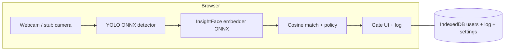

# Gatekeeper — architecture (1–2 page source for PDF)

## System flow

## Pipeline stages

1. **Detection:** `ImageData` → bounding boxes (`src/infra/detector-ort.ts`, worker optional).
2. **Embedding:** square crop + 112² preprocess → 512-D L2-normalized vector (`src/app/crop.ts`, `src/infra/embedder-ort.ts`).
3. **Matching:** brute-force cosine similarity01 vs enrolled rows; thresholds in `src/domain/access-policy.ts` via `src/app/policy.ts`.

## Storage (IndexedDB)

- **users:** name, role, embedding, reference image blob (`src/infra/db-dexie.ts`).
- **accessLog:** timestamped decisions for `/log` + CSV export.
- **settings:** `thresholds`, `cooldownMs`, consent flag, and **E12** camera preferences: `gateCameraPreference` and `enrollCameraPreference` (JSON: optional `deviceId` and `facingMode`). Stale or missing `deviceId` falls back to `config.camera.defaultFacingMode` and the choice is re-saved when the stream starts.

## Performance observability

- `window.__gatekeeperMetrics` — last-stage timings and cold `navigationToDetectorReadyMs` (`src/app/gatekeeper-metrics.ts`). Fill [`docs/BENCHMARKS.md`](BENCHMARKS.md) from **MBP + Chrome** runs.

## Limitations

- Client-side embeddings are visible in DevTools; no server-side anti-spoofing in MVP.
- Stub gate (`VITE_E2E_STUB_GATE`) is for CI only; production behavior uses full ONNX.
