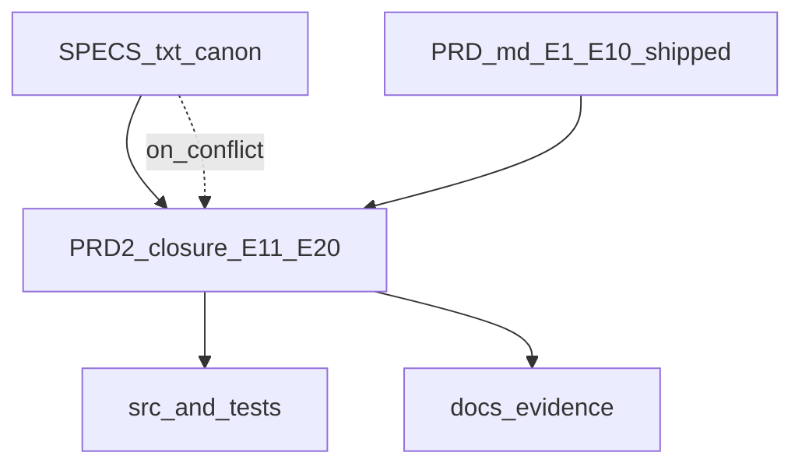
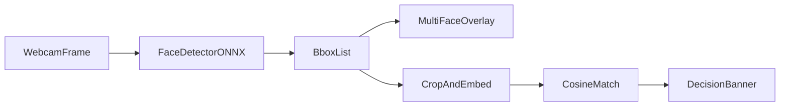
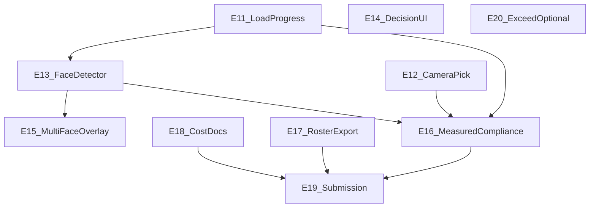

# Gatekeeper — PRD-2 (SPECS closure, agent execution)

**Status:** Active — additive backlog **E11+** derived from [`docs/SPECS.txt`](SPECS.txt) (canon).

**Relationship to existing docs**

- [`docs/PRD.md`](PRD.md) remains the execution PRD for shipped epics **E1–E10**.
- **PRD-2** closes gaps between the running product + repo artifacts and **literal** `SPECS.txt` requirements, with measurable evidence and submission completeness.
- Authority order (unchanged): **`SPECS.txt` > `PRD.md` > `PRE-WORK.md`**. On conflict, **`SPECS.txt` wins**; PRD-2 may supersede older PRD wording where PRD intentionally deferred a SPEC item.
- For PRD-2 scope, **Open Question Q1** superseded the historical **PRD.md** §6 Open Question #4 narrative during closure; **E13** (Path A: `yolov8n-face.onnx` + JS NMS) is the shipped detector. **Path B** remains only as a documented `WAIVED` + human-approval path.

---

## 0. How to use this document (agent instructions)

### 0.1 Picking the next task

- Work only Task IDs **`E11.*` through `E20.*`** defined in **§5** of this file unless a Task’s **Files** list requires reading code introduced in **E1–E10** (use [`docs/PRD.md`](PRD.md) for context only; commits still reference **PRD-2** Task IDs).
- Always pick the **lowest-numbered** unchecked `###### Task` whose **Preconditions** are satisfied (every referenced Task is `- [x]`).
- If multiple Tasks are eligible, pick the **lowest** `E{n}.S{n}.F{n}.T{n}` lexicographically.
- Never start a Task whose parent Epic’s **Depends on** Epics are not fully complete (every child Task in those epics `- [x]`).

### 0.2 Marking progress

- Flip `- [ ]` → `- [x]` on the **Task** line **after** its **Acceptance test** passes locally.
- Flip Feature → Story → Epic checkboxes only when **every** descendant Task under that node is `- [x]`.
- Update **§7. PRD-2 progress dashboard** counts in the same commit that completes the last Task of an Epic.

### 0.3 When to stop and report to the human

- Epic completion (all Tasks `- [x]`): produce a short **End-of-Epic report** (what changed, SPEC cites satisfied, benchmark deltas if any).
- Any **blocker** >30 minutes: add `BLOCKER:` sub-bullet under the Task, then stop.
- Any need to change **§4 Open questions** defaults: stop and get human confirmation.
- Any Task that would require edits **outside** its **Files** list: stop and report (or amend Task via human).

### 0.4 Commit message convention

Same as [`docs/PRD.md`](PRD.md) §0.4 — reference the **PRD-2** Task ID:

```text
E{n}.S{n}.F{n}.T{n}: <imperative summary, <72 chars>
```

### 0.5 Handling blockers and waivers

- Do **not** silently skip Tasks. Use `BLOCKER:` on the Task line, then escalate.
- **`WAIVED`** gaps: operator edits **§2 Gap register** status cell and adds a one-line signed rationale; human-only unless Task explicitly assigns doc edit to agent.

---

## 1. Canon and closure scope



**Intent:** `PRD2_closure` turns SPEC gaps into implementable work and **documented** measurements. Shipped architecture in `PRD.md` is the baseline; PRD-2 brings the product and artifacts in line with **literal** SPECS where required.

---

## 2. Gap register (SPEC to closure)

Each row maps to exactly one **Closing Epic**. Detailed work lives under **§5**.

| Area | SPECS reference | Gap | Target | Closing Epic |
| --- | --- | --- | --- | --- |
| Detector semantics | Face Detection (~L72–L76); Deep dive (~L154–L182) | COCO person + head heuristic vs face-specialized | **Path A (shipped):** `yolov8n-face.onnx` (YOLOv8n, single face class) + decode/NMS; OR **Path B:** `WAIVED` only if E13 `BLOCKER` + human approval | **E13** `DONE` |
| Model load UX | Deep dive (~L163–L164) | Text status only | Determinate bar where `Content-Length` exists; indeterminate + stage labels otherwise; graceful failure + retry | **E11** |
| Mobile cameras | Webcam (~L72) | `facingMode` from config only | Gate + Admin: device picker or flip; persist in `settings` | **E12** — DONE |
| Preview latency | Test 1 (~L127–L127) | Not asserted in CI/docs | Document + measure in [`docs/BENCHMARKS.md`](BENCHMARKS.md); tune path if missed | **E16** |
| Access decision colors | Access (~L112–L112) | `UNCERTAIN` third state | Green / red / distinct amber; score visible on grant/deny paths | **E14** |
| Default threshold wording | Threshold (~L82–L82) | Banded thresholds vs “default ≥ 0.75” | Document mapping to SPEC 0.75 and/or admin-visible preset; update [`docs/ARCHITECTURE.md`](ARCHITECTURE.md) | **E14** |
| Printed photo / spoof | Test 5 (~L132–L132); Anti-spoof (~L84–L84) | No liveness heuristics | SPOOF_UNCERTAIN / presentation banner minimum; stretch in E20 | **E20** |
| JSON backup | Storage (~L98–L98) | Import only | Admin export roster JSON symmetric to import | **E17** |
| Audit export PDF | Stretch in SPECS / log features | CSV only | Optional PDF in exceed track | **E20** |
| Performance evidence | Performance table (~L138–L152); Deep dive (~L248–L252) | Pending rows / stub benches | MBP+Chrome canonical rows filled; 50-user synthetic; FPS; memory | **E16** |
| AI cost analysis | AI Cost (~L254–L267) | Incomplete rows | LLM, tokens, conversion, training, testing compute documented | **E18** |
| Production cost projection | Table (~L269–L290) | Not one doc | [`docs/PRODUCTION_COSTS.md`](PRODUCTION_COSTS.md) or ARCHITECTURE section + assumptions | **E18** |
| Multi-face highlight | Multi-face (~L86–L86) | Verify all boxes drawn | Audit overlay + regression test | **E15** |
| Stretch inventory | Stretch list | ≥3 shipped; exceed optional | Optional +1 in E20 Features | **E20** |
| Submission | Submission (~L370–L388) | Operator placeholders | Close [`docs/SUBMISSION.md`](SUBMISSION.md) per tasks | **E19** |

**Row status (agent/operator):** append `DONE` or `WAIVED` in a PR comment or revision note when §8 gates pass for that row.

---

## 3. SPECS “We will test” mapping

| # | Scenario | SPECS cite | Closure (Epic / Task) | Evidence complete |
| --- | --- | --- | --- | --- |
| 1 | Feed within 2s of permission | L127 | E16 (measure + doc) | - [ ] |
| 2 | Enroll new user | L128 | E1–E8 baseline; keep E2E green | - [ ] |
| 3 | GRANTED &lt;3s | L129–L130 | E16 benchmarks + pipeline | - [ ] |
| 4 | Stranger DENIED / Unknown | L131 | E14 + existing policy/E2E | - [ ] |
| 5 | Printed photo flagged | L132 | E20 (or WAIVED with rationale) | - [ ] |
| 6 | Two people handled | L133–L134 | E15 + policy/E2E | - [ ] |
| 7 | IndexedDB persist | L135 | Existing; refresh scenario in E16 | - [ ] |
| 8 | Log complete | L136–L137 | Log page + CSV; PDF optional E20 | - [ ] |

---

## 4. Open questions (PRD-2 defaults)

1. **Detector literalism (supersedes PRD.md §6 OQ #4 for this closure).**  
   **Default:** **Path A** — integrate a **face-specialized** (or face-class) ONNX detector and align **decode + NMS** in [`src/infra/detector-yolo-decode.ts`](../src/infra/detector-yolo-decode.ts) + session creation in [`src/infra/ort-session-factory.ts`](../src/infra/ort-session-factory.ts) / pipeline entrypoints.  
   **Escalation:** **Path B** only after a `BLOCKER:` on the relevant E13 Task, human approval, and a **`WAIVED`** one-liner in §2 for the detector row (document two-stage + honest UX copy + [`docs/ARCHITECTURE.md`](../docs/ARCHITECTURE.md)).

2. **Exceed / P3 stretch.**  
   **Default:** No optional E20 Feature is required for “PRD-2 complete” unless the operator checks it on. Ship only SPECS minimum + gap rows assigned to E11–E19.

3. **Canonical hardware for numbers.**  
   **Default:** MacBook Pro + desktop Chrome session per [`docs/BENCHMARKS.md`](BENCHMARKS.md) header; stub benches on port 5199 remain **non-canonical** helpers unless explicitly labeled.

---

## 5. Epics E11–E20

### Epic E11: Model load progress and graceful failure — [x]

**Goal:** Meet SPECS deep-dive model loading: **visible progress** (not text-only) and **graceful** failure with retry for detector + embedder on the gate (and admin parity where models load).

**Depends on:** Epic E10 complete (shipped baseline).

**Epic DoD:**

- [x] Gate shows a **progress bar** (determinate when length known, else indeterminate + stage label) during detector and embedder load.
- [x] Failed load shows clear error + **retry** without full page reload.
- [x] Admin enrollment path that loads both models reflects the same UX pattern.
- [x] All E11 Tasks `- [x]`.

#### User Story E11.S1: As a visitor, I see model download/load progress on the gate — [x]

**Acceptance criteria:**

- Given gate boot, when models fetch/load, then a progress bar (or staged indeterminate bar) is visible in the gate status region.
- Given a failed network or ORT error, when load fails, then the user sees a friendly message and can retry.

##### Feature E11.S1.F1: Progress UI in gate status region — [x]

**Description:** Replace or augment plain `textContent` status with a **bar** + optional byte fraction.  
**Interfaces/contracts:** Progress reporting callback or events from load wrappers; DOM under existing gate status container.  
**Files:** [`src/app/gate-session-detector-load.ts`](../src/app/gate-session-detector-load.ts), [`src/app/gate-session-orchestrator.ts`](../src/app/gate-session-orchestrator.ts), gate HTML/CSS under [`src/styles/`](../src/styles/) or gate mount.

###### Task E11.S1.F1.T1: Add determinate/indeterminate progress bar markup and styles — [x]

- **Files:** gate mount template or orchestrator DOM hooks, `src/styles/*` (banner/gate section).
- **Preconditions:** none
- **Steps:**
  1. Introduce a small progress sub-tree (track + fill + optional label) next to or inside the existing status region.
  2. Style fill width via CSS variable or inline width for determinate mode; indeterminate animation when no byte fraction.
- **Acceptance test:** With throttled network (DevTools), loading state shows an animated or widening bar before models become ready.
- **SPEC cite:** SPECS.txt deep dive “Display a loading progress bar” (~L163).

###### Task E11.S1.F1.T2: Wire `beginDetectorLoad` to update bar from load lifecycle — [x]

- **Files:** [`src/app/gate-session-detector-load.ts`](../src/app/gate-session-detector-load.ts), [`src/app/gatekeeper-metrics.ts`](../src/app/gatekeeper-metrics.ts) (if extending `withMeasuredLoad`), [`src/infra/ort-session-factory.ts`](../src/infra/ort-session-factory.ts), [`src/infra/embedder-ort.ts`](../src/infra/embedder-ort.ts) as needed.
- **Preconditions:** E11.S1.F1.T1 done
- **Steps:**
  1. Plumb optional `onProgress({ stage, loaded?, total? })` from `fetch`/ORT create through `detector.load()` / `embedder.load()` implementations.
  2. When `Content-Length` missing, switch UI to indeterminate + stage label (“Detector”, “Embedder”).
- **Acceptance test:** Console mock: progress callbacks update bar; both stages observable when both models load.
- **SPEC cite:** ~L163–L164.

##### Feature E11.S1.F2: Failed load UX with retry — [x]

**Description:** On rejection, keep user in recoverable state with explicit retry.  
**Files:** [`src/app/gate-session-detector-load.ts`](../src/app/gate-session-detector-load.ts), [`src/app/gate-session-orchestrator.ts`](../src/app/gate-session-orchestrator.ts).

###### Task E11.S1.F2.T1: Add retry control and idempotent reload — [x]

- **Files:** same as Feature description.
- **Preconditions:** E11.S1.F1.T2 done
- **Steps:**
  1. On failure, render message + button; clear prior partial sessions if required by ORT.
  2. Retry re-invokes the same load path without duplicating listeners.
- **Acceptance test:** Simulate `fetch` rejection; retry succeeds on second attempt (mock).
- **SPEC cite:** “Handle model download failures gracefully” (~L164).

#### User Story E11.S2: As an admin, I see consistent model load progress during enrollment — [x]

**Acceptance criteria:**

- Given admin capture flow loading models, when loads run, then progress matches gate semantics (bar + stages).

##### Feature E11.S2.F1: Enrollment capture load UX parity — [x]

**Files:** [`src/app/enrollment/enroll-capture.ts`](../src/app/enrollment/enroll-capture.ts), related enrollment UI mount.

###### Task E11.S2.F1.T1: Reuse or extract shared progress helper for enroll path — [x]

- **Files:** enroll capture + shared module if extracted from gate.
- **Preconditions:** E11.S1.F2.T1 done
- **Steps:**
  1. Call shared progress UI from enrollment `Promise.all([detector.load(), embedder.load()])` path.
  2. Ensure E2E stub env still skips heavy UI if needed (`VITE_E2E_STUB_*`).
- **Acceptance test:** Manual or unit smoke: enrollment load invokes progress API at least once per model.
- **SPEC cite:** Deep dive model loading (~L163) applies to all model loads in product.

---

### Epic E12: Front and rear camera selection — [x]

**Goal:** Meet SPECS webcam integration: **support front and rear cameras on mobile** via explicit user choice; persist last choice.

**Depends on:** E10 complete.

**Epic DoD:**

- [x] Gate and Admin can select camera device or facing mode with clear labels.
- [x] Last choice persists in `settings` store.
- [x] All E12 Tasks `- [x]`.

#### User Story E12.S1: As a visitor, I can pick which camera feeds the gate — [x]

**Acceptance criteria:**

- Given multiple video input devices, when I open the gate, then I can pick front vs rear (or device list).
- Given a selection, when I reload, then the app restores my last choice from IndexedDB settings.

##### Feature E12.S1.F1: Device enumeration and picker UI (gate) — [x]

**Files:** [`src/infra/camera.ts`](../src/infra/camera.ts), [`src/app/mount-gate.ts`](../src/app/mount-gate.ts), [`src/app/gate-session.ts`](../src/app/gate-session.ts), settings persistence via [`src/infra/db-dexie.ts`](../src/infra/db-dexie.ts) / [`src/infra/persistence.ts`](../src/infra/persistence.ts).

###### Task E12.S1.F1.T1: Implement `enumerateDevices` + labeled picker for gate — [x]

- **Preconditions:** none
- **Steps:**
  1. After permission, enumerate `videoinput` devices; map labels (“Front”, “Back”, or device label).
  2. Apply `deviceId` or `facingMode` constraints per selection.
- **Acceptance test:** With fake `MediaDevices` in unit test, preferred device id is passed to `getUserMedia`.
- **SPEC cite:** L72 “front and rear cameras on mobile”.

###### Task E12.S1.F1.T2: Persist gate camera choice in settings — [x]

- **Preconditions:** E12.S1.F1.T1 done
- **Steps:**
  1. On change, write `settings` key (e.g. `gateCameraDeviceId` / `facingMode`).
  2. On boot, read and apply before `start()`.
- **Acceptance test:** Unit or integration: setting round-trips across mocked reload.
- **SPEC cite:** L72; storage L308 (IndexedDB / settings).

#### User Story E12.S2: As an admin, I can pick the enrollment camera — [x]

##### Feature E12.S2.F1: Admin enrollment picker — [x]

**Files:** admin enrollment mount / [`src/app/mount-admin-shell.ts`](../src/app/mount-admin-shell.ts) or enrollment controllers.

###### Task E12.S2.F1.T1: Wire same enumeration + persistence for admin capture — [x]

- **Preconditions:** E12.S1.F1.T2 done
- **Steps:** Reuse shared camera picker helper; separate settings key or shared policy per product decision (document in ARCHITECTURE).
- **Acceptance test:** Admin flow selects non-default device in test double.
- **SPEC cite:** L72; enrollment L96–L97.

---

### Epic E13: Literal face detection (Path A default) — [x]

**Goal:** Align running detector with SPECS **face** detection narrative (bounding boxes on **faces**), using **Path A** per §4 Q1.

**Depends on:** E11 complete (stable load UX for new artifact).

**Epic DoD:**

- [x] ONNX + decode path documented in [`public/models/README.md`](../public/models/README.md).
- [x] [`docs/ARCHITECTURE.md`](ARCHITECTURE.md) states model I/O and why it satisfies SPECS face detection section.
- [x] Automated tests cover decode output shape / at least one golden vector or snapshot contract.
- [x] All E13 Tasks `- [x]` **or** §2 detector row `WAIVED` with Path B rationale.

#### User Story E13.S1: As the system, I run a face-appropriate detector in the browser — [x]

##### Feature E13.S1.F1: Model artifact and configuration — [x]

**Files:** [`src/config.ts`](../src/config.ts), `public/models/*`, [`public/models/README.md`](../public/models/README.md).

###### Task E13.S1.F1.T1: Select and vendor face-specialized ONNX; update `modelUrls.detector` — [x]

- **Preconditions:** E11 complete (Epic-level)
- **Steps:** Choose model consistent with SPECS; record license/size; add to `public/models` or documented CDN path per project rules.
- **Acceptance test:** `pnpm run build` includes model or fetch URL valid on deploy; README lists input size and task.
- **SPEC cite:** L72–L76, L154–L166.

##### Feature E13.S1.F2: Decode and NMS aligned to new outputs — [x]

**Files:** [`src/infra/detector-yolo-decode.ts`](../src/infra/detector-yolo-decode.ts), [`src/infra/detector-core-types.ts`](../src/infra/detector-core-types.ts), tests under [`tests/`](../tests/).

###### Task E13.S1.F2.T1: Implement decode + NMS for chosen head — [x]

- **Preconditions:** E13.S1.F1.T1 done
- **Steps:** Map tensors to pixel bboxes + scores; filter to face-relevant classes if multi-class; unit-test golden output.
- **Acceptance test:** Vitest passes on fixed tensor input with expected boxes.
- **SPEC cite:** L74–L76.

##### Feature E13.S1.F3: Pipeline integration — [x]

**Files:** [`src/app/detection-pipeline/`](../src/app/detection-pipeline/), [`src/app/pipeline.ts`](../src/app/pipeline.ts) if still orchestrating.

###### Task E13.S1.F3.T1: End-to-end frame → bbox contract for gate and enrollment — [x]

- **Preconditions:** E13.S1.F2.T1 done
- **Steps:** Wire preprocess input size to new model; ensure crop/embed path receives face ROI per policy.
- **Acceptance test:** Existing pipeline tests updated green; stub E2E still passes if applicable.
- **SPEC cite:** L178–L187.

#### User Story E13.S2: As an auditor, I can read accurate detector documentation — [x]

##### Feature E13.S2.F1: Architecture and model docs — [x]

**Files:** [`docs/ARCHITECTURE.md`](ARCHITECTURE.md), [`public/models/README.md`](../public/models/README.md).

###### Task E13.S2.F1.T1: Update ARCHITECTURE detector section to match SPECS wording — [x]

- **Preconditions:** E13.S1.F3.T1 done
- **Steps:** Replace COCO/person narrative with actual architecture; note quantization and ORT EPs.
- **Acceptance test:** Doc review checklist: mentions face boxes, model name, input tensor shape.
- **SPEC cite:** L154–L182.

**Pipeline touchpoints (E13 reference):**



---

### Epic E14: Decision UI and threshold semantics — [x]

**Goal:** GRANTED/DENIED colors per SPECS; **similarity score** visible on grant/deny; threshold language aligned with **default ≥ 0.75** in docs and/or config.

**Depends on:** none (can parallel E13 for UI-only doc tasks—use Preconditions to sequence doc tasks after E13 if they reference detector).

**Epic DoD:**

- [x] Banner variants: green / red / distinct amber (UNCERTAIN).
- [x] Score shown for GRANTED and DENIED paths per SPECS access display.
- [x] ARCHITECTURE explains band mapping vs 0.75 default.
- [x] All E14 Tasks `- [x]`.

**End-of-Epic report (E14):** Decision banners use solid tokenized backgrounds with WCAG-AA-checked fg/bg pairs (`tests/banner-wcag-contract.test.ts`); `GateAccessEvaluation` carries `bandThresholds` so the confidence meter matches IndexedDB `settings.thresholds`. Docs: [docs/ARCHITECTURE.md](ARCHITECTURE.md) “Threshold rationale”. Admin “Apply SPECS 0.75 strong floor” writes `strong: 0.75` to `settings` ([`src/app/admin-threshold-preset.ts`](../src/app/admin-threshold-preset.ts)). Benchmark delta: N/A (CSS + small UI).

#### User Story E14.S1: As a visitor, I see SPEC-accurate decision styling — [x]

##### Feature E14.S1.F1: Banner colors and copy audit — [x]

**Files:** [`src/ui/components/decision-banner.ts`](../src/ui/components/decision-banner.ts), [`src/styles/`](../src/styles/) (banner classes), call sites in gate pipeline.

###### Task E14.S1.F1.T1: Audit and fix GRANTED/DENIED/UNCERTAIN color contrast — [x]

- **Preconditions:** none
- **Steps:** Ensure CSS meets intent: green / red / amber distinct; WCAG AA where feasible.
- **Acceptance test:** Visual or computed style test / Storybook-style HTML snapshot.
- **SPEC cite:** L112–L112.

###### Task E14.S1.F1.T2: Ensure similarity score appears in title/copy for grant and deny — [x]

- **Preconditions:** E14.S1.F1.T1 done
- **Steps:** Trace all decision branches; add score to model string where missing.
- **Acceptance test:** Unit test on `renderDecisionBanner` / controller with mocked decisions.
- **SPEC cite:** L112 (name + confidence score).

#### User Story E14.S2: As an auditor, I understand default 0.75 vs bands — [x]

##### Feature E14.S2.F1: Documentation and optional preset — [x]

**Files:** [`docs/ARCHITECTURE.md`](ARCHITECTURE.md), [`src/config.ts`](../src/config.ts), optional admin settings UI.

###### Task E14.S2.F1.T1: Document `strong`/`weak` mapping to SPEC 0.75 language — [x]

- **Preconditions:** none
- **Steps:** Add subsection “Threshold rationale”; state default `strong ≥ 0.75` or equivalent proof.
- **Acceptance test:** ARCHITECTURE section exists and quotes SPEC default.
- **SPEC cite:** L82–L82.

###### Task E14.S2.F1.T2: Optional admin “single-threshold preset” from 0.75 — [x]

- **Preconditions:** E14.S2.F1.T1 done
- **Steps:** If product wants preset button, write bands to `settings`; else mark Task N/A with `BLOCKER: descoped` after human ok.
- **Acceptance test:** If implemented, settings round-trip updates decision distribution in test.
- **SPEC cite:** L82.

---

### Epic E15: Multi-face overlay (“highlight each”) — [x]

**Goal:** When multiple faces appear, **each** face has a visible box before policy blocks grant, per SPECS.

**Depends on:** E13 complete (bbox semantics stable).

**Epic DoD:**

- [x] Overlay draws all face boxes returned by detector policy.
- [x] Regression test prevents single-box regression.
- [x] All E15 Tasks `- [x]`.

**End-of-Epic report (E15):** Verified frame path still renders all detections (`run-frame` calls `drawDetections` before cardinality gating), and added pipeline-level regression coverage in [`tests/pipeline.test.ts`](../tests/pipeline.test.ts) asserting multi-face frames draw one rectangle per detection (3 detections => 3 `strokeRect` calls). SPEC closure: multi-face highlight (`L86`) and scenario 6 handling basis (`L133–L134`).

#### User Story E15.S1: As a visitor, I see every detected face highlighted — [x]

##### Feature E15.S1.F1: Overlay audit and test — [x]

**Files:** [`src/app/bbox-overlay.ts`](../src/app/bbox-overlay.ts), [`src/app/detection-pipeline/run-frame.ts`](../src/app/detection-pipeline/run-frame.ts), tests.

###### Task E15.S1.F1.T1: Trace overlay input list; fix if only largest box drawn — [x]

- **Preconditions:** E13 complete
- **Steps:** Log or inspect multi-det path; ensure loop draws all boxes with distinct colors optional.
- **Acceptance test:** Manual multi-face frame or synthetic test doubles show N boxes.
- **SPEC cite:** L86–L86.

###### Task E15.S1.F1.T2: Add regression test for multi-face overlay — [x]

- **Preconditions:** E15.S1.F1.T1 done
- **Steps:** Vitest with canvas mock or pure geometry list asserting N rectangles.
- **Acceptance test:** `pnpm test` includes new test file green.
- **SPEC cite:** L86; test scenario 6 L133–L134.

---

### Epic E16: Measured compliance (benchmarks and accuracy) — [ ]

**Goal:** Fill canonical **MBP + Chrome** evidence for SPECS performance table; accuracy trial; scenario mapping; synthetic scale tests.

**Depends on:** E11, E12, E13 complete (canonical numbers reflect final detector + camera path).

**Epic DoD:**

- [ ] [`docs/BENCHMARKS.md`](BENCHMARKS.md) has no `_PENDING_` for canonical rows where required.
- [ ] [`docs/ACCURACY_RESULTS.md`](ACCURACY_RESULTS.md) populated per [`docs/ACCURACY_TRIAL.md`](ACCURACY_TRIAL.md).
- [ ] Scenario 1–8 mapped to Playwright or [`docs/DEMO.md`](DEMO.md) scripts.
- [ ] All E16 Tasks `- [x]`.

#### User Story E16.S1: As an auditor, I can read filled benchmark tables — [x]

##### Feature E16.S1.F1: Canonical environment + detection/E2E/cold rows — [x]

**Files:** [`docs/BENCHMARKS.md`](BENCHMARKS.md), optional bench scripts [`tests/accuracy/`](../tests/accuracy/).

###### Task E16.S1.F1.T1: Record exact MBP + Chrome environment string at top of BENCHMARKS — [x]

- **Preconditions:** E13 complete
- **Steps:** Add machine model, macOS version, Chrome version, date.
- **Acceptance test:** Markdown renders; string non-empty.
- **SPEC cite:** Performance L138–L146.

###### Task E16.S1.F1.T2: Fill &lt;500ms detection, &lt;3s E2E, &lt;8s cold rows with measured p50/p90 — [x]

- **Preconditions:** E16.S1.F1.T1 done
- **Steps:** Follow SUBMISSION runbook + BENCHMARKS protocol on **5173** canonical session.
- **Acceptance test:** No `_PENDING_` tokens in those rows.
- **SPEC cite:** L141–L147.

###### Task E16.S1.F1.T3: Add 15 FPS preview row under real detector session — [x]

- **Preconditions:** E16.S1.F1.T2 done
- **Steps:** Measure preview loop with detection enabled; document method.
- **Acceptance test:** Row filled with methodology footnote.
- **SPEC cite:** L152–L152.

###### Task E16.S1.F1.T4: Add 50-user synthetic match latency smoke (script or bench) — [x]

- **Preconditions:** E16.S1.F1.T2 done
- **Steps:** JS loop over N=50 embeddings cosine match; record p99.
- **Acceptance test:** Result recorded in BENCHMARKS or linked file.
- **SPEC cite:** L150–L150.

###### Task E16.S1.F1.T5: Memory footprint row (&lt;500MB) via Performance tab protocol — [x]

- **Preconditions:** E16.S1.F1.T2 done
- **Steps:** Document sampling approach; paste observed peak if policy allows.
- **Acceptance test:** Row present with note on methodology.
- **SPEC cite:** Deep dive L252–L252.

#### User Story E16.S2: As an auditor, I see accuracy trial outcomes — [ ]

##### Feature E16.S2.F1: ≥20-face trial — [ ]

**Files:** [`docs/ACCURACY_RESULTS.md`](ACCURACY_RESULTS.md), trial protocol.

###### Task E16.S2.F1.T1: Run trial and fill TP/FP/FN/TN or equivalent matrix — [ ]

- **Preconditions:** E13 complete
- **Steps:** Follow ACCURACY_TRIAL; do not retune thresholds without before/after matrix per PRE-WORK.
- **Acceptance test:** ≥20 identities documented; meets or waives ≥85% TPR @ ≤5% FPR with rationale.
- **SPEC cite:** L148–L149.
- **BLOCKER:** Requires operator-run participant trial (>=20 identities) per consent protocol.

#### User Story E16.S3: As a TA, I can map SPECS tests to runnable checks — [ ]

##### Feature E16.S3.F1: Scenario coverage matrix — [ ]

**Files:** [`docs/DEMO.md`](DEMO.md), [`tests/scenarios/`](../tests/scenarios/), PR comment optional.

###### Task E16.S3.F1.T1: Map scenarios 1–8 to Playwright test names or manual DEMO steps — [x]

- **Preconditions:** none
- **Steps:** Table in DEMO.md or new `docs/SCENARIO_COVERAGE.md` linking scenario → command/steps.
- **Acceptance test:** Every row in §3 has at least one link target.
- **SPEC cite:** L124–L137.

###### Task E16.S3.F1.T2: Permission-to-preview ≤2s measurement doc — [x]

- **Preconditions:** E16.S1.F1.T1 done
- **Steps:** Add stopwatch protocol to BENCHMARKS or DEMO; if fail, file tuning Task under gate-session with cross-link.
- **Acceptance test:** Documented number or explicit tuning Task id.
- **SPEC cite:** L127.

###### Task E16.S3.F1.T3: Deep dive total pipeline &lt;2s evidence or optimization tasks filed — [x]

- **Preconditions:** E16.S1.F1.T2 done
- **Steps:** Measure staged latency; if above budget, list bottleneck + follow-up (may spawn new Tasks).
- **Acceptance test:** BENCHMARKS row or linked note with sum of stages.
- **SPEC cite:** L248–L250.

---

### Epic E17: Roster JSON export — [x]

**Goal:** Optional JSON **export** symmetric to bulk import, per SPECS storage backend.

**Depends on:** none.

**Epic DoD:**

- [x] Admin can export roster JSON including embeddings per [`docs/IMPORT_SCHEMA.md`](IMPORT_SCHEMA.md).
- [x] Cross-linked from README or ARCHITECTURE.
- [x] All E17 Tasks `- [x]`.

#### User Story E17.S1: As an admin, I can download a backup JSON of all users — [x]

##### Feature E17.S1.F1: Export pipeline — [x]

**Files:** new `src/app/roster-json-export.ts` (suggested), admin UI handler, [`docs/IMPORT_SCHEMA.md`](IMPORT_SCHEMA.md).

###### Task E17.S1.F1.T1: Implement `exportRosterJson()` from Dexie users store — [x]

- **Preconditions:** none
- **Steps:** Serialize users + embeddings per schema; redact secrets none.
- **Acceptance test:** Unit test round-trip import → export → structural equality (golden).
- **SPEC cite:** L98–L98.

###### Task E17.S1.F1.T2: Add Admin UI control “Export roster JSON” — [x]

- **Preconditions:** E17.S1.F1.T1 done
- **Steps:** Button triggers download blob; filename dated.
- **Acceptance test:** Playwright or manual checklist entry in DEMO.
- **SPEC cite:** L98.

###### Task E17.S1.F1.T3: Document export in IMPORT_SCHEMA + README link — [x]

- **Preconditions:** E17.S1.F1.T2 done
- **Steps:** Add subsection “Export format” mirroring import.
- **Acceptance test:** Doc links valid on relative paths.
- **SPEC cite:** L98.

---

### Epic E18: AI and production cost documentation — [ ]

**Goal:** Complete SPECS AI cost categories + production cost projection table in-repo.

**Depends on:** none.

**Epic DoD:**

- [ ] [`docs/AI_COST_LOG.md`](AI_COST_LOG.md) includes conversion, training, testing compute rows (explicit $0 ok).
- [ ] [`docs/PRODUCTION_COSTS.md`](PRODUCTION_COSTS.md) exists with SPEC table + assumptions bullets.
- [ ] All E18 Tasks `- [x]`.

#### User Story E18.S1: As an auditor, I see full development cost disclosure — [ ]

##### Feature E18.S1.F1: AI cost log completeness — [ ]

**Files:** [`docs/AI_COST_LOG.md`](AI_COST_LOG.md).

###### Task E18.S1.F1.T1: Add model conversion / training / testing compute rows — [ ]

- **Preconditions:** none
- **Steps:** Document HF download vs train = none; Playwright/bench machine time as testing compute.
- **Acceptance test:** No placeholder gaps for those headings.
- **SPEC cite:** L257–L267.

#### User Story E18.S2: As an auditor, I see production cost projections — [ ]

##### Feature E18.S2.F1: Production cost doc — [ ]

**Files:** new [`docs/PRODUCTION_COSTS.md`](PRODUCTION_COSTS.md) (or ARCHITECTURE appendix—pick one; default **new file**).

###### Task E18.S2.F1.T1: Create PRODUCTION_COSTS.md with SPEC table 100/1K/10K/100K — [ ]

- **Preconditions:** none
- **Steps:** Copy categories from SPECS L273–L285; add assumption bullets L287–L290.
- **Acceptance test:** Markdown table renders; assumptions section ≥3 bullets.
- **SPEC cite:** L269–L290.

###### Task E18.S2.F1.T2: Link PRODUCTION_COSTS from README or ARCHITECTURE — [ ]

- **Preconditions:** E18.S2.F1.T1 done
- **Steps:** One-line cross-link.
- **Acceptance test:** Link resolves.
- **SPEC cite:** L269–L270.

---

### Epic E19: Submission checklist closure — [ ]

**Goal:** Operator-facing artifacts in [`docs/SUBMISSION.md`](SUBMISSION.md) have **definition of done** met or explicit N/A.

**Depends on:** E16, E17, E18 complete (evidence and exports exist to reference in demo).

**Epic DoD:**

- [ ] No `_PENDING_` for items the operator intends to submit (or replaced with URL/path).
- [ ] All E19 Tasks `- [x]`.

#### User Story E19.S1: As an operator, I can close the course submission list — [ ]

##### Feature E19.S1.F1: SUBMISSION.md updates — [ ]

**Files:** [`docs/SUBMISSION.md`](SUBMISSION.md).

###### Task E19.S1.F1.T1: Replace demo video placeholder with file path or stable URL — [ ]

- **Preconditions:** E16.S1.F1.T2 done (demo can show metrics)
- **Steps:** Operator provides artifact; agent commits text replacement only if operator supplies content **or** mark `BLOCKER:` for missing operator asset.
- **Acceptance test:** Line contains no `_PENDING_`.
- **SPEC cite:** L376–L379.

###### Task E19.S1.F1.T2: Replace Pre-Search export placeholder — [ ]

- **Preconditions:** none
- **Steps:** Same pattern as T1.
- **Acceptance test:** Line contains no `_PENDING_`.
- **SPEC cite:** L380–L380.

###### Task E19.S1.F1.T3: Confirm architecture PDF path or Netlify print workflow documented — [ ]

- **Preconditions:** none
- **Steps:** Link `docs/ARCHITECTURE.pdf` or document generation steps only.
- **Acceptance test:** SUBMISSION section lists reachable artifact or explicit `N/A` with waiver.
- **SPEC cite:** L382–L382.

###### Task E19.S1.F1.T4: Social post line matches operator policy — [ ]

- **Preconditions:** none
- **Steps:** Update URL or reaffirm N/A with course approval if skipping.
- **Acceptance test:** No contradictory `_PENDING_`.
- **SPEC cite:** L388–L388.

---

### Epic E20: Exceed track (optional) — [ ]

**Goal:** Optional stretch beyond minimum gap closure. **No Task in E20 is required** for §8 unless operator selects it.

**Depends on:** none (optional).

**Epic DoD:**

- [ ] Only checked Features/Tasks are implemented; others remain `- [ ]`.

#### User Story E20.S1 (optional): As a product owner, I may ship spoof heuristics — [ ]

##### Feature E20.S1.F1: Presentation-attack heuristic MVP — [ ]

**Files:** gate pipeline heuristics module (suggested), [`src/ui/components/decision-banner.ts`](../src/ui/components/decision-banner.ts).

###### Task E20.S1.F1.T1: Add frame variance / sharpness heuristic hooks — [ ]

- **Preconditions:** operator selected E20.S1
- **Steps:** Compute cheap metrics; threshold tuned with documented false positive rate note.
- **Acceptance test:** Unit tests with synthetic flat vs live-like sequence.
- **SPEC cite:** L132; L84–L84.

###### Task E20.S1.F1.T2: Surface `SPOOF_UNCERTAIN` (or equivalent) banner state — [ ]

- **Preconditions:** E20.S1.F1.T1 done
- **Steps:** Wire to decision controller without breaking GRANTED/DENIED flows.
- **Acceptance test:** E2E or manual script in DEMO.
- **SPEC cite:** L132.

#### User Story E20.S2 (optional): As an admin, I may export audit PDF — [ ]

##### Feature E20.S2.F1: PDF export MVP — [ ]

**Files:** [`src/app/csv-export.ts`](../src/app/csv-export.ts) sibling or log page print CSS.

###### Task E20.S2.F1.T1: Implement print-stylesheet or tiny PDF path for date-filtered log — [ ]

- **Preconditions:** operator selected E20.S2
- **Steps:** Choose `window.print` MVP or PDF lib; document limitations.
- **Acceptance test:** Operator can generate PDF from log page.
- **SPEC cite:** stretch audit formats.

#### User Story E20.S3 (optional): Other stretch items — [ ]

##### Feature E20.S3.F1: Multi-angle enrollment — [ ]

###### Task E20.S3.F1.T1: Spec + implement or mark WAIVED — [ ]

- **Preconditions:** operator selected E20.S3
- **SPEC cite:** Build strategy stretch list (~L333).

##### Feature E20.S3.F2: Access scheduling — [ ]

###### Task E20.S3.F2.T1: Spec + implement or mark WAIVED — [ ]

- **Preconditions:** operator selected E20.S3
- **SPEC cite:** stretch L333.

##### Feature E20.S3.F3: Landmark debug overlay — [ ]

###### Task E20.S3.F3.T1: Spec + implement or mark WAIVED — [ ]

- **Preconditions:** operator selected E20.S3
- **SPEC cite:** stretch L333.

---

## 6. Epic dependency graph



**Note:** `E14` runs in parallel with `E11`–`E13` (not shown as an edge). **`E19`** waits on `E16`, `E17`, and `E18` per Epic E19 **Depends on**. `E20` has no incoming edges.

---

## 7. PRD-2 progress dashboard

Update the `(x/y tasks)` counts when Tasks flip to `- [x]`.

| Epic | Title | Progress |
| --- | --- | --- |
| E11 | Model load progress + graceful failure | - [x] (4/4 tasks) |
| E12 | Front/rear camera selection | - [x] (3/3 tasks) |
| E13 | Literal face detection (Path A) | - [x] (4/4 tasks) |
| E14 | Decision UI + threshold semantics | - [x] (4/4 tasks) |
| E15 | Multi-face overlay | - [x] (2/2 tasks) |
| E16 | Measured compliance | - [ ] (8/9 tasks) |
| E17 | Roster JSON export | - [x] (3/3 tasks) |
| E18 | AI + production cost docs | - [ ] (0/3 tasks) |
| E19 | Submission closure | - [ ] (0/4 tasks) |
| E20 | Exceed (optional) | - [ ] (0/6 tasks, skip unless selected) |

**Total PRD-2 core (E11–E19):** 36 tasks. **E20:** 6 optional tasks.

---

## 8. PRD-2 complete gate

- [ ] §2 Gap register: every row **DONE** or **WAIVED** with signed rationale in-table or footnote.
- [ ] §3: all scenario evidence checkboxes `- [x]`.
- [ ] §7: E11–E19 epics checked complete.
- [ ] SPECS deep-dive **progress bar** and **mobile cameras** rows satisfied or **WAIVED** with staff-approved text (human gate).
- [ ] [`docs/BENCHMARKS.md`](BENCHMARKS.md) and [`docs/ACCURACY_RESULTS.md`](ACCURACY_RESULTS.md): no `_PENDING_` for canonical MBP+Chrome obligations targeted in E16.
- [ ] [`docs/SUBMISSION.md`](SUBMISSION.md): no `_PENDING_` for artifacts the operator will submit.

---

## 9. Revision history

| Date | Author | Notes |
| --- | --- | --- |
| 2026-04-24 | PRD-2 draft | Initial gap synthesis from SPECS + repo audit. |
| 2026-04-24 | PRD-2 revision | Agent-optimal structure: §0 instructions, gap→epic mapping, E11–E20 hierarchy, mermaid, dashboards, Path A default. |
