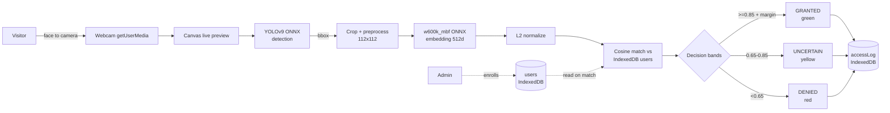
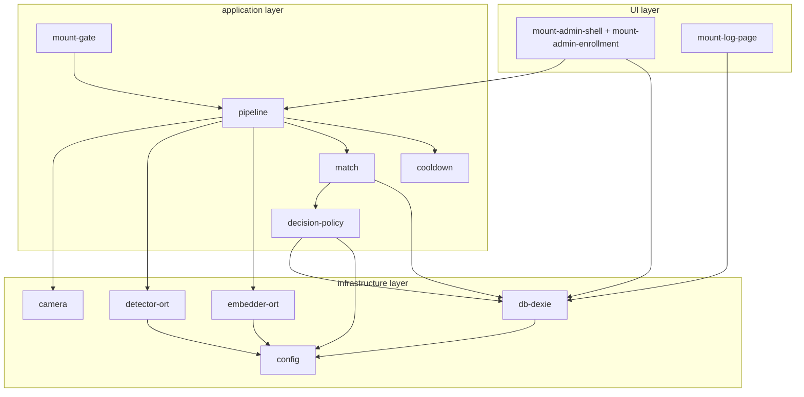
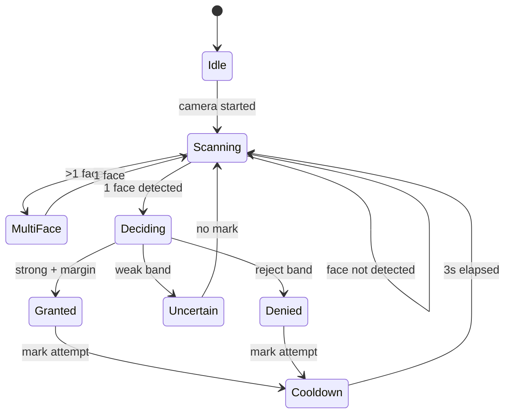
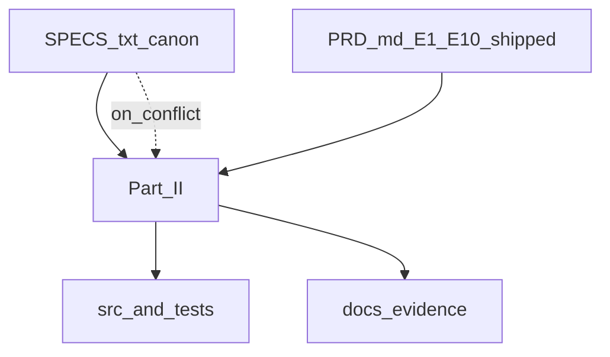
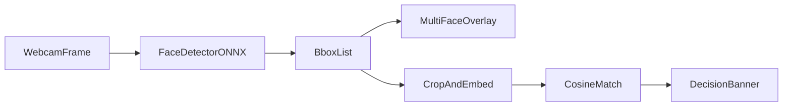
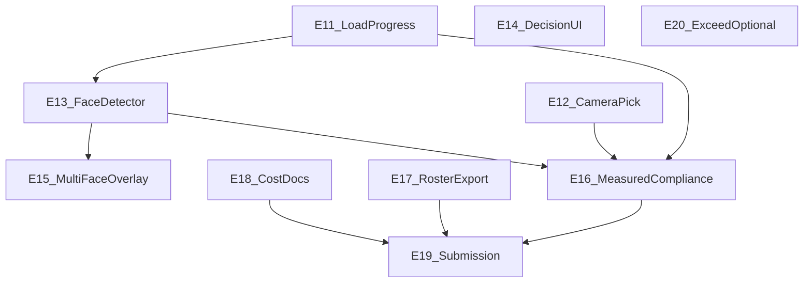
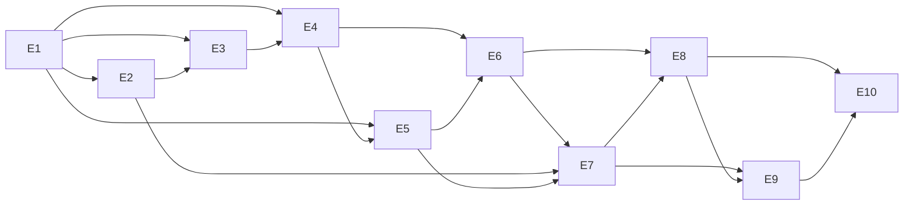

# Gatekeeper — PRD for AI Agents

> Browser-based facial-recognition door-entry system. Client-side ML only.
> This document is the single source of truth for implementation.
> Primary reader: autonomous AI coding agent. Secondary reader: humans.

**Source authority order (resolve conflicts top → bottom):**

1. `docs/SPECS.txt` (immutable assignment spec)
2. This `docs/PRD.md`
3. `docs/PRE-WORK.md` (normalized evidence & locked decisions)

**Tranches:** **Part I (E1–E10)** = MVP, stretch, and validation. **Part II (E11–E20)** = post-MVP `SPECS.txt` **closure** (gaps, benchmarks, submission). Same authority; E11+ closure defaults are **§6.2**.

---

## 0. How to use this document (agent instructions)

**Part I (E1–E10):** default task window for shipped MVP work; use **§7.1** and **§6.1**.
**Part II (E11–E20):** `SPECS` closure, evidence, and submission; use **§0** rules below for E11+ IDs, **§7.2**, **§6.2**, and the **Part II** block inside `## 4. Epics`.

### 0.1 Picking the next task (Part I, E1–E10)

- Lowest-numbered open task whose preconditions are met; all dependency epics must be done first.

### 0.2 Picking the next task (Part II, E11–E20)

- Only `E11.*`…`E20.*` under **Part II**; same ordering rules; use Part I for code context. Do not rename task IDs. Update **§7.2** when a Part II epic’s last task completes.

### 0.3 Progress and commits

Flip `- [x]` after local acceptance. Commit: `E{n}.S{n}.F{n}.T{n}: <summary, <72c>` (same for both tranches).

### 0.4 Stopping for humans / blockers / outside Files

Follow each epic template for reporting. In Part II, add `BLOCKER:` on the specific task line for any unresolved blocker. Use **§6.1** for Part I defaults and **§6.2** for closure defaults. If required work would touch files outside the task’s declared files, stop and report before editing.

### 0.5 Part II waivers on gap register

Mark `WAIVED` / `DONE` in the Part II gap register (in `## 4`) with rationale where the register requires it. When this annotation is not explicitly delegated to the agent, a human operator must perform it.

---

## 1. Product Overview

### 1.1 Problem

Physical access control via badges/PINs is easily transferred, lost, or shared. A lightweight, browser-based facial-recognition gate provides biometric verification without new hardware or server infrastructure, usable on any HTTPS-capable device with a camera.

### 1.2 Users

- **Admin** — enrolls users, manages the roster, reviews the entry log.
- **Visitor** — approaches the camera to request entry; receives GRANTED / UNCERTAIN / DENIED.

### 1.3 Goals (measurable)

- Ship a working demo deployed to public HTTPS within 24 hours (MVP hard gate).
- Meet SPECS.txt performance targets: detection <500 ms/frame, end-to-end <3 s, cold load <8 s, ≥85% TPR @ ≤5% FPR on ≥20 faces (source: `docs/SPECS.txt`).
- Demonstrate ≥3 stretch features from the SPECS.txt stretch list (source: `docs/SPECS.txt`).
- Produce submission artifacts: demo video, architecture PDF, AI cost log, Pre-Search transcript.

### 1.4 Non-goals

- Multi-device server-side sync or federation (client-side only per SPECS.txt).
- Production-grade anti-spoofing beyond the stretch-tier confidence/liveness heuristics.
- Multi-tenant SaaS. Organizational isolation is achieved per-deployment (separate Netlify origin = separate IndexedDB) — documented, not built as a feature.
- Scaling beyond 50 enrolled users. 10K+ is an interview-topic architectural discussion (source: `docs/SPECS.txt` interview topics), not an implementation obligation.

### 1.5 Success metrics

| Metric                   | Target                         | Source           |
| ------------------------ | ------------------------------ | ---------------- |
| Scenarios 1–8 pass       | 8/8                            | `docs/SPECS.txt` |
| Detection latency        | <500 ms/frame                  | `docs/SPECS.txt` |
| End-to-end verification  | <3 s                           | `docs/SPECS.txt` |
| Cold model load          | <8 s                           | `docs/SPECS.txt` |
| Similarity accuracy      | ≥85% TPR @ ≤5% FPR (≥20 faces) | `docs/SPECS.txt` |
| Enrolled-user capacity   | ≥50 without degradation        | `docs/SPECS.txt` |
| Preview FPS              | ≥15 FPS while detection runs   | `docs/SPECS.txt` |
| Stretch features shipped | ≥3 of 7                        | `docs/SPECS.txt` |

---

## 2. Architecture & Constraints

### 2.1 High-level system



### 2.2 Module boundaries



Rule: UI entrypoints call `app/*` composition roots (`mountGateView`, `mountAdminView`, `mountLogView`). `app/*` imports only from `infra/*` and other `app/*`. `infra/*` may import only from other `infra/*` and `config`. No circular imports. No UI logic inside `infra/*`. No direct `indexedDB` access outside `infra/db-dexie`.

### 2.3 Tech stack (locked — do not change without updating this PRD)

| Layer      | Choice                                                                                   | Source                                     |
| ---------- | ---------------------------------------------------------------------------------------- | ------------------------------------------ |
| Frontend   | Vanilla HTML5 + CSS3 + JS (ES modules)                                                   | `docs/PRE-WORK.md` [LOCKED]                |
| Build tool | Vite (ESM, fast HMR, zero-config static deploy)                                          | this PRD (resolves `docs/PRE-WORK.md` gap) |
| ML runtime | `onnxruntime-web` (jsDelivr CDN)                                                         | `docs/PRE-WORK.md` [LOCKED]                |
| Detector   | YOLOv9-tiny (`yolov9t.onnx`, ~8.33 MiB, COCO general-object + person-box head heuristic) | `docs/PRE-WORK.md` [PROVEN]                |
| Embedder   | InsightFace `w600k_mbf.onnx` (~12.99 MiB, 512-d)                                         | `docs/PRE-WORK.md` [PROVEN]                |
| Storage    | IndexedDB via Dexie.js                                                                   | `docs/PRE-WORK.md` [LOCKED]                |
| Matching   | Cosine on L2-normalized 512-d, brute-force 1:N                                           | `docs/PRE-WORK.md` [LOCKED]                |
| Hosting    | Netlify — canonical origin `https://let-me-in-gatekeeper.netlify.app`                    | `docs/PRE-WORK.md` [LOCKED]                |

### 2.4 Scale & capacity envelope

- MVP is intentionally single-origin, client-side, ≤50 enrolled users.
- Brute-force cosine at 50×512-d is ~0.017 ms/scan (source: `docs/PRE-WORK.md` [PROVEN]).
- Scaling beyond 50 users to thousands is **not** in scope. The architecture answer (server-side + ANN) is an interview topic per `docs/SPECS.txt`.

### 2.5 Multi-organization isolation (by design, not by feature)

- Each organization deploys its own Netlify site. IndexedDB is scoped per origin → zero data bleed between orgs.
- A single config module (`src/config.ts`, built in E1) holds all org-specific values (org name, logo, threshold, cooldown, admin credential source). Forking for a new org = edit `config.ts` + redeploy.
- The bulk JSON import schema (E8) is the canonical "bring your own users" contract.
- No code path reads organization-identifying values from anywhere other than `src/config.ts` (Dependency Inversion).

### 2.6 SOLID / DRY / modularity guardrails for this codebase

- **Single Responsibility:** one module per pipeline stage (`detector`, `embedder`, `matcher`, `policy`, `cooldown`). UI views are thin and contain zero ML code.
- **Open/Closed:** `policy` reads thresholds from `config`. Adding a new decision band requires editing `policy` + `config` only, never UI or pipeline.
- **Liskov:** detector/embedder expose a uniform `OrtInferenceSession` contract — any future model swap must satisfy the same interface.
- **Interface Segregation:** UI views receive narrow event callbacks (`onDecision`, `onFrame`, `onError`) — never the whole pipeline.
- **Dependency Inversion:** `app/*` depends on `infra/*` via narrow ports: `src/infra/persistence.ts` (IndexedDB), `src/infra/camera.ts` (webcam), and `src/infra/ort-session-factory.ts` (ORT session creation, surfaced through infra exports). Domain row types live in `src/domain/types.ts`. No `app/*` file imports `dexie`, `onnxruntime-web`, or `navigator.mediaDevices` directly.
- **DRY:** thresholds, strings, model URLs, and routes live in exactly one file each. No magic numbers in logic.
- **Modularity:** folder layout mirrors §2.2. Favor small modules/functions; treat size limits as targets, not hard blockers when simplification benefits from consolidating orchestration.

### 2.7 Repository layout (agent MUST create this in E1)

```text
/
  index.html
  admin.html
  log.html
  netlify.toml
  tsconfig.json                # noEmit:true, strict:true — type-check only
  .prettierrc                  # single formatting config
  eslint.config.ts             # flat config: @typescript-eslint + prettier compat
  package.json
  multi-page.ts              # Rollup HTML inputs, dev pretty routes, Netlify redirect TOML helper
  public/
    _headers
    models/                    # yolov9t.onnx, w600k_mbf.onnx (LFS or CDN)
  src/
    config.ts                  # §2.5 — all org-configurable values
    main.ts                    # gate entry
    admin.ts                   # admin entry
    log.ts                     # log viewer entry
    app/
      bootstrap-app.ts         # composition root: HTTPS check, persistence.initDatabase, mount
      gate-runtime.ts          # config + env → page titles, camera strings, DB seed snapshot, dev FPS flag
      mount-gate.ts            # gate DOM, overlay canvas, YOLO detector + wireGatePreviewSession
      gatekeeper-metrics.ts    # PRD §5.2 — performance marks + window.__gatekeeperMetrics
      gate-e2e-doubles.ts      # VITE_E2E_STUB_GATE detector/embedder + localStorage scenario switch
      gate-session.ts          # preview controls, optional detector load + detection pipeline
      bbox-overlay.ts          # drawBbox helper for gate overlay canvas
      camera.ts                # DIP re-export of infra/camera for UI/app callers
      https-gate.ts
      pipeline.ts              # createDetectionPipeline — camera frames → detector.infer → overlay
      match.ts
      gate-decision.ts
      cooldown.ts
      events.ts
      crop.ts
      auth.ts
      enroll.ts
      bulk-import.ts
      audio.ts
      csv-export.ts
      consent.ts
    domain/
      types.ts                 # User, Decision, AccessLogRow, MatchResult, …
      access-policy.ts         # pure decideFromMatch (thresholds) — shipped
    infra/
      persistence.ts           # DIP — IndexedDB port; getDefaultPersistence + repo facades
      db-dexie.ts
      camera.ts
      onnx-runtime.ts          # re-exports ORT session factory; ESLint blocks app/ui from onnxruntime-web
      detector-ort.ts
      embedder-ort.ts
      ort-session-factory.ts
    ui/
      components/              # reusable: decision-banner.ts, confidence-meter.ts, etc.
    styles/
      tokens.css               # colors, spacing, fonts
      layout.css
  tests/
    scenarios/                 # scripted 1..8
    accuracy/                  # Epic 10 trial scripts
```

---

## 3. Glossary

| Term                    | Definition                                                                                              |
| ----------------------- | ------------------------------------------------------------------------------------------------------- |
| **Embedding**           | 512-dimensional float vector produced by `w600k_mbf.onnx` representing a face.                          |
| **similarity01**        | `(1 + cosine) / 2`, mapping cosine [-1,1] to [0,1] for UI display. Source: `docs/PRE-WORK.md` [LOCKED]. |
| **Strong band**         | `similarity01 >= 0.85` AND margin `Δ >= 0.05` vs runner-up (if any) → GRANTED.                          |
| **Weak band**           | `0.65 <= similarity01 < 0.85` OR margin `Δ < 0.05` → UNCERTAIN (no access).                             |
| **Reject band**         | `similarity01 < 0.65` → DENIED ("Unknown").                                                             |
| **Unknown threshold**   | `similarity01 < 0.65` → explicitly label decision as "Unknown".                                         |
| **Cooldown**            | 3-second lockout between decision attempts per `docs/SPECS.txt`.                                        |
| **MVP hard gate**       | SPECS.txt 24-hour checklist. See §1.3.                                                                  |
| **Canonical benchmark** | Measurement taken on real MacBook Pro + desktop Chrome (not Cursor-embedded Chromium).                  |
| **Probe**               | Pre-implementation measurement taken in Cursor-embedded Chromium (non-canonical).                       |
| **Org**                 | A single organization deploying this app. One org = one Netlify origin = one IndexedDB.                 |

---

## 4. Epics

### Part I — MVP and shipped validation (E1–E10)

> Shipped baseline, stretch, validation, initial course submission path.

---

### Epic E1: Foundation — [x]

**Goal:** Scaffold the project with TypeScript + Prettier + ESLint, stand up the database schema, wire up Netlify HTTPS hosting with model caching headers, and centralize all org-configurable values into a single `config.ts`.

**Why it matters:** Every subsequent epic depends on a correct module boundary, a typed schema, and a deployable origin. Getting this wrong costs rework in every later epic.

**Depends on:** none

**Definition of Done (Epic-level):**

- DoD-1: `pnpm run dev` serves the three pages (`/`, `/admin`, `/log`) with hot reload.
- DoD-2: `pnpm run build` produces a static `dist/` deployable to Netlify.
- DoD-3: Dexie schema for `users`, `accessLog`, `settings` exists and round-trips a synthetic record.
- DoD-4: Canonical Netlify URL `https://let-me-in-gatekeeper.netlify.app` serves the app over HTTPS with `/models/`* cached for 3600s.
- DoD-5: All child Stories checked.
- DoD-6: `pnpm run typecheck` exits 0, `pnpm run lint` exits 0, `pnpm run format:check` exits 0, `pnpm test` green (even if empty).
- DoD-7: Human validation report delivered.

**SOLID/DRY/Modularity checklist for this Epic:**

- Single Responsibility: `config.ts` holds values only, no logic.
- Open/Closed: adding a new config key requires editing `config.ts` + persistence seeding / settings usage as needed.
- Liskov: n/a this epic (no polymorphism yet).
- Interface Segregation: `db-dexie.ts` exports per-store APIs, not a god-object.
- Dependency Inversion: `app/*` and `ui/*` import from `infra/persistence.ts` and `app/camera.ts` (camera policy), not from `dexie`.
- No duplicated logic across modules (DRY).
- Module boundaries per §2.2 & §2.7 respected.

#### User Story E1.S1: As a developer, I want a reproducible project scaffold so that any agent can clone and run the app. — [x]

**Acceptance criteria:**

- given a fresh clone, when I run `pnpm install && pnpm run dev`, then the dev server serves `/`, `/admin`, `/log` on localhost over HTTPS or with a clear localhost exception for getUserMedia.
- given `pnpm run build`, then `dist/` contains hashed static assets and is <2 MiB excluding `/models`.

##### Feature E1.S1.F1: Project initialization — [x]

**Description:** Initialize Vite + TypeScript, create `package.json`, install runtime and tooling deps.
**Interfaces/contracts:** `package.json` scripts: `dev`, `build`, `preview`, `typecheck`, `lint`, `format`, `format:check`, `test`.

###### Task E1.S1.F1.T1: Create `package.json` with declared dependencies — [x]

- Files: `package.json`
- Preconditions: none
- Steps:
  1. Create `package.json` with `"type": "module"`.
  2. Declare runtime deps: `dexie` (^4), `onnxruntime-web` (^1.24.x per `docs/PRE-WORK.md` / `config.ortWasmBase`).
  3. Declare dev deps: `typescript` (^6), `vite` (^8), `@vitejs/plugin-vue` is NOT needed — plain vite, `vitest` (^4), `eslint` (^10), `@typescript-eslint/eslint-plugin` (^8), `@typescript-eslint/parser` (^8), `eslint-config-prettier` (^10), `prettier` (^3).
  4. Declare scripts: `dev: vite`, `build: vite build`, `preview: vite preview`, `typecheck: tsc --noEmit`, `lint: eslint src`, `format: prettier --write src`, `format:check: prettier --check src`, `test: vitest run`.
- Acceptance test: `pnpm install` completes with exit code 0; `pnpm run typecheck` exits 0 on empty scaffold.
- SOLID/DRY note: one place declares deps (DRY); no inline versions elsewhere.

###### Task E1.S1.F1.T2: Create `vite.config.ts` with multi-page entry — [x]

- Files: `vite.config.ts`, `index.html`, `admin.html`, `log.html`
- Preconditions: E1.S1.F1.T1 done
- Steps:
  1. Configure Vite `build.rollupOptions.input` to three HTML entries.
  2. Each HTML file loads its matching entry (`src/main.ts`, `src/admin.ts`, `src/log.ts`) via `<script type="module" src="...">`.
  3. Place minimal `<div id="app">` + script tag in each HTML.
- Acceptance test: `pnpm run build` produces `dist/index.html`, `dist/admin.html`, `dist/log.html`.
- SOLID/DRY note: one build config handles all pages (DRY).

###### Task E1.S1.F1.T3: Create directory scaffold per §2.7 — [x]

- Files: all directories + placeholder `.gitkeep` files under `src/app`, `src/infra`, `src/ui/components`, `src/styles`, `tests/scenarios`, `tests/accuracy`, `public/models`.
- Preconditions: E1.S1.F1.T2 done
- Steps:
  1. Create directories.
  2. Add `.gitkeep` in any empty directory.
- Acceptance test: `ls src/app src/infra src/ui/components` all exist.
- SOLID/DRY note: folder layout is the SRP enforcement mechanism.

###### Task E1.S1.F1.T4: Create `tsconfig.json` with strict + noEmit — [x]

- Files: `tsconfig.json`
- Preconditions: E1.S1.F1.T1 done
- Steps:
  1. Set `"strict": true`, `"noEmit": true`, `"target": "ES2022"`, `"module": "ESNext"`, `"moduleResolution": "bundler"`, `"skipLibCheck": true`.
  2. Set `"include": ["src", "tests", "eslint.config.ts"]`.
  3. Do NOT set `"outDir"` — `noEmit` makes it irrelevant; Vite owns transpilation.
- Acceptance test: `pnpm run typecheck` exits 0 on the empty scaffold; `pnpm run build` still succeeds (Vite ignores tsconfig for emit).
- SOLID/DRY note: single config owns type-checking; build and type-check are separate concerns (SRP).

###### Task E1.S1.F1.T5: Create `.prettierrc` — [x]

- Files: `.prettierrc`
- Preconditions: E1.S1.F1.T1 done
- Steps:
  1. Set: `{ "semi": true, "singleQuote": true, "printWidth": 100, "trailingComma": "all", "tabWidth": 2 }`.
- Acceptance test: `pnpm run format:check` exits 0 on the empty scaffold.
- SOLID/DRY note: one formatting config for the entire repo (DRY).

###### Task E1.S1.F1.T6: Create `eslint.config.ts` with TS + prettier compat — [x]

- Files: `eslint.config.ts`
- Preconditions: E1.S1.F1.T4, E1.S1.F1.T5 done
- Steps:
  1. Use ESLint v9 flat config (`export default [ ... ]`).
  2. Apply `@typescript-eslint/eslint-plugin` recommended rules.
  3. Append `eslint-config-prettier` last to disable any rules that conflict with Prettier.
  4. Add `no-restricted-imports` rule banning: `ui/* → dexie`, `ui/* → onnxruntime-web`, `app/* → dexie`, `app/* → onnxruntime-web`.
  5. Enable `max-lines: 300` and `max-lines-per-function: 50`.
- Acceptance test: `pnpm run lint` exits 0 on the empty scaffold; a file with a banned import fails lint; a Prettier-style conflict does NOT appear as an ESLint error.
- SOLID/DRY note: ESLint enforces DIP; Prettier enforces style; no overlap (ISP).

##### Feature E1.S1.F2: Central configuration module — [x]

**Description:** All org-configurable values live in `src/config.ts`. No other file may hardcode a threshold, URL, or org string.
**Interfaces/contracts:** `export const config: Config` where `Config` is a fully-typed interface exported from `config.ts`.

###### Task E1.S1.F2.T1: Create `src/config.ts` with typed schema — [x]

- Files: `src/config.ts`
- Preconditions: E1.S1.F1.T4 done
- Steps:
  1. Declare and export `interface Config` with fields: `org: { name: string; logoUrl: string }`, `thresholds: { strong: number; weak: number; unknown: number; margin: number }`, `cooldownMs: number`, `modelUrls: { detector: string; embedder: string }`, `ortWasmBase: string`, `audioEnabled: boolean`, `ui: { strings: { unknown: string; noFace: string; multiFace: string } }`. (Admin sign-in credentials are **not** on `Config`; they are resolved only in the admin entry via `src/app/admin-credentials.ts` — see E1.S1.F2.T2.)
  2. Export `const config: Config` with default values: `thresholds.strong=0.85`, `thresholds.weak=0.65`, `thresholds.unknown=0.65`, `thresholds.margin=0.05`, `cooldownMs=3000`, strings from §3 Glossary.
- Acceptance test: `pnpm run typecheck` passes; `import { config } from './config.ts'` resolves; `config.thresholds.strong === 0.85`.
- SOLID/DRY note: single source of truth (SRP + DRY); TypeScript enforces the shape.

###### Task E1.S1.F2.T2: Add env-override for admin credential — [x]

- Files: `src/app/admin-credentials.ts`, `src/app/mount-admin-shell.ts`, `.env.example`
- Preconditions: E1.S1.F2.T1 done
- Steps:
  1. Implement `resolveAdminCredentialsForShell()` in `admin-credentials.ts`: read `import.meta.env.VITE_ADMIN_USER` and `import.meta.env.VITE_ADMIN_PASS` (non-empty username after trim; non-empty password).
  2. If both are set → use them (`source: 'env'`). If **production** and either is missing → **throw** with a clear error (admin bundle cannot load without build-time credentials). If **development** and either is missing → `console.warn` and dev-default `admin` / `admin` (`source: 'dev-default'`).
  3. `mount-admin-shell` passes the resolved `{ user, pass }` into `createAdminAuth` when the test harness does not inject `auth` — not via `config`.
  4. `.env.example` documents both vars.
- Acceptance test: with `.env` absent in dev, console warns "dev-default credentials"; with both env vars set, no warning and login uses those values. Production build without both vars: admin entry fails at load with a thrown error.
- SOLID/DRY note: SRP — one module owns admin env resolution; gate and log bundles do not import it; no `import.meta.env` in UI pages beyond that module.

#### User Story E1.S2: As the system, I want a typed IndexedDB schema so that users and logs persist across reloads. — [x]

**Acceptance criteria:**

- given a fresh browser, when a user record is written via `db.users.put(...)`, then after page reload `db.users.toArray()` returns the record.
- given a schema version bump, when the app loads, then migrations run without data loss.

##### Feature E1.S2.F1: Dexie schema module — [x]

**Description:** `src/infra/db-dexie.ts` defines three stores and exports narrow APIs per store.
**Interfaces/contracts:**

```text
users: { id (pk, string uuid), name, role, referenceImageBlob, embedding (Float32Array), createdAt }
accessLog: { timestamp (pk, number), userId (nullable, indexed), similarity01, decision (GRANTED|UNCERTAIN|DENIED), capturedFrameBlob }
settings: { key (pk, string), value }
```

###### Task E1.S2.F1.T1: Define Dexie schema v1 — [x]

- Files: `src/infra/db-dexie.ts`
- Preconditions: E1.S1.F2.T1 done
- Steps:
  1. Instantiate `new Dexie('gatekeeper')`.
  2. Declare `version(1).stores({ users: 'id,name', accessLog: 'timestamp,userId,decision', settings: 'key' })`.
  3. Export one function per store: `usersRepo`, `accessLogRepo`, `settingsRepo`, each exposing `put`, `get`, `delete`, `toArray`, and store-specific helpers (`accessLogRepo.appendDecision(...)`).
- Acceptance test: unit test writes and reads one record from each store; `Dexie.exists('gatekeeper')` returns true.
- SOLID/DRY note: ISP — each repo exposes only the verbs its consumers need.

###### Task E1.S2.F1.T2: Export DIP persistence port from `src/infra/persistence.ts` — [x]

- Files: `src/infra/persistence.ts`, `src/infra/db-dexie.ts`
- Preconditions: E1.S2.F1.T1 done
- Steps:
  1. Re-export `usersRepo`, `accessLogRepo`, `settingsRepo` from `db-dexie.ts`.
  2. Declare and export TypeScript interfaces: `User`, `AccessLogRow`, `Decision` (`'GRANTED' | 'UNCERTAIN' | 'DENIED'`), `MatchResult`, `BboxPixels`.
- Acceptance test: `import { usersRepo } from '../infra/persistence.ts'` works from `app/`.
- SOLID/DRY note: DIP — `app/*` never imports `dexie` directly.

###### Task E1.S2.F1.T3: Seed `settings` with default threshold snapshot — [x]

- Files: `src/infra/db-dexie.ts`
- Preconditions: E1.S2.F1.T2 done
- Steps:
  1. On DB open, if `settings` is empty, write `{key: 'thresholds', value: {...config.thresholds}}` and `{key: 'cooldownMs', value: config.cooldownMs}`.
- Acceptance test: fresh DB contains two settings rows after first load.
- SOLID/DRY note: settings decoupled from `config.ts` allows runtime override in E8 without code change (OCP).

#### User Story E1.S3: As a developer, I want HTTPS deployment with model caching so that `getUserMedia` works and model loads are fast on return visits. — [x]

**Acceptance criteria:**

- given the canonical URL, when the browser requests `/models/yolov9t.onnx`, then the response includes `Cache-Control: public, max-age=3600`.
- given any non-HTTPS origin (except `localhost`), when the app boots, then the app shows a hard-stop error and refuses to request camera.

##### Feature E1.S3.F1: Netlify configuration — [x]

**Description:** `netlify.toml` + `public/_headers` + `public/_redirects` as needed.

###### Task E1.S3.F1.T1: Create `netlify.toml` — [x]

- Files: `netlify.toml`
- Preconditions: E1.S1.F1.T2 done
- Steps:
  1. Declare `[build] command = "pnpm run build"` and `publish = "dist"`.
  2. Declare `[[redirects]]` from SPA-style routes if needed (keep minimal; three static HTMLs).
- Acceptance test: `netlify deploy --build` succeeds locally (or CI dry-run).
- SOLID/DRY note: deploy config is its own concern (SRP).

###### Task E1.S3.F1.T2: Create `public/_headers` — [x]

- Files: `public/_headers`
- Preconditions: E1.S3.F1.T1 done
- Steps:
  1. Add rule: `/models/`* → `Cache-Control: public, max-age=3600` (source: `docs/PRE-WORK.md` [PROVEN]).
  2. Add rule: `/*.onnx` → same.
- Acceptance test: after deploy, `curl -I https://let-me-in-gatekeeper.netlify.app/models/yolov9t.onnx` shows the cache header.
- SOLID/DRY note: single file owns cache policy.

##### Feature E1.S3.F2: HTTPS boot gate — [x]

**Description:** App refuses to run on non-HTTPS origins (except `localhost`).

###### Task E1.S3.F2.T1: Implement HTTPS check in `src/main.ts`, `src/admin.ts`, `src/log.ts` — [x]

- Files: `src/app/https-gate.ts`, `src/main.ts`, `src/admin.ts`, `src/log.ts`
- Preconditions: E1.S1.F1.T3 done
- Steps:
  1. Create `src/app/https-gate.ts` exporting `assertHttps()` that throws if `location.protocol !== 'https:'` AND `location.hostname !== 'localhost'` AND `location.hostname !== '127.0.0.1'`.
  2. Each entry file calls `assertHttps()` before any other import side-effect.
  3. On throw, render a full-page error banner "This app requires HTTPS. Camera access is disabled on insecure origins."
- Acceptance test: `http://gatekeeper-demo.example.com` (simulated) shows the banner; `https://...` does not.
- SOLID/DRY note: one gate module, called identically from all entries (DRY).

**End-of-Epic Human Report (agent produces this verbatim):**

> #### Epic E1 complete — report for human
>
> **What was done:**
>
> - Stood up the project skeleton with a dev server and build pipeline.
> - Created a local database on the device to hold users and entry-log rows.
> - Wired up the public website at `https://let-me-in-gatekeeper.netlify.app` with fast model loading.
> - Put every org-specific setting (name, thresholds, admin password) in one file so the app is easy to fork for another organization.
>
> **What you should now see:**
>
> - `pnpm run dev` shows three pages: the gate, admin, and log viewer — all empty.
> - The canonical Netlify URL loads a mostly-empty page over HTTPS.
> - Browser DevTools → Application → IndexedDB shows a `gatekeeper` database with three empty stores.
>
> **How to validate it yourself:**
>
> 1. Open `https://let-me-in-gatekeeper.netlify.app` in Chrome. Expected: page loads, padlock icon in address bar.
> 2. Open DevTools → Application → IndexedDB → `gatekeeper`. Expected: `users`, `accessLog`, `settings` tables listed, `settings` has 2 rows.
> 3. Visit `http://` (non-secure) version. Expected: red banner saying HTTPS is required.
>
> If any step fails, the foundation is broken — do not proceed.
>
> **Known limitations / follow-ups:** No camera, no ML, no UI yet. This is skeleton only.
> **Next epic:** E2 — Camera & Frame Capture.

---

### Epic E2: Camera & Frame Capture — [x]

**Goal:** Request webcam permission, render the live video to a canvas at ≥15 FPS, and expose a typed `getFrame()` API that downstream ML consumes.

**Why it matters:** No frame, no detection. This epic locks the upstream contract for E3 and E4.

**Depends on:** E1

**Definition of Done (Epic-level):**

- DoD-1: On the gate page, clicking "Start camera" shows a live feed within 2 s of permission grant (source: `docs/SPECS.txt` scenario 1).
- DoD-2: A headless unit test measures canvas draw loop at ≥15 FPS on a synthetic stream at the preview resolution from `config.camera` (default 1280×720).
- DoD-3: `camera.getFrame()` returns an `ImageData` at the canvas's current dimensions within 20 ms.
- DoD-4: All child Stories checked; lint/tests green.
- DoD-5: Human validation report delivered.

**SOLID/DRY/Modularity checklist:**

- Single Responsibility: `camera.ts` owns device selection + stream; `mount-gate.ts` owns gate page layout and preview wiring.
- Open/Closed: adding a new camera-constraint (e.g., 4K) edits `config.ts` only.
- Liskov: n/a.
- Interface Segregation: `camera` exposes `start`, `stop`, `getFrame`, `onError` only.
- Dependency Inversion: `mount-gate.ts` imports `createCamera` from `app/camera.ts` (policy re-export of `infra/camera.ts`); org strings and constraints resolve via `app/gate-runtime.ts` (config + env), not scattered `import.meta.env` in UI.
- DRY: all "please allow camera" copy lives in `config.ui.strings`.
- Module boundaries respected.

#### User Story E2.S1: As a visitor, I want the app to request camera permission and show my face on the screen so that I know the system sees me. — [x]

**Acceptance criteria:**

- given the gate page, when I click "Start camera" and approve permission, then the video feed appears within 2 s.
- given I deny permission, then a clear error explains I must allow camera access.
- given no camera is present, then a clear error explains no camera was found.

##### Feature E2.S1.F1: `getUserMedia` wrapper — [x]

**Interfaces/contracts:**

```text
camera.start({ facingMode }) -> Promise<MediaStream>
camera.stop() -> void
camera.getFrame() -> ImageData
camera.onError(cb) -> unsubscribe
```

###### Task E2.S1.F1.T1: Create `src/infra/camera.ts` skeleton — [x]

- Files: `src/infra/camera.ts`, `src/app/camera.ts`
- Preconditions: E1 complete
- Steps:
  1. Export `createCamera(videoEl, canvasEl)` factory.
  2. Internally hold `stream`, `rafId`, `errorListeners`.
  3. Re-export factory from `app/camera.ts` for UI; persistence remains in `persistence.ts`.
- Acceptance test: `createCamera(v, c)` returns an object with the four methods above.
- SOLID/DRY note: factory pattern isolates browser API (DIP).

###### Task E2.S1.F1.T2: Implement `start()` with permission + stream bind — [x]

- Files: `src/infra/camera.ts`
- Preconditions: E2.S1.F1.T1 done
- Steps:
  1. Call `navigator.mediaDevices.getUserMedia({ video: { facingMode, width: 1280, height: 720 } })`.
  2. Bind returned stream to `videoEl.srcObject`; `await videoEl.play()`.
  3. Wrap errors into typed `CameraError` (`permission-denied`, `no-device`, `unknown`).
- Acceptance test: in browser harness, `start()` resolves and `videoEl.videoWidth > 0`.
- SOLID/DRY note: error taxonomy is explicit (not stringly-typed).

###### Task E2.S1.F1.T3: Implement draw loop via `requestAnimationFrame` — [x]

- Files: `src/infra/camera.ts`
- Preconditions: E2.S1.F1.T2 done
- Steps:
  1. On first frame ready, start rAF loop that calls `canvasCtx.drawImage(videoEl, 0, 0, canvasEl.width, canvasEl.height)`.
  2. Expose `onFrame(cb)` that fires after each draw with the frame timestamp.
- Acceptance test: measure 60 frame draws; assert ≥15 FPS sustained.
- SOLID/DRY note: observers decouple camera from pipeline (OCP).

###### Task E2.S1.F1.T4: Implement `getFrame()` as ImageData snapshot — [x]

- Files: `src/infra/camera.ts`
- Preconditions: E2.S1.F1.T3 done
- Steps:
  1. Return `canvasCtx.getImageData(0, 0, canvasEl.width, canvasEl.height)`.
- Acceptance test: returned `ImageData.data.length === width*height*4`.
- SOLID/DRY note: `ImageData` is a stable W3C contract (LSP for any future frame source).

###### Task E2.S1.F1.T5: Implement `stop()` and cleanup — [x]

- Files: `src/infra/camera.ts`
- Preconditions: E2.S1.F1.T4 done
- Steps:
  1. `stream.getTracks().forEach(t => t.stop())`; `cancelAnimationFrame(rafId)`; null refs.
- Acceptance test: after `stop()`, webcam LED off; `getFrame()` throws "camera-stopped".
- SOLID/DRY note: explicit lifecycle prevents leaks.

##### Feature E2.S1.F2: Gate view integration — [x]

**Description:** The gate page (`index.html` → `src/main.ts` → `void bootstrapApp({ mount: mountGateView })` → `src/app/mount-gate.ts`) wires camera to a `<video>` + `<canvas>` pair with a Start/Stop button.

###### Task E2.S1.F2.T1: Scaffold gate layout (`mount-gate.ts`) — [x]

- Files: `src/app/mount-gate.ts`, `src/main.ts`, `src/styles/layout.css`
- Preconditions: E2.S1.F1.T5 done
- Steps:
  1. Create DOM: `<video autoplay muted playsinline hidden>`, `<canvas id="preview">` with width/height from `config.camera` (via `resolveGateRuntime()`), `<button id="start">`, decision banner `<div id="decision">`.
  2. Wire start button to `camera.start()`; stop button to `camera.stop()`.
- Acceptance test: clicking Start shows live feed in canvas; clicking Stop blacks it out.
- SOLID/DRY note: UI reads strings from `config.ui.strings` (DRY).

###### Task E2.S1.F2.T2: Implement FPS counter overlay (dev only) — [x]

- Files: `src/app/mount-gate.ts`, `src/app/gate-runtime.ts`
- Preconditions: E2.S1.F2.T1 done
- Steps:
  1. If `resolveGateRuntime().showFpsOverlay` (true when `import.meta.env.DEV`), show `<div id="fps">` updating via `onFrame` callback with rolling average.
- Acceptance test: in dev mode, FPS reads ≥15 at idle.
- SOLID/DRY note: dev-only concern is gated (no prod bloat).

**End-of-Epic Human Report:**

> #### Epic E2 complete — report for human
>
> **What was done:**
>
> - The gate page now asks for camera permission and shows the live feed.
> - We measure frames-per-second to make sure the preview is smooth.
> - A clean "snapshot" function is ready for the face detector to use next.
>
> **What you should now see:**
>
> - Open the gate page, click "Start camera", allow permission → your face is on screen.
> - A small FPS counter in the corner (dev mode only).
>
> **How to validate it yourself:**
>
> 1. Visit the gate page on Chrome. Click "Start camera". Grant permission. Expected: your face on screen within 2 seconds.
> 2. Click "Stop camera". Expected: feed disappears and webcam LED turns off.
> 3. Deny permission when prompted. Expected: a clear message explaining you must allow the camera.
>
> **Known limitations / follow-ups:** No face detection yet; it's just a mirror.
> **Next epic:** E3 — Face Detection.

---

### Epic E3: Face Detection — [x]

**Goal:** Load YOLOv9-tiny via ONNX Runtime Web, run detection on each frame, and render bounding boxes on the canvas overlay.

**Why it matters:** Detection is the first ML stage and the longest pole (cold load + WASM fallback). Landing this unblocks E4 + E5.

**Depends on:** E1, E2

**Definition of Done:**

- DoD-1: Cold load of `yolov9t.onnx` completes in <8 s on MacBook Pro + Chrome (source: `docs/SPECS.txt`).
- DoD-2: Steady-state detection latency <500 ms/frame (source: `docs/SPECS.txt`).
- DoD-3: Bounding box overlay visible on live preview for every detected person.
- DoD-4: WebGL → WASM fallback is automatic; UI never crashes if WebGL is unavailable.
- DoD-5: All child Stories checked; lint/tests green.
- DoD-6: Human validation report delivered.

**SOLID/DRY/Modularity checklist:**

- SRP: `detector-ort.ts` does inference; `pipeline.ts` decides when to run.
- OCP: swap detector model by editing `config.modelUrls.detector` + `detector-ort.ts` only.
- LSP: `detector-ort` implements `{ load, infer }` contract shared with `embedder-ort` in E4.
- ISP: public API is `detect(imageData) → [{bbox, confidence}]` only.
- DIP: `pipeline.ts` imports `detect` from a dedicated infra port (alongside `persistence.ts` / `camera.ts`).
- DRY: preprocessing math lives in one helper.
- Module boundaries respected.

#### User Story E3.S1: As the system, I want to load the detector model once and reuse the session so that frame-by-frame detection is fast. — [x]

**Acceptance criteria:**

- given a fresh page load, when I call `detector.load()`, then the ORT session is ready in <8 s.
- given a loaded session, when I call `detector.infer(frame)`, then inference returns in <500 ms.

##### Feature E3.S1.F1: ORT session factory — [x]

**Interfaces/contracts:**

```typescript
createOrtSession(modelUrl, preferredEPs) -> Promise<{ session, executionProvider }>
```

###### Task E3.S1.F1.T1: Create `src/infra/ort-session-factory.ts` — [x]

- Files: `src/infra/ort-session-factory.ts`, plus the appropriate infra re-export surface (not UI-facing).
- Preconditions: E1 complete
- Steps:
  1. Import `* as ort` from `onnxruntime-web` (via Vite — Vite resolves from jsDelivr CDN proxy per `config`).
  2. Implement `createOrtSession(modelUrl, preferredEPs=['webgl','wasm'])`.
  3. Try each EP in order; on failure, log and fall through; `graphOptimizationLevel: 'all'`.
  4. Return `{ session, executionProvider }` with the EP that succeeded.
- Acceptance test: call with a valid URL; receive a session + EP string; call with invalid URL → typed error.
- SOLID/DRY note: both detector + embedder use this factory (DRY + LSP).

###### Task E3.S1.F1.T2: Configure ORT WASM asset base — [x]

- Files: `src/infra/ort-session-factory.ts`, `src/config.ts`
- Preconditions: E3.S1.F1.T1 done
- Steps:
  1. Set `ort.env.wasm.wasmPaths = config.ortWasmBase` (default: `https://cdn.jsdelivr.net/npm/onnxruntime-web@1.24.3/dist/`).
  2. Document in `config.ts` notes that vendoring is an option if CSP tightens (deferred per `## 6`).
- Acceptance test: page load fetches WASM from jsDelivr; console logs "ORT WASM base: …".
- SOLID/DRY note: SRP — asset routing lives in one place.

##### Feature E3.S1.F2: YOLOv9-tiny detector — [x]

**Interfaces/contracts:**

```typescript
detector.load() -> Promise<void>
detector.infer(imageData) -> Promise<Detection[]>
Detection = { bbox: [x1,y1,x2,y2], confidence: number, classId: number }
```

###### Task E3.S1.F2.T1: Download and place `yolov9t.onnx` in `public/models/` — [x]

- Files: `public/models/yolov9t.onnx`, `public/models/README.md`
- Preconditions: E1 complete
- Steps:
  1. Fetch `yolov9t.onnx` from Hugging Face `Kalray/yolov9` (source: `docs/PRE-WORK.md` [PROVEN]).
  2. Verify size ~8.33 MiB.
  3. Document source + checksum in `public/models/README.md`.
- Acceptance test: file exists; `sha256sum` matches recorded value.
- SOLID/DRY note: model provenance documented.

###### Task E3.S1.F2.T2: Implement `detector-ort.ts` preprocess — [x]

- Files: `src/infra/detector-ort.ts`
- Preconditions: E3.S1.F2.T1, E3.S1.F1.T2 done
- Steps:
  1. Implement `preprocess(imageData) -> Float32Array`: letterbox to 640×640, RGB channel-first, divide by 255.
  2. Produce tensor shape `[1,3,640,640]` float32.
- Acceptance test: unit test with 1280×720 fixture produces a Float32Array of length 1*3*640*640.
- SOLID/DRY note: preprocessing is pure + testable (SRP).

###### Task E3.S1.F2.T3: Implement `detector.infer()` — [x]

- Files: `src/infra/detector-ort.ts`
- Preconditions: E3.S1.F2.T2 done
- Steps:
  1. Run `session.run({ images: tensor })`.
  2. Receive output `predictions` float32 `[1,84,8400]`.
- Acceptance test: on warmed session, `infer()` returns raw output in <500 ms.
- SOLID/DRY note: raw output boundary; parsing lives next task.

###### Task E3.S1.F2.T4: Implement NMS + person-head-band decode — [x]

- Files: `src/infra/detector-ort.ts`
- Preconditions: E3.S1.F2.T3 done
- Steps:
  1. Decode YOLO output format: for each of 8400 anchors, extract cx,cy,w,h + 80 class scores.
  2. Filter to class `person` (COCO class 0) with confidence ≥0.35.
  3. Apply NMS with IoU 0.45.
  4. Apply head-band heuristic: keep top ~33% of each person bbox as face region (source: `docs/PRE-WORK.md` [PROVEN] detector narrative).
  5. Convert from 640×640 letterbox coords back to canvas pixel coords; clamp negatives.
- Acceptance test: on a still photo of a single person, returns exactly one `Detection` with bbox inside the face area.
- SOLID/DRY note: SRP — decode has no I/O.

##### Feature E3.S1.F3: Bounding-box overlay — [x]

###### Task E3.S1.F3.T1: Implement `drawBbox(ctx, bbox, color, label)` helper — [x]

- Files: `src/app/bbox-overlay.ts` (app layer — gate must not import `ui/*` per §2.2)
- Preconditions: E3.S1.F2.T4 done
- Steps:
  1. Draw stroked rect with 2 px line + optional label above.
- Acceptance test: unit test with mock ctx records 1 rect + 1 fillText call.
- SOLID/DRY note: one helper; all overlay drawing goes through it (DRY).

###### Task E3.S1.F3.T2: Integrate detection into gate view — [x]

- Files: `src/app/mount-gate.ts`, `src/app/gate-session.ts`, `src/app/pipeline.ts`, `src/app/bbox-overlay.ts`
- Preconditions: E3.S1.F3.T1 done
- Steps:
  1. Create `src/app/pipeline.ts` exporting `createDetectionPipeline({ camera, detector, overlayCtx, ... })`.
  2. Pipeline subscribes to `camera.onFrame`; when detector is ready and no inference is in-flight, call `detector.infer()`; draw returned bboxes on a second overlay canvas.
- Acceptance test: live demo shows green box around face tracking movement.
- SOLID/DRY note: pipeline is the orchestrator; no ML code inside UI (DIP).

**End-of-Epic Human Report:**

> #### Epic E3 complete — report for human
>
> **What was done:**
>
> - The app now downloads an AI model that finds faces in the camera feed.
> - A green box is drawn around your face on screen, updated many times per second.
>
> **What you should now see:**
>
> - A loading indicator the first time you visit (under 8 seconds).
> - A green rectangle that follows your face.
>
> **How to validate it yourself:**
>
> 1. Hard-refresh the gate page. Expected: "Loading detector…" briefly, then camera + green box.
> 2. Move your head around. Expected: box tracks you with short delay.
> 3. Step out of view. Expected: box disappears.
>
> **Known limitations / follow-ups:** Can't identify you yet — just finds a face.
> **Next epic:** E4 — Face Embedding.

---

### Epic E4: Face Embedding — [x]

**Goal:** Load the 512-d `w600k_mbf.onnx` embedder, crop the detected face, preprocess, infer, and L2-normalize.

**Why it matters:** The embedding is the unique "face fingerprint" used by matching.

**Depends on:** E1, E3

**Definition of Done:**

- DoD-1: Embedder load <8 s cold (shared budget with detector).
- DoD-2: `embedder.infer(crop)` returns a `Float32Array(512)` in <150 ms (source: `docs/SPECS.txt` deep-dive).
- DoD-3: Output is L2-normalized (`sum(x_i^2) ≈ 1.0 ± 1e-5`).
- DoD-4: All child Stories checked; lint/tests green.
- DoD-5: Human validation report delivered.

**SOLID/DRY/Modularity checklist:**

- SRP: `embedder-ort.ts` = infer only; crop math in its own helper.
- OCP: swap embedder by editing `config.modelUrls.embedder`.
- LSP: implements same `{ load, infer }` contract as detector.
- ISP: public API is `embed(crop) → Float32Array(512)`.
- DIP: `pipeline.ts` imports from infra ports (`persistence.ts`, camera / ORT modules).
- DRY: shared preprocess helpers (normalize, channel-first).
- Module boundaries respected.

#### User Story E4.S1: As the system, I want a face-crop in → 512-d embedding out pipeline so that matching has a stable representation. — [x]

**Acceptance criteria:**

- given a bbox from the detector, when I call `embedder.embed(frame, bbox)`, then I get a normalized `Float32Array(512)` in <150 ms.

##### Feature E4.S1.F1: Embedder model asset — [x]

###### Task E4.S1.F1.T1: Place `w600k_mbf.onnx` in `public/models/` — [x]

- Files: `public/models/w600k_mbf.onnx`, `public/models/README.md`
- Preconditions: E1 complete
- Steps:
  1. Source InsightFace buffalo_s `w600k_mbf.onnx` (~12.99 MiB) per `docs/PRE-WORK.md` [PROVEN].
  2. Record size + checksum in README.
- Acceptance test: file exists; size matches.
- SOLID/DRY note: provenance documented once.

##### Feature E4.S1.F2: Crop + preprocess — [x]

###### Task E4.S1.F2.T1: Implement `squareCropWithMargin(imageData, bbox, marginPct=0.10)` — [x]

- Files: `src/app/crop.ts`
- Preconditions: E3 complete
- Steps:
  1. Compute `size = max(w, h)` of bbox.
  2. Expand by `marginPct` on all sides.
  3. Clamp to image bounds (disallow negative origin).
  4. Return `ImageData` of the cropped square region.
- Acceptance test: unit test fixture with known bbox returns expected size.
- SOLID/DRY note: pure function (SRP + easy to test).

###### Task E4.S1.F2.T2: Implement `resizeTo112(imageData)` — [x]

- Files: `src/app/crop.ts`
- Preconditions: E4.S1.F2.T1 done
- Steps:
  1. Use offscreen canvas to draw source at 112×112.
- Acceptance test: output `ImageData.width === 112`.
- SOLID/DRY note: uses Canvas API (no third-party).

###### Task E4.S1.F2.T3: Implement `toEmbedderTensor(imageData)` — [x]

- Files: `src/infra/embedder-ort.ts`
- Preconditions: E4.S1.F2.T2 done
- Steps:
  1. Convert to CHW float32; apply `(pixel - 127.5) / 127.5` per `docs/PRE-WORK.md` [PROVEN].
  2. Return shape `[1,3,112,112]`.
- Acceptance test: typed array length 1*3*112*112; values roughly in [-1,1].
- SOLID/DRY note: preprocess helpers isolated from inference.

##### Feature E4.S1.F3: Inference + L2 normalization — [x]

###### Task E4.S1.F3.T1: Implement `embedder.load()` + `embedder.infer()` — [x]

- Files: `src/infra/embedder-ort.ts`
- Preconditions: E4.S1.F2.T3, E3.S1.F1.T1 done
- Steps:
  1. Use `createOrtSession(config.modelUrls.embedder)`.
  2. `session.run({ "input.1": tensor })` → output key `"516"`.
  3. Return `Float32Array(512)`.
- Acceptance test: on warmed session, p50 latency <150 ms.
- SOLID/DRY note: reuses session factory (DRY).

###### Task E4.S1.F3.T2: Implement `l2normalize(vec)` — [x]

- Files: `src/app/match.ts`
- Preconditions: E4.S1.F3.T1 done
- Steps:
  1. Compute `norm = sqrt(sum(x_i^2))`; divide each element.
- Acceptance test: post-normalize dot(vec, vec) is 1.0 ± 1e-5.
- SOLID/DRY note: pure function.

###### Task E4.S1.F3.T3: Compose `embedFace(frame, bbox)` convenience — [x]

- Files: `src/app/pipeline.ts`
- Preconditions: E4.S1.F3.T2 done
- Steps:
  1. `crop = squareCropWithMargin(frame, bbox)`.
  2. `small = resizeTo112(crop)`.
  3. `tensor = toEmbedderTensor(small)`.
  4. `raw = await embedder.infer(tensor)`.
  5. `return l2normalize(raw)`.
- Acceptance test: end-to-end embed of a face returns a normalized 512-d vector.
- SOLID/DRY note: pipeline composes; does not re-implement.

**End-of-Epic Human Report:**

> #### Epic E4 complete — report for human
>
> **What was done:**
>
> - A second AI model turns your cropped face into a 512-number "fingerprint".
> - These fingerprints are what we later compare to recognize someone.
>
> **What you should now see:**
>
> - Still just a green box — but under the hood, each frame now produces a fingerprint.
> - DevTools console logs the fingerprint length (512) and timing.
>
> **How to validate it yourself:**
>
> 1. Open DevTools console on the gate page.
> 2. Enable dev flag (see `config.ts`) to log embedding timings.
> 3. Expected: each log line shows `embed: ~20ms` and `len: 512`.
>
> **Known limitations / follow-ups:** Still no matching against saved users.
> **Next epic:** E5 — Matching Engine.

---

### Epic E5: Matching Engine — [x]

**Goal:** Compare a live embedding against all enrolled users, apply threshold bands + margin logic, enforce cooldown, and produce a `Decision`.

**Why it matters:** The matching engine is the product's core logic. It decides who gets in.

**Depends on:** E1, E4

**Definition of Done:**

- DoD-1: Against 50 enrolled embeddings, `match(live)` returns in <20 ms.
- DoD-2: Decision bands applied exactly per §3 Glossary.
- DoD-3: Cooldown of 3000 ms enforced from the last `GRANTED` or `DENIED` (not `UNCERTAIN`).
- DoD-4: All child Stories checked; lint/tests green.
- DoD-5: Human validation report delivered.

**SOLID/DRY/Modularity checklist:**

- SRP: `match.ts` does similarity; `gate-decision.ts` composes threshold policy; `cooldown.ts` does time gating.
- OCP: new decision band = edit `access-policy.ts` / `gate-decision.ts` + `config.thresholds`.
- LSP: `Decision` is a sum type — all consumers handle GRANTED/UNCERTAIN/DENIED uniformly.
- ISP: `policy.decide(input) → Decision`; no other exports.
- DIP: `pipeline.ts` depends on `policy` abstraction, not raw threshold numbers.
- DRY: thresholds from `settings` store with `config.thresholds` as seed.
- Module boundaries respected.

#### User Story E5.S1: As the system, I want a deterministic decision given a live embedding and enrolled users. — [x]

**Acceptance criteria:**

- given an embedding that matches a known user ≥0.85 with margin ≥0.05, then the decision is `GRANTED` with that user's id.
- given a best match in [0.65, 0.85), then the decision is `UNCERTAIN`.
- given all matches <0.65, then the decision is `DENIED` with `userId=null` and `label="Unknown"`.
- given no face detected, then the system remains in scanning state and renders "No face detected" status (no decision emitted).

##### Feature E5.S1.F1: Cosine similarity — [x]

###### Task E5.S1.F1.T1: Implement `cosine(a,b)` and `similarity01(a,b)` — [x]

- Files: `src/app/match.ts`
- Preconditions: E4 complete
- Steps:
  1. `cosine = dot(a,b) / (||a|| * ||b||)` (or `dot` if pre-normalized).
  2. `similarity01 = (1 + cosine) / 2`.
- Acceptance test: identical vectors → 1.0 ± 1e-5; orthogonal → 0.5.
- SOLID/DRY note: pure.

###### Task E5.S1.F1.T2: Implement `matchOne(live, enrolled[])` — [x]

- Files: `src/app/match.ts`
- Preconditions: E5.S1.F1.T1, E1.S2 complete
- Steps:
  1. For each enrolled user, compute `similarity01`; track top-2.
  2. Return `{ best: {userId, score}, runnerUp: {userId, score} | null }`.
- Acceptance test: fixture with 3 embeddings returns correct ranking.
- SOLID/DRY note: no I/O.

##### Feature E5.S1.F2: Decision policy — [x]

###### Task E5.S1.F2.T1: Implement `policy.decide({best, runnerUp, thresholds})` — [x]

- Files: `src/domain/gate-decision.ts`, `src/domain/access-policy.ts`
- Preconditions: E5.S1.F1.T2 done
- Steps:
  1. If `best.score >= thresholds.strong` AND (no runnerUp OR `best.score - runnerUp.score >= thresholds.margin`) → `{decision:"GRANTED", userId, score}`.
  2. Else if `best.score >= thresholds.weak` → `{decision:"UNCERTAIN", userId, score}`.
  3. Else → `{decision:"DENIED", userId:null, score, label:"Unknown"}`.
- Acceptance test: table-driven tests cover all 5 paths.
- SOLID/DRY note: single pure function maps inputs → decision.

##### Feature E5.S1.F3: Cooldown — [x]

###### Task E5.S1.F3.T1: Implement `createCooldown(ms)` — [x]

- Files: `src/app/cooldown.ts`
- Preconditions: E1 complete
- Steps:
  1. Expose `tryEnter() -> boolean` and `markAttempt()`.
  2. After a `markAttempt()`, `tryEnter()` returns false until `ms` elapses.
- Acceptance test: unit test with fake clock.
- SOLID/DRY note: time source is injected (testable).

###### Task E5.S1.F3.T2: Wire cooldown into pipeline — [x]

- Files: `src/app/pipeline.ts`
- Preconditions: E5.S1.F3.T1 done
- Steps:
  1. On each frame, if `cooldown.tryEnter()` is false, skip inference (render "wait N s").
  2. After a `GRANTED` or `DENIED` decision, call `cooldown.markAttempt()`. Do **not** trigger cooldown on `UNCERTAIN` (otherwise user is locked out while trying).
- Acceptance test: two consecutive GRANTED attempts show a cooldown banner for 3 s.
- SOLID/DRY note: UX rule encoded once in pipeline.

**State diagram for decision-making:**



**End-of-Epic Human Report:**

> #### Epic E5 complete — report for human
>
> **What was done:**
>
> - The system can now compare a live face against enrolled faces and decide GRANTED, UNCERTAIN, or DENIED.
> - We enforce a 3-second cooldown between decisions.
>
> **What you should now see:**
>
> - Unit tests prove the decision logic is correct.
> - No user-visible change yet — enrollment UI arrives in E6.
>
> **How to validate it yourself:**
>
> 1. Run `pnpm test`. Expected: all matching + policy + cooldown tests green.
>
> **Known limitations / follow-ups:** No enrollment UI yet — nothing to match against.
> **Next epic:** E6 — Minimal Enrollment.

---

### Epic E6: Minimal Enrollment (MVP 24h gate) — [x]

**Goal:** Deliver the smallest possible enrollment path so that an admin can sign in with `admin/admin`, capture 3 users' faces, and save them to IndexedDB.

**Why it matters:** This is the last epic needed to ship the MVP hard gate per `docs/SPECS.txt` (≥3 enrolled users, GRANTED/DENIED UI).

**Depends on:** E1, E4, E5

**Definition of Done:**

- DoD-1: Admin can log in with credentials from `resolveAdminCredentialsForShell()` (env in production; dev defaults or env in local development).
- DoD-2: Admin can capture a face → embedding → save with name + role. ≥3 users saved.
- DoD-3: After page refresh, saved users persist (IndexedDB verified).
- DoD-4: Live gate page matches saved users and shows GRANTED/DENIED per E5 + E7 UI.
- DoD-5: Admin credential source is env-overridable; Netlify deploy uses build-time secret.
- DoD-6: All child Stories checked; lint/tests green.
- DoD-7: Human validation report delivered.
- DoD-8: **MVP submission artifact:** deployed URL demonstrates scenarios 1, 2, 3, 4, 7 from `docs/SPECS.txt`.

**SOLID/DRY/Modularity checklist:**

- SRP: enrollment view handles UI; saving goes through `usersRepo`.
- OCP: adding a new enrollment field (e.g., `photoUrl`) edits the view + repo only.
- LSP: n/a.
- ISP: view receives `{ onSave, onCancel, camera }`.
- DIP: admin UI imports camera via `app/camera.ts`; enrollment capture lives in `app/enrollment/enroll-capture.ts` (reuses `embedFace`).
- DRY: enrollment flow reuses `pipeline.embedFace`.
- Module boundaries respected.

#### User Story E6.S1: As an admin, I want a simple login so that only I can enroll users. — [x]

**Acceptance criteria:**

- given I visit `/admin`, when credentials are incorrect, then I cannot access the enrollment form.
- given correct credentials, then I see the enrollment form; a session token persists across reloads for 8 hours.

##### Feature E6.S1.F1: Dev + env credential source — [x]

###### Task E6.S1.F1.T1: Implement `src/app/auth.ts` — [x]

- Files: `src/app/auth.ts`
- Preconditions: E1.S1.F2.T2 done
- Steps:
  1. `createAdminAuth` receives `admin: { user, pass }` from the caller. In production, `mount-admin-shell` supplies values from `resolveAdminCredentialsForShell()` (`src/app/admin-credentials.ts`); tests inject `auth` with explicit credentials.
  2. `login(user, pass)` → if match, set `localStorage.gatekeeper_admin_token = <timestamp>`; expire after 8 h.
  3. `isAdmin()` → boolean; `logout()` → clear token.
- Acceptance test: login/logout cycle works; expired token treated as logged out.
- SOLID/DRY note: single auth module (SRP).

###### Task E6.S1.F1.T2: Build admin login modal — [x]

- Files: `src/app/mount-admin-shell.ts`, `admin.html`
- Preconditions: E6.S1.F1.T1 done
- Steps:
  1. On `/admin` load, if `!isAdmin()`, show modal with username + password fields.
  2. On submit, call `login()`; on success close modal.
- Acceptance test: Playwright test: wrong creds → modal stays; right creds → enrollment form appears.
- SOLID/DRY note: single modal component reused if needed.

###### Task E6.S1.F1.T3: Document Netlify build-secret rotation — [x]

- Files: `README.md`, `.env.example`, `docs/DEPLOY.md`
- Preconditions: E6.S1.F1.T1 done
- Steps:
  1. Document: set `VITE_ADMIN_USER` and `VITE_ADMIN_PASS` in Netlify → Site settings → Build & deploy → Environment.
  2. Document rotation process: change values → trigger redeploy → distribute new password.
- Acceptance test: follow the doc on a scratch Netlify site; verify new credential takes effect.
- SOLID/DRY note: documented once, not repeated per epic.

#### User Story E6.S2: As an admin, I want to capture a user's face and save it with name + role so we have enrolled users to match against. — [x]

**Acceptance criteria:**

- given I'm on `/admin`, when I click "Enroll user", the camera starts.
- given the detector finds exactly one face, when I click "Capture", the frame freezes and an embedding is computed.
- given I fill in name + role and click "Save", then the record is written to IndexedDB and the form resets.

##### Feature E6.S2.F1: Single-photo enrollment flow — [x]

###### Task E6.S2.F1.T1: Build enrollment state machine — [x]

- Files: `src/app/enroll.ts`
- Preconditions: E4 complete, E6.S1 complete
- Steps:
  1. States: `idle → camera → detecting → captured → editing → saving → saved`.
  2. Transitions driven by pipeline events + user clicks.
- Acceptance test: unit test walks through all states.
- SOLID/DRY note: explicit FSM (OCP — add states without rewriting flow).

###### Task E6.S2.F1.T2: Build enrollment UI — [x]

- Files: `src/app/admin-enrollment-dom.ts`, `src/styles/layout.css`
- Preconditions: E6.S2.F1.T1 done
- Steps:
  1. Camera tile on left; form on right.
  2. States shown via disabled/enabled buttons: Start camera, Capture, Retake, Save.
- Acceptance test: Playwright test walks idle → saved.
- SOLID/DRY note: UI strings from `config`.

###### Task E6.S2.F1.T3: Save `User` record to IndexedDB — [x]

- Files: `src/infra/db-dexie.ts` (schema unchanged), `src/app/enrollment/enroll-save.ts` + `persistEnrolledUser`
- Preconditions: E6.S2.F1.T2 done
- Steps:
  1. Generate UUID for `id`.
  2. Convert captured frame crop to Blob (JPEG, 85% quality) — stored as `referenceImageBlob`.
  3. Store the `Float32Array(512)` embedding as-is (Dexie supports typed arrays).
  4. Set `createdAt = Date.now()`.
- Acceptance test: after save + reload, `usersRepo.toArray().length === 1`.
- SOLID/DRY note: repo owns persistence.

###### Task E6.S2.F1.T4: Seed script for 3 test users — [x]

- Files: `tests/scenarios/seed-3-users.js`, `vitest.seed.config.ts`, `tests/scenarios/seed-3-users.integration.test.ts`
- Preconditions: E6.S2.F1.T3 done
- Steps:
  1. Provide a dev-only helper that seeds three `User` rows via `persistEnrolledUser` (same save path as the UI). Synthetic JPEG placeholders; extend with real `tests/fixtures/` images later if desired.
- Acceptance test: `pnpm seed:users` leaves 3 users in DB.
- SOLID/DRY note: speeds MVP gate verification without re-enrolling by hand.

**End-of-Epic Human Report:**

> #### Epic E6 complete — report for human (MVP SHIPPABLE AT THIS POINT)
>
> **What was done:**
>
> - Admin login.
> - Enroll at least 3 users with their face, name, and role.
> - Live gate recognizes enrolled users with GRANTED and says "Unknown" for strangers.
> - Deployed to `https://let-me-in-gatekeeper.netlify.app`.
>
> **What you should now see:**
>
> - `/admin` shows a login; after login, enrollment form.
> - `/` (gate) recognizes enrolled users and denies strangers.
>
> **How to validate it yourself:**
>
> 1. Go to `/admin`. Log in. Enroll three people with clearly different faces.
> 2. Go to `/`. Start camera. Enrolled person → green GRANTED banner with their name. Stranger → red DENIED "Unknown".
> 3. Refresh the page. Expected: users persist; still recognized.
>
> **Known limitations / follow-ups:** Side-by-side reference, full log viewer, multi-face guard, bulk import, CRUD edit/delete all arrive in E7–E8.
> **Next epic:** E7 — Decision UI & Entry Log.

---

### Epic E7: Decision UI & Entry Log — [x]

**Goal:** Polish the visitor experience (decision banner, side-by-side reference vs live crop, multi-face guard, consent notice) and append every decision to `accessLog`.

**Why it matters:** Scenarios 6, 7, 8 of `docs/SPECS.txt` depend on visible decision UI + a persistent log. Consent notice is a legal prerequisite for any public demo.

**Depends on:** E2, E5, E6

**Definition of Done:**

- DoD-1: Decision banner shows GRANTED (green) / UNCERTAIN (yellow) / DENIED (red) with user name + similarity.
- DoD-2: On GRANTED/UNCERTAIN, side-by-side shows enrolled reference vs captured crop.
- DoD-3: Multi-face detection shows the multi-face prompt and refuses to match.
- DoD-4: Every decision appended to `accessLog` with timestamp + userId + similarity + decision.
- DoD-5: First-run consent overlay gates camera start; acceptance persists in `settings`.
- DoD-6: Scenarios 6, 7, 8 pass (source: `docs/SPECS.txt`).
- DoD-7: All child Stories checked; lint/tests green.
- DoD-8: Human validation report delivered.

**SOLID/DRY/Modularity checklist:**

- SRP: view renders; pipeline decides; repo persists.
- OCP: adding a new decision state edits `policy` + view CSS class only.
- LSP: `Decision` sum type handled uniformly.
- ISP: view receives decision via `onDecision(decision)`.
- DIP: no Dexie imports in view.
- DRY: banner colors from `tokens.css`; strings from `config`.
- Module boundaries respected.

#### User Story E7.S1: As a visitor, I want to see a clear decision screen so I know whether I was let in. — [x]

**Acceptance criteria:**

- GRANTED banner: green background, visitor's name, similarity percentage.
- UNCERTAIN banner: yellow, "Please try again", no name.
- DENIED banner: red, "Unknown", similarity percentage.

##### Feature E7.S1.F1: Decision banner component — [x]

###### Task E7.S1.F1.T1: Build `decision-banner` component — [x]

- Files: `src/ui/components/decision-banner.ts`, `src/styles/tokens.css`
- Preconditions: E5 complete
- Steps:
  1. Component renders a `<div class="banner banner--{state}">` with text from `config.ui.strings`.
  2. Colors from design tokens (`--color-granted`, `--color-uncertain`, `--color-denied`).
- Acceptance test: component test covers 3 decision states.
- SOLID/DRY note: single banner component reused in gate view (DRY).

###### Task E7.S1.F1.T2: Side-by-side reference vs live crop — [x]

- Files: `src/ui/components/side-by-side.ts`
- Preconditions: E7.S1.F1.T1 done
- Steps:
  1. Render two `` tags: left = `URL.createObjectURL(user.referenceImageBlob)`, right = captured frame PNG.
  2. Label similarity score underneath.
- Acceptance test: GRANTED decision renders side-by-side; DENIED does not.
- SOLID/DRY note: one component, decision state drives mount/unmount.

#### User Story E7.S2: As the system, I want to log every entry attempt so an admin can audit. — [x]

**Acceptance criteria:**

- given any GRANTED/UNCERTAIN/DENIED decision, when the cooldown is marked, then a row is appended to `accessLog`.
- given the log page, then the latest 20 entries show in a table.

##### Feature E7.S2.F1: accessLog append — [x]

###### Task E7.S2.F1.T1: Implement `accessLogRepo.appendDecision(decision, live)` — [x]

- Files: `src/infra/db-dexie.ts`
- Preconditions: E1.S2 complete
- Steps:
  1. Write `{ timestamp: Date.now(), userId: decision.userId, similarity01: decision.score, decision: decision.decision, capturedFrameBlob }`.
- Acceptance test: a decision followed by a reload shows the row in the table.
- SOLID/DRY note: SRP.

###### Task E7.S2.F1.T2: Wire append into pipeline — [x]

- Files: `src/app/pipeline.ts`
- Preconditions: E7.S2.F1.T1 done
- Steps:
  1. After `policy.decide`, if decision is `GRANTED` or `DENIED` (not `UNCERTAIN`), call `accessLogRepo.appendDecision`.
- Acceptance test: UNCERTAIN does not write (matches cooldown rule).
- SOLID/DRY note: single logging rule.

##### Feature E7.S2.F2: Basic log view — [x]

###### Task E7.S2.F2.T1: Build `/log` page with latest-20 table — [x]

- Files: `src/app/mount-log-page.ts`, `log.html`
- Preconditions: E7.S2.F1.T2 done
- Steps:
  1. Query `accessLogRepo.toArray()` sorted by timestamp desc, take 20.
  2. Render columns: timestamp, user (name or "Unknown"), similarity, decision.
- Acceptance test: generate 25 synthetic rows; table shows 20, newest first.
- SOLID/DRY note: full filtering/sorting deferred to E8 (YAGNI).

#### User Story E7.S3: As the system, I want to handle multi-face and no-face states gracefully. — [x]

##### Feature E7.S3.F1: Multi-face + no-face prompts — [x]

###### Task E7.S3.F1.T1: Multi-face guard — [x]

- Files: `src/app/pipeline.ts`, `src/app/mount-gate.ts`
- Preconditions: E3 complete
- Steps:
  1. If detector returns >1 detection, skip embedding + match; show banner with `config.ui.strings.multiFace`.
  2. Highlight each detected face with a distinct color.
- Acceptance test: two people in frame → banner shown, no decision logged.
- SOLID/DRY note: single guard check.

###### Task E7.S3.F1.T2: No-face prompt — [x]

- Files: `src/app/pipeline.ts`, `src/app/mount-gate.ts`
- Preconditions: E7.S3.F1.T1 done
- Steps:
  1. If detector returns 0 detections for >1 s, show `config.ui.strings.noFace`.
- Acceptance test: cover camera → prompt appears after 1 s.
- SOLID/DRY note: debounce lives in pipeline, not view.

#### User Story E7.S4: As an operator, I want visitors to give consent before their face is processed. — [x]

##### Feature E7.S4.F1: Consent overlay — [x]

###### Task E7.S4.F1.T1: First-run consent gate — [x]

- Files: `src/ui/components/consent.ts`, `src/app/consent.ts`
- Preconditions: E1 complete
- Steps:
  1. On gate page first visit, before camera start, show modal: purpose (access control), data stored (embedding + reference image, client-side only), retention (until admin deletes), right to refuse (close tab).
  2. On accept, write `settings.consentAccepted = {timestamp}`.
  3. On refuse, the camera start button stays disabled.
- Acceptance test: fresh profile shows modal; second visit does not.
- SOLID/DRY note: consent state persisted in `settings` (same store as thresholds).

**End-of-Epic Human Report:**

> #### Epic E7 complete — report for human
>
> **What was done:**
>
> - Polished the decision screen with green/yellow/red banners.
> - Added side-by-side comparison on GRANTED.
> - Added a consent screen before camera starts.
> - Every decision is written to a log viewable at `/log`.
>
> **What you should now see:**
>
> - Consent modal on first visit to `/`.
> - Three clear decision banners depending on match result.
> - `/log` shows the latest 20 decisions.
>
> **How to validate it yourself:**
>
> 1. Fresh browser profile → consent modal appears. Accept.
> 2. Match an enrolled user. Expected: green banner + side-by-side images.
> 3. Stand with a second person. Expected: yellow "multiple faces" prompt, no decision logged.
> 4. Cover camera. Expected: "No face detected" after ~1 s.
> 5. Visit `/log`. Expected: table with your attempts.
>
> **Known limitations / follow-ups:** Log view is read-only and shows only 20 rows. Full admin CRUD, bulk import, filtering arrive in E8.
> **Next epic:** E8 — Admin CRUD, Bulk Import, Full Log Viewer.

---

### Epic E8: Admin CRUD, Bulk Import, Full Log Viewer — [x]

**Goal:** Complete the admin surface: full user CRUD (including delete with log anonymization), bulk JSON import, and a sortable/filterable log viewer.

**Why it matters:** SPECS.txt requires a bulk JSON import (parity with the assignment) and a log viewer with sort/filter. This epic closes those requirements.

**Depends on:** E6, E7

**Definition of Done:**

- DoD-1: Admin can list, edit (name/role), and delete enrolled users.
- DoD-2: Deleting a user anonymizes their `accessLog` rows (sets `userId` to null, keeps the row).
- DoD-3: Bulk JSON import accepts an array of `{name, role, imageBase64}` with schema validation and duplicate detection.
- DoD-4: Log viewer supports sort (timestamp, user, similarity, decision) and filter (date range, user, decision).
- DoD-5: All child Stories checked; lint/tests green.
- DoD-6: Human validation report delivered.

**SOLID/DRY/Modularity checklist:**

- SRP: CRUD in admin view; import parser in its own module; filter logic in log view.
- OCP: adding a new filter edits `mount-log-page` filtering logic + its helper only.
- LSP: import parser output is `User[]` — same type the enrollment flow produces.
- ISP: `bulkImport.parse(json) -> {valid, errors}` is its only export.
- DIP: views import from `app/*` re-exports and `infra/persistence.ts` where persistence is required.
- DRY: filter predicates reused between sort/filter.
- Module boundaries respected.

#### User Story E8.S1: As an admin, I want to edit and delete enrolled users. — [x]

##### Feature E8.S1.F1: User list + edit + delete — [x]

###### Task E8.S1.F1.T1: User list table on `/admin` — [x]

- Files: `src/app/admin-enrollment-dom.ts`, `src/app/mount-admin-enrollment.ts`
- Preconditions: E6 complete
- Steps:
  1. Render table with thumbnail + name + role + createdAt + Edit + Delete buttons.
- Acceptance test: with 3 seeded users, table shows 3 rows.
- SOLID/DRY note: one table component.

###### Task E8.S1.F1.T2: Edit flow (name, role, optional re-capture) — [x]

- Files: `src/app/mount-admin-enrollment.ts`, `src/app/enroll.ts`
- Preconditions: E8.S1.F1.T1 done
- Steps:
  1. Edit opens the enrollment flow prefilled.
  2. If user skips re-capture, keep existing embedding/blob.
- Acceptance test: edit name → list updates; gate still recognizes.
- SOLID/DRY note: reuses enrollment FSM (DRY).

###### Task E8.S1.F1.T3: Delete with log anonymization — [x]

- Files: `src/infra/db-dexie.ts`
- Preconditions: E8.S1.F1.T2 done
- Steps:
  1. `usersRepo.deleteWithAnonymization(userId)`: inside Dexie transaction, update all `accessLog` rows with this `userId` → `userId = null`, then delete the user row.
- Acceptance test: delete user → `usersRepo.get(id)` returns undefined; `accessLog` rows for that id have `userId === null`; row count unchanged.
- SOLID/DRY note: atomic transaction enforces consistency (SRP of repo).

#### User Story E8.S2: As an admin, I want to import many users from a JSON file so we can onboard quickly. — [x]

##### Feature E8.S2.F1: Bulk JSON import — [x]

###### Task E8.S2.F1.T1: Define import schema — [x]

- Files: `docs/IMPORT_SCHEMA.md`, `src/app/bulk-import.ts`
- Preconditions: E6 complete
- Steps:
  1. Schema: `[{ name: string, role: string, imageBase64: string }]`.
  2. Document in `docs/IMPORT_SCHEMA.md`.
- Acceptance test: JSON schema validator passes/fails known fixtures.
- SOLID/DRY note: contract documented once.

###### Task E8.S2.F1.T2: Implement parser + duplicate detection — [x]

- Files: `src/app/bulk-import.ts`
- Preconditions: E8.S2.F1.T1 done
- Steps:
  1. Parse JSON; validate each row; collect errors per row index.
  2. Duplicate = same `name` (case-insensitive, trimmed) — return as warnings, not errors; admin confirms.
- Acceptance test: fixture with 3 valid + 2 invalid rows returns `{valid: 3, errors: 2, duplicates: 1}`.
- SOLID/DRY note: pure function.

###### Task E8.S2.F1.T3: Execute import — [x]

- Files: `src/app/bulk-import.ts`, `src/app/mount-admin-enrollment.ts`
- Preconditions: E8.S2.F1.T2 done
- Steps:
  1. For each valid row: decode base64 → ImageData → run detector → crop → embed → save.
  2. Emit progress events (`n of N`).
  3. On any failure, continue; collect per-row results.
- Acceptance test: 10-row fixture imports in <30 s; all 10 rows in DB.
- SOLID/DRY note: reuses pipeline embed (DRY).

#### User Story E8.S3: As an admin, I want to search and sort the entry log. — [x]

##### Feature E8.S3.F1: Sortable/filterable log viewer — [x]

###### Task E8.S3.F1.T1: Filter by date range — [x]

- Files: `src/app/mount-log-page.ts`
- Preconditions: E7 complete
- Steps:
  1. Add two `<input type="date">`; query `accessLogRepo.where('timestamp').between(fromMs, toMs)`.
- Acceptance test: filter narrows results.
- SOLID/DRY note: one filter helper.

###### Task E8.S3.F1.T2: Filter by user and decision — [x]

- Files: `src/app/mount-log-page.ts`
- Preconditions: E8.S3.F1.T1 done
- Steps:
  1. Dropdown listing all users + "Unknown"; dropdown for GRANTED/UNCERTAIN/DENIED.
- Acceptance test: each filter independently narrows.
- SOLID/DRY note: filter predicates combine via AND.

###### Task E8.S3.F1.T3: Sortable columns — [x]

- Files: `src/app/mount-log-page.ts`
- Preconditions: E8.S3.F1.T2 done
- Steps:
  1. Click column header to toggle asc/desc. Default: timestamp desc.
- Acceptance test: clicking "similarity" sorts.
- SOLID/DRY note: sort comparator dispatch.

**End-of-Epic Human Report:**

> #### Epic E8 complete — report for human
>
> **What was done:**
>
> - Admins can now edit and delete enrolled users.
> - Large user lists can be bulk-imported from a JSON file.
> - The log viewer supports searching, sorting, and date-range filtering.
>
> **What you should now see:**
>
> - `/admin` has a full table with Edit/Delete buttons and an Import button.
> - `/log` has date pickers, user/decision dropdowns, sortable headers.
>
> **How to validate it yourself:**
>
> 1. Delete a user on `/admin`. Go to `/log`. Expected: old decisions from that user now show "Unknown" instead of their name.
> 2. Import `tests/fixtures/bulk-10.json`. Expected: progress indicator then 10 new users in the list.
> 3. On `/log`, filter to today only + decision=DENIED. Expected: only today's DENIED rows show.
>
> **Known limitations / follow-ups:** Final validation and submission artifacts in E10.
> **Next epic:** E10 — Validation & Submission.

---

### Epic E9: Stretch Features — [x]

**Goal:** Ship the three committed stretch features: confidence meter, audio feedback, CSV audit export. Meets SPECS.txt ≥3-of-7 stretch requirement.

**Why it matters:** Assignment grade requires ≥3 stretch features. Confidence meter + audio feedback improve UX; CSV export enables offline audit.

**Depends on:** E7, E8

**Definition of Done:**

- DoD-1: Confidence meter renders alongside decision banner.
- DoD-2: Audio chime plays on GRANTED; buzzer tone on DENIED.
- DoD-3: Admin can export full `accessLog` to CSV.
- DoD-4: All child Stories checked; lint/tests green.
- DoD-5: Human validation report delivered.

**SOLID/DRY/Modularity checklist:**

- SRP: confidence meter component; audio service; CSV builder — three separate modules.
- OCP: adding a new audio cue edits `audio.ts` only.
- LSP: n/a.
- ISP: each feature's API is narrow.
- DIP: UI imports each capability via `app/*` and `infra/persistence.ts` as appropriate.
- DRY: CSV escaping helper shared if needed elsewhere.
- Module boundaries respected.

#### User Story E9.S1: As a visitor, I want to see a confidence meter so I understand how certain the match is — [x]

##### Feature E9.S1.F1: Confidence meter — [x]

###### Task E9.S1.F1.T1: Build horizontal bar component — [x]

- Files: `src/ui/components/confidence-meter.ts`
- Preconditions: E7 complete
- Steps:
  1. Render a 100% wide bar with fill proportional to `similarity01`.
  2. Color bands mirror decision bands (green ≥0.85, yellow 0.65–0.85, red <0.65).
- Acceptance test: component test renders expected width + color per score.
- SOLID/DRY note: reads thresholds from `config` (DRY).

#### User Story E9.S2: As a visitor, I want audible feedback so I don't have to watch the screen — [x]

##### Feature E9.S2.F1: Audio cues — [x]

###### Task E9.S2.F1.T1: Implement `audio.ts` — [x]

- Files: `src/app/audio.ts`, `public/audio/granted.mp3`, `public/audio/denied.mp3`
- Preconditions: E7 complete
- Steps:
  1. `audio.play(decision)` — plays the right file via `HTMLAudioElement` preloaded at app start.
  2. Respect a `config.audioEnabled` flag (default true).
- Acceptance test: stubbed play counter fires on GRANTED; not on UNCERTAIN.
- SOLID/DRY note: SRP.

#### User Story E9.S3: As an admin, I want to export the log so I can review it offline — [x]

##### Feature E9.S3.F1: CSV audit export — [x]

###### Task E9.S3.F1.T1: Build CSV exporter — [x]

- Files: `src/app/csv-export.ts`, `src/app/mount-log-page.ts`
- Preconditions: E8 complete
- Steps:
  1. `toCsv(rows)` with proper escaping (RFC 4180).
  2. Add "Export CSV" button on `/log`; downloads `gatekeeper-log-<yyyymmdd>.csv`.
- Acceptance test: generated CSV opens cleanly in Excel + Numbers; contains all logged columns.
- SOLID/DRY note: one escape helper.

**End-of-Epic Human Report:**

> #### Epic E9 complete — report for human
>
> **What was done:**
>
> - Added a confidence meter visible on every decision.
> - Added a chime on access granted and a tone on access denied.
> - Admins can now export the full entry log as a CSV file.
>
> **What you should now see:**
>
> - A colored bar next to the decision banner.
> - Sound when a decision happens.
> - A new "Export CSV" button on the log page.
>
> **How to validate it yourself:**
>
> 1. Walk up to the camera as an enrolled user. Expected: green banner, green bar near 100%, chime.
> 2. Stand as a stranger. Expected: red banner, low bar, buzz.
> 3. On `/log`, click "Export CSV". Open the downloaded file in Excel. Expected: all rows present, timestamps readable.
>
> **Known limitations / follow-ups:** None for stretch set. Final validation in E10.
> **Next epic:** E10 — Validation & Submission.

---

### Epic E10: Validation & Submission — [x]

**Goal:** Run all 8 SPECS.txt scenarios on canonical hardware, execute the formal ≥20-face accuracy trial, capture canonical benchmarks, and produce submission artifacts (demo video, architecture PDF, AI cost log, social post).

**Why it matters:** This epic converts a working app into a submitted, grade-able deliverable.

**Depends on:** E1–E9

**Definition of Done:**

- DoD-1: Scenarios 1–8 pass on MacBook Pro + desktop Chrome; results recorded.
- DoD-2: ≥20-face TPR/FPR trial executed; confusion matrix stored.
- DoD-3: Canonical latency benchmarks recorded (detection, end-to-end, cold load) on target hardware.
- DoD-4: 3–5 minute demo video recorded.
- DoD-5: 1–2 page architecture PDF generated.
- DoD-6: `docs/AI_COST_LOG.md` updated with actual tool spend.
- DoD-7: Pre-Search conversation exported and linked.
- DoD-8: Social media post drafted and published (@GauntletAI).
- DoD-9: Human validation report delivered.

**SOLID/DRY/Modularity checklist:**

- SRP: each test script one scenario.
- OCP: adding a new scenario = new file in `tests/scenarios/`.
- LSP: n/a.
- ISP: reports are data, not coupled to test harness internals.
- DIP: tests import from `app/camera.ts` or `infra/persistence.ts` at the same boundary as production callers.
- DRY: common setup in a shared fixture.
- Module boundaries respected.

#### User Story E10.S1: As a grader, I want evidence that scenarios 1–8 pass

##### Feature E10.S1.F1: Scripted scenarios — [x]

###### Task E10.S1.F1.T1: Scenario 1 — Chrome webcam within 2 s — [x]

- Files: `tests/scenarios/01-webcam-under-2s.spec.js`
- Preconditions: E7 complete
- Steps:
  1. Playwright: grant camera permission; measure time from click to first frame.
- Acceptance test: time <2000 ms; pass recorded.
- SOLID/DRY note: one scenario per file.

###### Task E10.S1.F1.T2: Scenario 2 — admin enroll happy path — [x]

- Files: `tests/scenarios/02-admin-enroll.spec.js`
- Preconditions: E6 complete
- Steps:
  1. Login, enroll user, reload, verify persistence.
- Acceptance test: user visible in `/admin` table after reload.
- SOLID/DRY note: reuses auth fixture.

###### Task E10.S1.F1.T3: Scenario 3 — enrolled user GRANTED under 3 s — [x]

- Files: `tests/scenarios/03-enrolled-granted.spec.js`
- Preconditions: E7 complete
- Steps:
  1. With an enrolled user, present face; measure time to GRANTED.
- Acceptance test: <3000 ms.
- SOLID/DRY note: fixture seeds a known user.

###### Task E10.S1.F1.T4: Scenario 4 — unenrolled DENIED + Unknown — [x]

- Files: `tests/scenarios/04-unknown-denied.spec.js`
- Preconditions: E7 complete
- Steps:
  1. Present an unenrolled face; expect DENIED + "Unknown".
- Acceptance test: decision.decision === "DENIED" && label === "Unknown".
- SOLID/DRY note: n/a.

###### Task E10.S1.F1.T5: Scenario 5 — printed photo flag (stretch liveness) — [x]

- Files: `tests/scenarios/05-printed-photo.spec.js`
- Preconditions: E7 complete
- Steps:
  1. Present a printed photo of an enrolled user.
  2. Record decision; document known limitation (no full liveness this MVP).
- Acceptance test: scenario runs and records outcome; document honestly if spoof succeeds.
- SOLID/DRY note: honest reporting.

###### Task E10.S1.F1.T6: Scenario 6 — two people handled — [x]

- Files: `tests/scenarios/06-two-people.spec.js`
- Preconditions: E7 complete
- Steps:
  1. Two faces in frame; expect multi-face prompt; no decision logged.
- Acceptance test: prompt shown; `accessLog` length unchanged.
- SOLID/DRY note: n/a.

###### Task E10.S1.F1.T7: Scenario 7 — refresh persistence — [x]

- Files: `tests/scenarios/07-refresh-persist.spec.js`
- Preconditions: E6 complete
- Steps:
  1. Enroll N users; reload; `usersRepo.toArray().length === N`.
- Acceptance test: equality holds.
- SOLID/DRY note: n/a.

###### Task E10.S1.F1.T8: Scenario 8 — log shows prior attempts — [x]

- Files: `tests/scenarios/08-log-prior-attempts.spec.js`
- Preconditions: E7 complete
- Steps:
  1. Run a GRANTED and a DENIED; visit `/log`; verify rows present with correct timestamps + decisions.
- Acceptance test: table contains expected rows.
- SOLID/DRY note: n/a.

#### User Story E10.S2: As a grader, I want evidence of ≥85% TPR @ ≤5% FPR on ≥20 faces

##### Feature E10.S2.F1: Accuracy trial — [ ]

###### Task E10.S2.F1.T1: Recruit + consent ≥20 volunteers — [ ]

- Files: `docs/ACCURACY_TRIAL.md`
- Preconditions: E6 complete
- Steps:
  1. Document protocol: consent form, capture procedure, anonymization after trial.
  2. Collect consent signatures.
- Acceptance test: ≥20 consent records on file.
- SOLID/DRY note: ethical baseline.

###### Task E10.S2.F1.T2: Run trial + record confusion matrix — [ ]

- Files: `tests/accuracy/trial.js`, `docs/ACCURACY_RESULTS.md`
- Preconditions: E10.S2.F1.T1 done
- Steps:
  1. Enroll 20 faces.
  2. For each: present same face (TP test) + present each of 4 other faces (FP test) → build confusion matrix.
  3. Compute TPR and FPR; retune `thresholds.strong` if needed (update `settings`, not `config.ts` defaults, per `## 6` default).
- Acceptance test: TPR ≥0.85 AND FPR ≤0.05 at chosen threshold.
- SOLID/DRY note: results file is the audit record.

#### User Story E10.S3: As a grader, I want canonical latency benchmarks on target hardware

##### Feature E10.S3.F1: Canonical benchmarks — [x]

###### Task E10.S3.F1.T1: Measure detection latency (MBP + Chrome) — [x]

- Files: `tests/accuracy/bench-detection.js`, `docs/BENCHMARKS.md`
- Preconditions: E3 complete
- Steps:
  1. Run 100 inferences; record p50, p90, p99.
  2. Compare to probe numbers from `docs/PRE-WORK.md`.
- Acceptance test: p50 <500 ms; results written to `docs/BENCHMARKS.md`.
- SOLID/DRY note: single source for canonical numbers (replaces probes).

###### Task E10.S3.F1.T2: Measure end-to-end verification latency — [x]

- Files: `tests/accuracy/bench-e2e.js`, `docs/BENCHMARKS.md`
- Preconditions: E10.S3.F1.T1 done
- Steps:
  1. Frame → GRANTED; record p50, p90.
- Acceptance test: p50 <3000 ms.
- SOLID/DRY note: n/a.

###### Task E10.S3.F1.T3: Measure cold model load — [x]

- Files: `tests/accuracy/bench-cold-load.js`, `docs/BENCHMARKS.md`
- Preconditions: E4 complete
- Steps:
  1. Clear cache; navigate; measure time from `navigationStart` to `detector.load()` complete.
- Acceptance test: <8000 ms.
- SOLID/DRY note: n/a.

#### User Story E10.S4: As a grader, I want a demo video, architecture PDF, cost log, and social post

##### Feature E10.S4.F1: Submission deliverables — [ ]

###### Task E10.S4.F1.T1: Record 3–5 min demo video — [ ]

- Files: `docs/demo.mp4` (or external link in `docs/SUBMISSION.md`)
- Preconditions: E8 complete
- Steps:
  1. Script: enrollment → match (GRANTED) → stranger (DENIED) → multi-face → log viewer → CSV export.
  2. Record screen + narration.
- Acceptance test: 3 ≤ duration ≤ 5 minutes; covers scripted points.
- SOLID/DRY note: n/a.

###### Task E10.S4.F1.T2: Write 1–2 page architecture PDF — [x]

- Files: `docs/ARCHITECTURE.md`, `docs/ARCHITECTURE.pdf`
- Preconditions: E10.S3 complete
- Steps:
  1. Include system diagram (reuse §2.1 mermaid → export), pipeline, matching algorithm, storage design, performance table (from `BENCHMARKS.md`), limitations.
- Acceptance test: 1–2 pages; all sections present.
- SOLID/DRY note: reuses this PRD's content.

###### Task E10.S4.F1.T3: Update `docs/AI_COST_LOG.md` — [x]

- Files: `docs/AI_COST_LOG.md`
- Preconditions: E9 complete
- Steps:
  1. Per session: one row per tool with estimated tokens + cost (or `0.00` with note if within free tier).
- Acceptance test: totals row present.
- SOLID/DRY note: one log per project.

###### Task E10.S4.F1.T4: Publish social media post — [ ]

- Files: `docs/SUBMISSION.md`
- Preconditions: E10.S4.F1.T1 done
- Steps:
  1. Draft post mentioning `@GauntletAI` with demo link.
  2. Publish; record URL in `docs/SUBMISSION.md`.
- Acceptance test: URL resolves publicly.
- SOLID/DRY note: n/a.

**End-of-Epic Human Report:**

> #### Epic E10 complete — report for human (FINAL)
>
> **What was done:**
>
> - Ran all 8 assignment scenarios and recorded pass/fail.
> - Ran a 20-face accuracy trial and recorded the confusion matrix.
> - Measured cold-load, detection, and end-to-end latency on a real MacBook Pro + Chrome.
> - Produced demo video, architecture PDF, cost log, and social post.
>
> **What you should now see:**
>
> - `docs/BENCHMARKS.md` with canonical latency numbers.
> - `docs/ACCURACY_RESULTS.md` with TPR/FPR.
> - `docs/demo.mp4` (or link) and `docs/ARCHITECTURE.pdf`.
> - Published social post referenced in `docs/SUBMISSION.md`.
>
> **How to validate it yourself:**
>
> 1. Open each deliverable file. Expected: all exist, nonempty, match claims above.
> 2. Click the public social post link. Expected: loads, mentions `@GauntletAI`, includes demo URL.
> 3. Open demo video. Expected: 3–5 minutes covering enrollment, match, denied, log, export.
>
> **Known limitations / follow-ups:** Documented in `docs/ARCHITECTURE.md` limitations section.
> **Next / follow-up:** for literal-SPECS alignment, additional measurements, and submission **closure** artifacts, use **Part II (E11–E20)** below in the same `## 4. Epics` section.

---

### Part II — Post-MVP / SPEC closure (E11–E20)

> Follow-up tranche. Authority unchanged. **Open questions** for E11+ are in **§6.2**.

#### 1. Canon and closure scope



**Intent:** This tranche turns SPEC gaps into implementable work and **documented** measurements. Part I in this `PRD.md` is the baseline; Part II brings the product and artifacts in line with **literal** SPECS where required.

---

#### 2. Gap register (SPEC to closure)

Each row maps to exactly one **Closing Epic**. Detailed work lives in the E11–E20 epic subsections in **Part II** below.

| Area | SPECS reference | Gap | Target | Closing Epic |
| --- | --- | --- | --- | --- |
| Detector semantics | Face Detection (~L72–L76); Deep dive (~L154–L182) | COCO person + head heuristic vs face-specialized | **Path A (shipped):** `yolov8n-face.onnx` (YOLOv8n, single face class) + decode/NMS; OR **Path B:** `WAIVED` only if E13 `BLOCKER` + human approval | **E13** `DONE` |
| Model load UX | Deep dive (~L163–L164) | Text status only | Determinate bar where `Content-Length` exists; indeterminate + stage labels otherwise; graceful failure + retry | **E11** |
| Mobile cameras | Webcam (~L72) | `facingMode` from config only | Gate + Admin: device picker or flip; persist in `settings` | **E12** — DONE |
| Preview latency | Test 1 (~L127–L127) | Not asserted in CI/docs | Document + measure in [`docs/BENCHMARKS.md`](BENCHMARKS.md); tune path if missed | **E16** |
| Access decision colors | Access (~L112–L112) | `UNCERTAIN` third state | Green / red / distinct amber; score visible on grant/deny paths | **E14** |
| Default threshold wording | Threshold (~L82–L82) | Banded thresholds vs “default ≥ 0.75” | Document mapping to SPEC 0.75 and/or admin-visible preset; update [`docs/ARCHITECTURE.md`](ARCHITECTURE.md) | **E14** |
| Printed photo / spoof | Test 5 (~L132–L132); Anti-spoof (~L84–L84) | No liveness heuristics | SPOOF_UNCERTAIN / presentation banner minimum; stretch in E20 | **E20** |
| JSON backup | Storage (~L98–L98) | Import only | Admin export roster JSON symmetric to import | **E17** |
| Audit export PDF | Stretch in SPECS / log features | CSV only | Optional PDF in exceed track | **E20** |
| Performance evidence | Performance table (~L138–L152); Deep dive (~L248–L252) | Pending rows / stub benches | MBP+Chrome canonical rows filled; 50-user synthetic; FPS; memory | **E16** |
| AI cost analysis | AI Cost (~L254–L267) | Incomplete rows | LLM, tokens, conversion, training, testing compute documented | **E18** |
| Production cost projection | Table (~L269–L290) | Not one doc | [`docs/PRODUCTION_COSTS.md`](PRODUCTION_COSTS.md) or ARCHITECTURE section + assumptions | **E18** |
| Multi-face highlight | Multi-face (~L86–L86) | Verify all boxes drawn | Audit overlay + regression test | **E15** |
| Stretch inventory | Stretch list | ≥3 shipped; exceed optional | Optional +1 in E20 Features | **E20** |
| Submission | Submission (~L370–L388) | Operator placeholders | Close [`docs/SUBMISSION.md`](SUBMISSION.md) per tasks | **E19** |

**Row status (agent/operator):** mark each row `DONE` or `WAIVED` directly in this table (or in a linked footnote on that row), with signed rationale where required.

---

#### 3. SPECS “We will test” mapping

| # | Scenario | SPECS cite | Closure (Epic / Task) | Evidence complete |
| --- | --- | --- | --- | --- |
| 1 | Feed within 2s of permission | L127 | E16 (measure + doc) | - [ ] |
| 2 | Enroll new user | L128 | E1–E8 baseline; keep E2E green | - [ ] |
| 3 | GRANTED &lt;3s | L129–L130 | E16 benchmarks + pipeline | - [ ] |
| 4 | Stranger DENIED / Unknown | L131 | E14 + existing policy/E2E | - [ ] |
| 5 | Printed photo flagged | L132 | E20 (or WAIVED with rationale) | - [ ] |
| 6 | Two people handled | L133–L134 | E15 + policy/E2E | - [ ] |
| 7 | IndexedDB persist | L135 | Existing; refresh scenario in E16 | - [ ] |
| 8 | Log complete | L136–L137 | Log page + CSV; PDF optional E20 | - [ ] |

---

### Epic E11: Model load progress and graceful failure — [x]

**Goal:** Meet SPECS deep-dive model loading: **visible progress** (not text-only) and **graceful** failure with retry for detector + embedder on the gate (and admin parity where models load).

**Depends on:** Epic E10 complete (shipped baseline).

**Epic DoD:**

- [x] Gate shows a **progress bar** (determinate when length known, else indeterminate + stage label) during detector and embedder load.
- [x] Failed load shows clear error + **retry** without full page reload.
- [x] Admin enrollment path that loads both models reflects the same UX pattern.
- [x] All E11 Tasks `- [x]`.

#### User Story E11.S1: As a visitor, I see model download/load progress on the gate — [x]

**Acceptance criteria:**

- Given gate boot, when models fetch/load, then a progress bar (or staged indeterminate bar) is visible in the gate status region.
- Given a failed network or ORT error, when load fails, then the user sees a friendly message and can retry.

##### Feature E11.S1.F1: Progress UI in gate status region — [x]

**Description:** Replace or augment plain `textContent` status with a **bar** + optional byte fraction.  
**Interfaces/contracts:** Progress reporting callback or events from load wrappers; DOM under existing gate status container.  
**Files:** [`src/app/gate-session-detector-load.ts`](../src/app/gate-session-detector-load.ts), [`src/app/gate-session-orchestrator.ts`](../src/app/gate-session-orchestrator.ts), gate HTML/CSS under [`src/styles/`](../src/styles/) or gate mount.

###### Task E11.S1.F1.T1: Add determinate/indeterminate progress bar markup and styles — [x]

- **Files:** gate mount template or orchestrator DOM hooks, `src/styles/*` (banner/gate section).
- **Preconditions:** none
- **Steps:**
  1. Introduce a small progress sub-tree (track + fill + optional label) next to or inside the existing status region.
  2. Style fill width via CSS variable or inline width for determinate mode; indeterminate animation when no byte fraction.
- **Acceptance test:** With throttled network (DevTools), loading state shows an animated or widening bar before models become ready.
- **SPEC cite:** SPECS.txt deep dive “Display a loading progress bar” (~L163).

###### Task E11.S1.F1.T2: Wire `beginDetectorLoad` to update bar from load lifecycle — [x]

- **Files:** [`src/app/gate-session-detector-load.ts`](../src/app/gate-session-detector-load.ts), [`src/app/gatekeeper-metrics.ts`](../src/app/gatekeeper-metrics.ts) (if extending `withMeasuredLoad`), [`src/infra/ort-session-factory.ts`](../src/infra/ort-session-factory.ts), [`src/infra/embedder-ort.ts`](../src/infra/embedder-ort.ts) as needed.
- **Preconditions:** E11.S1.F1.T1 done
- **Steps:**
  1. Plumb optional `onProgress({ stage, loaded?, total? })` from `fetch`/ORT create through `detector.load()` / `embedder.load()` implementations.
  2. When `Content-Length` missing, switch UI to indeterminate + stage label (“Detector”, “Embedder”).
- **Acceptance test:** Console mock: progress callbacks update bar; both stages observable when both models load.
- **SPEC cite:** ~L163–L164.

##### Feature E11.S1.F2: Failed load UX with retry — [x]

**Description:** On rejection, keep user in recoverable state with explicit retry.  
**Files:** [`src/app/gate-session-detector-load.ts`](../src/app/gate-session-detector-load.ts), [`src/app/gate-session-orchestrator.ts`](../src/app/gate-session-orchestrator.ts).

###### Task E11.S1.F2.T1: Add retry control and idempotent reload — [x]

- **Files:** same as Feature description.
- **Preconditions:** E11.S1.F1.T2 done
- **Steps:**
  1. On failure, render message + button; clear prior partial sessions if required by ORT.
  2. Retry re-invokes the same load path without duplicating listeners.
- **Acceptance test:** Simulate `fetch` rejection; retry succeeds on second attempt (mock).
- **SPEC cite:** “Handle model download failures gracefully” (~L164).

#### User Story E11.S2: As an admin, I see consistent model load progress during enrollment — [x]

**Acceptance criteria:**

- Given admin capture flow loading models, when loads run, then progress matches gate semantics (bar + stages).

##### Feature E11.S2.F1: Enrollment capture load UX parity — [x]

**Files:** [`src/app/enrollment/enroll-capture.ts`](../src/app/enrollment/enroll-capture.ts), related enrollment UI mount.

###### Task E11.S2.F1.T1: Reuse or extract shared progress helper for enroll path — [x]

- **Files:** enroll capture + shared module if extracted from gate.
- **Preconditions:** E11.S1.F2.T1 done
- **Steps:**
  1. Call shared progress UI from enrollment `Promise.all([detector.load(), embedder.load()])` path.
  2. Ensure E2E stub env still skips heavy UI if needed (`VITE_E2E_STUB_*`).
- **Acceptance test:** Manual or unit smoke: enrollment load invokes progress API at least once per model.
- **SPEC cite:** Deep dive model loading (~L163) applies to all model loads in product.

---

### Epic E12: Front and rear camera selection — [x]

**Goal:** Meet SPECS webcam integration: **support front and rear cameras on mobile** via explicit user choice; persist last choice.

**Depends on:** E10 complete.

**Epic DoD:**

- [x] Gate and Admin can select camera device or facing mode with clear labels.
- [x] Last choice persists in `settings` store.
- [x] All E12 Tasks `- [x]`.

#### User Story E12.S1: As a visitor, I can pick which camera feeds the gate — [x]

**Acceptance criteria:**

- Given multiple video input devices, when I open the gate, then I can pick front vs rear (or device list).
- Given a selection, when I reload, then the app restores my last choice from IndexedDB settings.

##### Feature E12.S1.F1: Device enumeration and picker UI (gate) — [x]

**Files:** [`src/infra/camera.ts`](../src/infra/camera.ts), [`src/app/mount-gate.ts`](../src/app/mount-gate.ts), [`src/app/gate-session.ts`](../src/app/gate-session.ts), settings persistence via [`src/infra/db-dexie.ts`](../src/infra/db-dexie.ts) / [`src/infra/persistence.ts`](../src/infra/persistence.ts).

###### Task E12.S1.F1.T1: Implement `enumerateDevices` + labeled picker for gate — [x]

- **Preconditions:** none
- **Steps:**
  1. After permission, enumerate `videoinput` devices; map labels (“Front”, “Back”, or device label).
  2. Apply `deviceId` or `facingMode` constraints per selection.
- **Acceptance test:** With fake `MediaDevices` in unit test, preferred device id is passed to `getUserMedia`.
- **SPEC cite:** L72 “front and rear cameras on mobile”.

###### Task E12.S1.F1.T2: Persist gate camera choice in settings — [x]

- **Preconditions:** E12.S1.F1.T1 done
- **Steps:**
  1. On change, write `settings` key (e.g. `gateCameraDeviceId` / `facingMode`).
  2. On boot, read and apply before `start()`.
- **Acceptance test:** Unit or integration: setting round-trips across mocked reload.
- **SPEC cite:** L72; storage L308 (IndexedDB / settings).

#### User Story E12.S2: As an admin, I can pick the enrollment camera — [x]

##### Feature E12.S2.F1: Admin enrollment picker — [x]

**Files:** admin enrollment mount / [`src/app/mount-admin-shell.ts`](../src/app/mount-admin-shell.ts) or enrollment controllers.

###### Task E12.S2.F1.T1: Wire same enumeration + persistence for admin capture — [x]

- **Preconditions:** E12.S1.F1.T2 done
- **Steps:** Reuse shared camera picker helper; separate settings key or shared policy per product decision (document in ARCHITECTURE).
- **Acceptance test:** Admin flow selects non-default device in test double.
- **SPEC cite:** L72; enrollment L96–L97.

---

### Epic E13: Literal face detection (Path A default) — [x]

**Goal:** Align running detector with SPECS **face** detection narrative (bounding boxes on **faces**), using **Path A** per **§6.2** item 1 below.

**Depends on:** E11 complete (stable load UX for new artifact).

**Epic DoD:**

- [x] ONNX + decode path documented in [`public/models/README.md`](../public/models/README.md).
- [x] [`docs/ARCHITECTURE.md`](ARCHITECTURE.md) states model I/O and why it satisfies SPECS face detection section.
- [x] Automated tests cover decode output shape / at least one golden vector or snapshot contract.
- [x] All E13 Tasks `- [x]` **or** Part II `#### 2. Gap register` detector row marked `WAIVED` with Path B rationale.

#### User Story E13.S1: As the system, I run a face-appropriate detector in the browser — [x]

##### Feature E13.S1.F1: Model artifact and configuration — [x]

**Files:** [`src/config.ts`](../src/config.ts), `public/models/*`, [`public/models/README.md`](../public/models/README.md).

###### Task E13.S1.F1.T1: Select and vendor face-specialized ONNX; update `modelUrls.detector` — [x]

- **Preconditions:** E11 complete (Epic-level)
- **Steps:** Choose model consistent with SPECS; record license/size; add to `public/models` or documented CDN path per project rules.
- **Acceptance test:** `pnpm run build` includes model or fetch URL valid on deploy; README lists input size and task.
- **SPEC cite:** L72–L76, L154–L166.

##### Feature E13.S1.F2: Decode and NMS aligned to new outputs — [x]

**Files:** [`src/infra/detector-yolo-decode.ts`](../src/infra/detector-yolo-decode.ts), [`src/infra/detector-core-types.ts`](../src/infra/detector-core-types.ts), tests under [`tests/`](../tests/).

###### Task E13.S1.F2.T1: Implement decode + NMS for chosen head — [x]

- **Preconditions:** E13.S1.F1.T1 done
- **Steps:** Map tensors to pixel bboxes + scores; filter to face-relevant classes if multi-class; unit-test golden output.
- **Acceptance test:** Vitest passes on fixed tensor input with expected boxes.
- **SPEC cite:** L74–L76.

##### Feature E13.S1.F3: Pipeline integration — [x]

**Files:** [`src/app/detection-pipeline/`](../src/app/detection-pipeline/), [`src/app/pipeline.ts`](../src/app/pipeline.ts) if still orchestrating.

###### Task E13.S1.F3.T1: End-to-end frame → bbox contract for gate and enrollment — [x]

- **Preconditions:** E13.S1.F2.T1 done
- **Steps:** Wire preprocess input size to new model; ensure crop/embed path receives face ROI per policy.
- **Acceptance test:** Existing pipeline tests updated green; stub E2E still passes if applicable.
- **SPEC cite:** L178–L187.

#### User Story E13.S2: As an auditor, I can read accurate detector documentation — [x]

##### Feature E13.S2.F1: Architecture and model docs — [x]

**Files:** [`docs/ARCHITECTURE.md`](ARCHITECTURE.md), [`public/models/README.md`](../public/models/README.md).

###### Task E13.S2.F1.T1: Update ARCHITECTURE detector section to match SPECS wording — [x]

- **Preconditions:** E13.S1.F3.T1 done
- **Steps:** Replace COCO/person narrative with actual architecture; note quantization and ORT EPs.
- **Acceptance test:** Doc review checklist: mentions face boxes, model name, input tensor shape.
- **SPEC cite:** L154–L182.

**Pipeline touchpoints (E13 reference):**



---

### Epic E14: Decision UI and threshold semantics — [x]

**Goal:** GRANTED/DENIED colors per SPECS; **similarity score** visible on grant/deny; threshold language aligned with **default ≥ 0.75** in docs and/or config.

**Depends on:** none (can parallel E13 for UI-only doc tasks—use Preconditions to sequence doc tasks after E13 if they reference detector).

**Epic DoD:**

- [x] Banner variants: green / red / distinct amber (UNCERTAIN).
- [x] Score shown for GRANTED and DENIED paths per SPECS access display.
- [x] ARCHITECTURE explains band mapping vs 0.75 default.
- [x] All E14 Tasks `- [x]`.

**End-of-Epic report (E14):** Decision banners use solid tokenized backgrounds with WCAG-AA-checked fg/bg pairs (`tests/banner-wcag-contract.test.ts`); `GateAccessEvaluation` carries `bandThresholds` so the confidence meter matches IndexedDB `settings.thresholds`. Docs: [docs/ARCHITECTURE.md](ARCHITECTURE.md) “Threshold rationale”. Admin “Apply SPECS 0.75 strong floor” writes `strong: 0.75` to `settings` ([`src/app/admin-threshold-preset.ts`](../src/app/admin-threshold-preset.ts)). Benchmark delta: N/A (CSS + small UI).

#### User Story E14.S1: As a visitor, I see SPEC-accurate decision styling — [x]

##### Feature E14.S1.F1: Banner colors and copy audit — [x]

**Files:** [`src/ui/components/decision-banner.ts`](../src/ui/components/decision-banner.ts), [`src/styles/`](../src/styles/) (banner classes), call sites in gate pipeline.

###### Task E14.S1.F1.T1: Audit and fix GRANTED/DENIED/UNCERTAIN color contrast — [x]

- **Preconditions:** none
- **Steps:** Ensure CSS meets intent: green / red / amber distinct; WCAG AA where feasible.
- **Acceptance test:** Visual or computed style test / Storybook-style HTML snapshot.
- **SPEC cite:** L112–L112.

###### Task E14.S1.F1.T2: Ensure similarity score appears in title/copy for grant and deny — [x]

- **Preconditions:** E14.S1.F1.T1 done
- **Steps:** Trace all decision branches; add score to model string where missing.
- **Acceptance test:** Unit test on `renderDecisionBanner` / controller with mocked decisions.
- **SPEC cite:** L112 (name + confidence score).

#### User Story E14.S2: As an auditor, I understand default 0.75 vs bands — [x]

##### Feature E14.S2.F1: Documentation and optional preset — [x]

**Files:** [`docs/ARCHITECTURE.md`](ARCHITECTURE.md), [`src/config.ts`](../src/config.ts), optional admin settings UI.

###### Task E14.S2.F1.T1: Document `strong`/`weak` mapping to SPEC 0.75 language — [x]

- **Preconditions:** none
- **Steps:** Add subsection “Threshold rationale”; state default `strong ≥ 0.75` or equivalent proof.
- **Acceptance test:** ARCHITECTURE section exists and quotes SPEC default.
- **SPEC cite:** L82–L82.

###### Task E14.S2.F1.T2: Optional admin “single-threshold preset” from 0.75 — [x]

- **Preconditions:** E14.S2.F1.T1 done
- **Steps:** If product wants preset button, write bands to `settings`; else mark Task N/A with `BLOCKER: descoped` after human ok.
- **Acceptance test:** If implemented, settings round-trip updates decision distribution in test.
- **SPEC cite:** L82.

---

### Epic E15: Multi-face overlay (“highlight each”) — [x]

**Goal:** When multiple faces appear, **each** face has a visible box before policy blocks grant, per SPECS.

**Depends on:** E13 complete (bbox semantics stable).

**Epic DoD:**

- [x] Overlay draws all face boxes returned by detector policy.
- [x] Regression test prevents single-box regression.
- [x] All E15 Tasks `- [x]`.

**End-of-Epic report (E15):** Verified frame path still renders all detections (`run-frame` calls `drawDetections` before cardinality gating), and added pipeline-level regression coverage in [`tests/pipeline.test.ts`](../tests/pipeline.test.ts) asserting multi-face frames draw one rectangle per detection (3 detections => 3 `strokeRect` calls). SPEC closure: multi-face highlight (`L86`) and scenario 6 handling basis (`L133–L134`).

#### User Story E15.S1: As a visitor, I see every detected face highlighted — [x]

##### Feature E15.S1.F1: Overlay audit and test — [x]

**Files:** [`src/app/bbox-overlay.ts`](../src/app/bbox-overlay.ts), [`src/app/detection-pipeline/run-frame.ts`](../src/app/detection-pipeline/run-frame.ts), tests.

###### Task E15.S1.F1.T1: Trace overlay input list; fix if only largest box drawn — [x]

- **Preconditions:** E13 complete
- **Steps:** Log or inspect multi-det path; ensure loop draws all boxes with distinct colors optional.
- **Acceptance test:** Manual multi-face frame or synthetic test doubles show N boxes.
- **SPEC cite:** L86–L86.

###### Task E15.S1.F1.T2: Add regression test for multi-face overlay — [x]

- **Preconditions:** E15.S1.F1.T1 done
- **Steps:** Vitest with canvas mock or pure geometry list asserting N rectangles.
- **Acceptance test:** `pnpm test` includes new test file green.
- **SPEC cite:** L86; test scenario 6 L133–L134.

---

### Epic E16: Measured compliance (benchmarks and accuracy) — [ ]

**Goal:** Fill canonical **MBP + Chrome** evidence for SPECS performance table; accuracy trial; scenario mapping; synthetic scale tests.

**Depends on:** E11, E12, E13 complete (canonical numbers reflect final detector + camera path).

**Epic DoD:**

- [ ] [`docs/BENCHMARKS.md`](BENCHMARKS.md) has no `_PENDING_` for canonical rows where required.
- [ ] [`docs/ACCURACY_RESULTS.md`](ACCURACY_RESULTS.md) populated per [`docs/ACCURACY_TRIAL.md`](ACCURACY_TRIAL.md).
- [ ] Scenario 1–8 mapped to Playwright or [`docs/DEMO.md`](DEMO.md) scripts.
- [ ] All E16 Tasks `- [x]`.

#### User Story E16.S1: As an auditor, I can read filled benchmark tables — [x]

##### Feature E16.S1.F1: Canonical environment + detection/E2E/cold rows — [x]

**Files:** [`docs/BENCHMARKS.md`](BENCHMARKS.md), optional bench scripts [`tests/accuracy/`](../tests/accuracy/).

###### Task E16.S1.F1.T1: Record exact MBP + Chrome environment string at top of BENCHMARKS — [x]

- **Preconditions:** E13 complete
- **Steps:** Add machine model, macOS version, Chrome version, date.
- **Acceptance test:** Markdown renders; string non-empty.
- **SPEC cite:** Performance L138–L146.

###### Task E16.S1.F1.T2: Fill &lt;500ms detection, &lt;3s E2E, &lt;8s cold rows with measured p50/p90 — [x]

- **Preconditions:** E16.S1.F1.T1 done
- **Steps:** Follow SUBMISSION runbook + BENCHMARKS protocol on **5173** canonical session.
- **Acceptance test:** No `_PENDING_` tokens in those rows.
- **SPEC cite:** L141–L147.

###### Task E16.S1.F1.T3: Add 15 FPS preview row under real detector session — [x]

- **Preconditions:** E16.S1.F1.T2 done
- **Steps:** Measure preview loop with detection enabled; document method.
- **Acceptance test:** Row filled with methodology footnote.
- **SPEC cite:** L152–L152.

###### Task E16.S1.F1.T4: Add 50-user synthetic match latency smoke (script or bench) — [x]

- **Preconditions:** E16.S1.F1.T2 done
- **Steps:** JS loop over N=50 embeddings cosine match; record p99.
- **Acceptance test:** Result recorded in BENCHMARKS or linked file.
- **SPEC cite:** L150–L150.

###### Task E16.S1.F1.T5: Memory footprint row (&lt;500MB) via Performance tab protocol — [x]

- **Preconditions:** E16.S1.F1.T2 done
- **Steps:** Document sampling approach; paste observed peak if policy allows.
- **Acceptance test:** Row present with note on methodology.
- **SPEC cite:** Deep dive L252–L252.

#### User Story E16.S2: As an auditor, I see accuracy trial outcomes — [ ]

##### Feature E16.S2.F1: ≥20-face trial — [ ]

**Files:** [`docs/ACCURACY_RESULTS.md`](ACCURACY_RESULTS.md), trial protocol.

###### Task E16.S2.F1.T1: Run trial and fill TP/FP/FN/TN or equivalent matrix — [ ]

- **Preconditions:** E13 complete
- **Steps:** Follow ACCURACY_TRIAL; do not retune thresholds without before/after matrix per PRE-WORK.
- **Acceptance test:** ≥20 identities documented; meets or waives ≥85% TPR @ ≤5% FPR with rationale.
- **SPEC cite:** L148–L149.
- **BLOCKER:** Requires operator-run participant trial (>=20 identities) per consent protocol.

#### User Story E16.S3: As a TA, I can map SPECS tests to runnable checks — [ ]

##### Feature E16.S3.F1: Scenario coverage matrix — [ ]

**Files:** [`docs/DEMO.md`](DEMO.md), [`tests/scenarios/`](../tests/scenarios/), PR comment optional.

###### Task E16.S3.F1.T1: Map scenarios 1–8 to Playwright test names or manual DEMO steps — [x]

- **Preconditions:** none
- **Steps:** Table in DEMO.md or new `docs/SCENARIO_COVERAGE.md` linking scenario → command/steps.
- **Acceptance test:** Every row in §3 has at least one link target.
- **SPEC cite:** L124–L137.

###### Task E16.S3.F1.T2: Permission-to-preview ≤2s measurement doc — [x]

- **Preconditions:** E16.S1.F1.T1 done
- **Steps:** Add stopwatch protocol to BENCHMARKS or DEMO; if fail, file tuning Task under gate-session with cross-link.
- **Acceptance test:** Documented number or explicit tuning Task id.
- **SPEC cite:** L127.

###### Task E16.S3.F1.T3: Deep dive total pipeline &lt;2s evidence or optimization tasks filed — [x]

- **Preconditions:** E16.S1.F1.T2 done
- **Steps:** Measure staged latency; if above budget, list bottleneck + follow-up (may spawn new Tasks).
- **Acceptance test:** BENCHMARKS row or linked note with sum of stages.
- **SPEC cite:** L248–L250.

---

### Epic E17: Roster JSON export — [x]

**Goal:** Optional JSON **export** symmetric to bulk import, per SPECS storage backend.

**Depends on:** none.

**Epic DoD:**

- [x] Admin can export roster JSON including embeddings per [`docs/IMPORT_SCHEMA.md`](IMPORT_SCHEMA.md).
- [x] Cross-linked from README or ARCHITECTURE.
- [x] All E17 Tasks `- [x]`.

#### User Story E17.S1: As an admin, I can download a backup JSON of all users — [x]

##### Feature E17.S1.F1: Export pipeline — [x]

**Files:** new `src/app/roster-json-export.ts` (suggested), admin UI handler, [`docs/IMPORT_SCHEMA.md`](IMPORT_SCHEMA.md).

###### Task E17.S1.F1.T1: Implement `exportRosterJson()` from Dexie users store — [x]

- **Preconditions:** none
- **Steps:** Serialize users + embeddings per schema; redact secrets none.
- **Acceptance test:** Unit test round-trip import → export → structural equality (golden).
- **SPEC cite:** L98–L98.

###### Task E17.S1.F1.T2: Add Admin UI control “Export roster JSON” — [x]

- **Preconditions:** E17.S1.F1.T1 done
- **Steps:** Button triggers download blob; filename dated.
- **Acceptance test:** Playwright or manual checklist entry in DEMO.
- **SPEC cite:** L98.

###### Task E17.S1.F1.T3: Document export in IMPORT_SCHEMA + README link — [x]

- **Preconditions:** E17.S1.F1.T2 done
- **Steps:** Add subsection “Export format” mirroring import.
- **Acceptance test:** Doc links valid on relative paths.
- **SPEC cite:** L98.

---

### Epic E18: AI and production cost documentation — [x]

**Goal:** Complete SPECS AI cost categories + production cost projection table in-repo.

**Depends on:** none.

**Epic DoD:**

- [x] [`docs/AI_COST_LOG.md`](AI_COST_LOG.md) includes conversion, training, testing compute rows (explicit $0 ok).
- [x] [`docs/PRODUCTION_COSTS.md`](PRODUCTION_COSTS.md) exists with SPEC table + assumptions bullets.
- [x] All E18 Tasks `- [x]`.

#### User Story E18.S1: As an auditor, I see full development cost disclosure — [x]

##### Feature E18.S1.F1: AI cost log completeness — [x]

**Files:** [`docs/AI_COST_LOG.md`](AI_COST_LOG.md).

###### Task E18.S1.F1.T1: Add model conversion / training / testing compute rows — [x]

- **Preconditions:** none
- **Steps:** Document HF download vs train = none; Playwright/bench machine time as testing compute.
- **Acceptance test:** No placeholder gaps for those headings.
- **SPEC cite:** L257–L267.

#### User Story E18.S2: As an auditor, I see production cost projections — [x]

##### Feature E18.S2.F1: Production cost doc — [x]

**Files:** new [`docs/PRODUCTION_COSTS.md`](PRODUCTION_COSTS.md) (or ARCHITECTURE appendix—pick one; default **new file**).

###### Task E18.S2.F1.T1: Create PRODUCTION_COSTS.md with SPEC table 100/1K/10K/100K — [x]

- **Preconditions:** none
- **Steps:** Copy categories from SPECS L273–L285; add assumption bullets L287–L290.
- **Acceptance test:** Markdown table renders; assumptions section ≥3 bullets.
- **SPEC cite:** L269–L290.

###### Task E18.S2.F1.T2: Link PRODUCTION_COSTS from README or ARCHITECTURE — [x]

- **Preconditions:** E18.S2.F1.T1 done
- **Steps:** One-line cross-link.
- **Acceptance test:** Link resolves.
- **SPEC cite:** L269–L270.

---

### Epic E19: Submission checklist closure — [ ]

**Goal:** Operator-facing artifacts in [`docs/SUBMISSION.md`](SUBMISSION.md) have **definition of done** met or explicit N/A.

**Depends on:** E16, E17, E18 complete (evidence and exports exist to reference in demo).

**Epic DoD:**

- [ ] No `_PENDING_` for items the operator intends to submit (or replaced with URL/path).
- [ ] All E19 Tasks `- [x]`.

#### User Story E19.S1: As an operator, I can close the course submission list — [ ]

##### Feature E19.S1.F1: SUBMISSION.md updates — [ ]

**Files:** [`docs/SUBMISSION.md`](SUBMISSION.md).

###### Task E19.S1.F1.T1: Replace demo video placeholder with file path or stable URL — [ ]

- **Preconditions:** E16.S1.F1.T2 done (demo can show metrics)
- **Steps:** Operator provides artifact; agent commits text replacement only if operator supplies content **or** mark `BLOCKER:` for missing operator asset.
- **Acceptance test:** Line contains no `_PENDING_`.
- **SPEC cite:** L376–L379.
- **BLOCKER:** Human-dependent artifact still required: operator must provide `docs/demo.mp4` or stable URL before final submission.

###### Task E19.S1.F1.T2: Replace Pre-Search export placeholder — [ ]

- **Preconditions:** none
- **Steps:** Same pattern as T1.
- **Acceptance test:** Line contains no `_PENDING_`.
- **SPEC cite:** L380–L380.
- **BLOCKER:** Human-dependent artifact still required: operator must provide saved export path/URL before final submission.

###### Task E19.S1.F1.T3: Confirm architecture PDF path or Netlify print workflow documented — [x]

- **Preconditions:** none
- **Steps:** Link `docs/ARCHITECTURE.pdf` or document generation steps only.
- **Acceptance test:** SUBMISSION section lists reachable artifact or explicit `N/A` with waiver.
- **SPEC cite:** L382–L382.

###### Task E19.S1.F1.T4: Social post line matches operator policy — [x]

- **Preconditions:** none
- **Steps:** Update URL or reaffirm N/A with course approval if skipping.
- **Acceptance test:** No contradictory `_PENDING_`.
- **SPEC cite:** L388–L388.

---

### Epic E20: Exceed track (optional) — [ ]

**Goal:** Optional stretch beyond minimum gap closure. **No Task in E20 is required** for **§8. SPEC closure and submission gate** unless operator selects it.

**Depends on:** none (optional).

**Epic DoD:**

- [ ] Only checked Features/Tasks are implemented; others remain `- [ ]`.

#### User Story E20.S1 (optional): As a product owner, I may ship spoof heuristics — [ ]

##### Feature E20.S1.F1: Presentation-attack heuristic MVP — [ ]

**Files:** gate pipeline heuristics module (suggested), [`src/ui/components/decision-banner.ts`](../src/ui/components/decision-banner.ts).

###### Task E20.S1.F1.T1: Add frame variance / sharpness heuristic hooks — [ ]

- **Preconditions:** operator selected E20.S1
- **Steps:** Compute cheap metrics; threshold tuned with documented false positive rate note.
- **Acceptance test:** Unit tests with synthetic flat vs live-like sequence.
- **SPEC cite:** L132; L84–L84.

###### Task E20.S1.F1.T2: Surface `SPOOF_UNCERTAIN` (or equivalent) banner state — [ ]

- **Preconditions:** E20.S1.F1.T1 done
- **Steps:** Wire to decision controller without breaking GRANTED/DENIED flows.
- **Acceptance test:** E2E or manual script in DEMO.
- **SPEC cite:** L132.

#### User Story E20.S2 (optional): As an admin, I may export audit PDF — [ ]

##### Feature E20.S2.F1: PDF export MVP — [ ]

**Files:** [`src/app/csv-export.ts`](../src/app/csv-export.ts) sibling or log page print CSS.

###### Task E20.S2.F1.T1: Implement print-stylesheet or tiny PDF path for date-filtered log — [ ]

- **Preconditions:** operator selected E20.S2
- **Steps:** Choose `window.print` MVP or PDF lib; document limitations.
- **Acceptance test:** Operator can generate PDF from log page.
- **SPEC cite:** stretch audit formats.

#### User Story E20.S3 (optional): Other stretch items — [ ]

##### Feature E20.S3.F1: Multi-angle enrollment — [ ]

###### Task E20.S3.F1.T1: Spec + implement or mark WAIVED — [ ]

- **Preconditions:** operator selected E20.S3
- **SPEC cite:** Build strategy stretch list (~L333).

##### Feature E20.S3.F2: Access scheduling — [ ]

###### Task E20.S3.F2.T1: Spec + implement or mark WAIVED — [ ]

- **Preconditions:** operator selected E20.S3
- **SPEC cite:** stretch L333.

##### Feature E20.S3.F3: Landmark debug overlay — [ ]

###### Task E20.S3.F3.T1: Spec + implement or mark WAIVED — [ ]

- **Preconditions:** operator selected E20.S3
- **SPEC cite:** stretch L333.

---

#### E11–E20 dependency graph



**Note:** `E14` runs in parallel with `E11`–`E13` (not shown as an edge). **`E19`** waits on `E16`, `E17`, and `E18` per Epic E19 **Depends on**. `E20` has no incoming edges.

---

## 5. Cross-cutting Requirements

### 5.1 Testing strategy

- **Unit:** Vitest for pure logic (match, policy, cooldown, crop, csv-export, bulk-import parser). Target: all pure functions 100% branch covered.
- **Component:** Vitest + jsdom for UI components (decision-banner, confidence-meter, consent).
- **E2E:** Playwright (Chromium, real getUserMedia via synthetic MediaStream) for all scenarios in E10.
- **Accuracy trial:** manual + automated hybrid per E10.S2.

### 5.2 Observability

- Structured console logs in dev only (`import.meta.env.DEV`).
- `performance.mark()` / `performance.measure()` around detector load, embedder load, inference, match, decision. Expose via `window.__gatekeeperMetrics` for tests to read.
- No third-party analytics. No remote logging.

### 5.3 Security

- HTTPS enforced (E1.S3.F2). `localhost` exempted for dev.
- Admin credentials via Netlify build secret (E6.S1.F1.T3). Dev default `admin/admin` warns in console.
- Embeddings + reference images are DevTools-accessible (IndexedDB). Documented in consent notice (E7.S4) and architecture PDF (E10.S4.F1.T2).
- No third-party calls at runtime beyond jsDelivr for ORT scripts (E3.S1.F1.T2). Vendoring is a follow-up (`## 6.2`).
- No cookies; only `localStorage` for admin session + `settings` in IndexedDB.

### 5.4 Performance budgets

| Metric                    | Budget   | Enforcement         |
| ------------------------- | -------- | ------------------- |
| Detection latency p50     | <500 ms  | E10.S3.F1.T1        |
| End-to-end p50            | <3000 ms | E10.S3.F1.T2        |
| Cold load                 | <8000 ms | E10.S3.F1.T3        |
| Embedder p50              | <150 ms  | E4 DoD-2            |
| Preview FPS               | ≥15      | E2 DoD-2            |
| Bundle size (exc. models) | <2 MiB   | E1 DoD-2            |
| Tab memory                | <500 MB  | E10.S3 (spot-check) |

### 5.5 Accessibility

- All buttons: visible focus ring, keyboard operable.
- Decision banner: color + icon + text (not color alone).
- Consent modal: focus-trapped, `Escape` = refuse.
- Contrast: all text ≥ WCAG AA (4.5:1). Verified via browser devtools in E7 per-task.
- `prefers-reduced-motion`: disable any decorative transitions.

---

## 6. Open Questions

### 6.1 Part I / MVP (E1–E10) — carry-forward

1. **Vendor ORT scripts/WASM same-origin vs jsDelivr?**
  Default: **jsDelivr**, proven in probes. Revisit if CSP tightens or if jsDelivr latency >500 ms at deploy origin. Source: `docs/PRE-WORK.md` [OPEN] #2.
2. **User deletion policy — anonymize vs hard-delete log rows?**
  Default: **anonymize** (set `userId = null`, keep row). Preserves audit integrity. Source: `docs/PRE-WORK.md` [OPEN] #3.
3. **Stretch feature set.**
  Default: **confidence meter + audio feedback + CSV export** (E9). Replaceable if a higher-value stretch is feasible inside budget. Source: `docs/PRE-WORK.md` [OPEN] #5.
4. **Exact final detector story for the interview.**
  Default: **YOLOv9-tiny COCO + person-head-band heuristic**. Face-specific YOLO swap is a follow-up if TPR <0.85 after E10 trial. Source: `docs/PRE-WORK.md` [OPEN] #1.
5. **Threshold retune after ≥20-face trial — edit `config.ts` defaults or runtime-only?**
  Default: **runtime-only** (write to `settings` store). Keeps `config.ts` defaults as the shipped fallback. Source: `docs/PRE-WORK.md` [OPEN] #6.
6. **Admin credential rotation cadence.**
  Default: **manually by operator** via Netlify build secret. No automated rotation. Source: `docs/PRE-WORK.md` [OPEN] #7.
7. **Canonical benchmark rerun — single session or continuous CI?**
  Default: **single session on submission day** per E10.S3. No CI perf harness. Source: `docs/PRE-WORK.md` [OPEN] #8.
8. **Printed photo scenario 5 — spoof acceptance or flag?**
  Default: **honestly record outcome**; liveness detection stays out of MVP. Source: `docs/SPECS.txt` scenario 5.

### 6.2 SPEC-closure (E11+) — merged closure defaults

1. **Detector literalism (supersedes §6.1 OQ #4 for the E11+ tranche).**  
   **Default:** **Path A** — integrate a **face-specialized** (or face-class) ONNX detector and align **decode + NMS** in [`src/infra/detector-yolo-decode.ts`](../src/infra/detector-yolo-decode.ts) + session creation in [`src/infra/ort-session-factory.ts`](../src/infra/ort-session-factory.ts) / pipeline entrypoints.  
   **Escalation:** **Path B** only after a `BLOCKER:` on the relevant E13 task, human approval, and a **`WAIVED`** one-liner in the **Part II gap register** (detector row) (document two-stage + honest UX copy + [`docs/ARCHITECTURE.md`](../docs/ARCHITECTURE.md)).

2. **Exceed / P3 stretch.**  
   **Default:** No optional E20 Feature is required for **Part II core (E11–E19) complete** unless the operator checks it on. Ship only SPECS minimum + gap rows assigned to E11–E19.

3. **Canonical hardware for numbers.**  
   **Default:** MacBook Pro + desktop Chrome session per [`docs/BENCHMARKS.md`](BENCHMARKS.md) header; stub benches on port 5199 remain **non-canonical** helpers unless explicitly labeled.

---

## 7. Progress Dashboard

### 7.1 Part I (E1–E10)

- [x] E1 Foundation (16/16 tasks)
- [x] E2 Camera & Frame Capture (7/7 tasks)
- [x] E3 Face Detection (8/8 tasks)
- [x] E4 Face Embedding (7/7 tasks)
- [x] E5 Matching Engine (5/5 tasks)
- [x] E6 Minimal Enrollment — MVP gate (7/7 tasks)
- [x] E7 Decision UI & Entry Log (8/8 tasks)
- [x] E8 Admin CRUD, Bulk Import, Log Viewer (9/9 tasks)
- [x] E9 Stretch Features (3/3 tasks)
- [x] E10 Validation & Submission (12/15 tasks — some deliverables may remain operator-owned; see E10 in Part I and Part II)

**Part I total: 82/85 tasks complete.**

**MVP hard-gate (24h):** E1 → E2 → E3 → E4 → E5 → E6. 49 tasks.

**Critical path (Part I):**



### 7.2 Part II (E11–E20)

Update the `(x/y tasks)` counts when Tasks flip to `- [x]`.

| Epic | Title | Progress |
| --- | --- | --- |
| E11 | Model load progress + graceful failure | - [x] (4/4 tasks) |
| E12 | Front/rear camera selection | - [x] (3/3 tasks) |
| E13 | Literal face detection (Path A) | - [x] (4/4 tasks) |
| E14 | Decision UI + threshold semantics | - [x] (4/4 tasks) |
| E15 | Multi-face overlay | - [x] (2/2 tasks) |
| E16 | Measured compliance | - [ ] (8/9 tasks) |
| E17 | Roster JSON export | - [x] (3/3 tasks) |
| E18 | AI + production cost docs | - [x] (3/3 tasks) |
| E19 | Submission closure | - [ ] (2/4 tasks) |
| E20 | Exceed (optional) | - [ ] (0/6 tasks, skip unless selected) |

**Part II (E11–E19) task total:** 36 tasks. **E20:** 6 optional tasks.

---

## 8. SPEC closure and submission gate

- [ ] **Part II gap register** (under `## 4` above): every row **DONE** or **WAIVED** with signed rationale in-table or footnote.
- [ ] Part II SPECS “We will test” mapping: all evidence checkboxes `- [x]`.
- [ ] `## 7.2` Part II: E11–E19 complete.
- [ ] SPECS deep-dive **progress bar** and **mobile cameras** rows satisfied or **WAIVED** with staff-approved text (human gate).
- [ ] [`docs/BENCHMARKS.md`](BENCHMARKS.md) and [`docs/ACCURACY_RESULTS.md`](ACCURACY_RESULTS.md): no `_PENDING_` for canonical MBP+Chrome obligations targeted in E16.
- [ ] [`docs/SUBMISSION.md`](SUBMISSION.md): no `_PENDING_` for artifacts the operator will submit.

---

## 9. Revision history

| Date | Author | Notes |
| --- | --- | --- |
| 2026-04-24 | Closure tranche draft | Initial gap synthesis from SPECS + repo audit. |
| 2026-04-24 | Closure tranche revision | Agent-optimal structure: §0 instructions, gap→epic mapping, E11–E20 hierarchy, mermaid, dashboards, Path A default. |
| 2026-04-25 | Unified merge | Folded the closure tranche into this file; single PRD (E1–E20). |

**End of PRD** — this file (E1–E20) is the single execution product requirements document.
