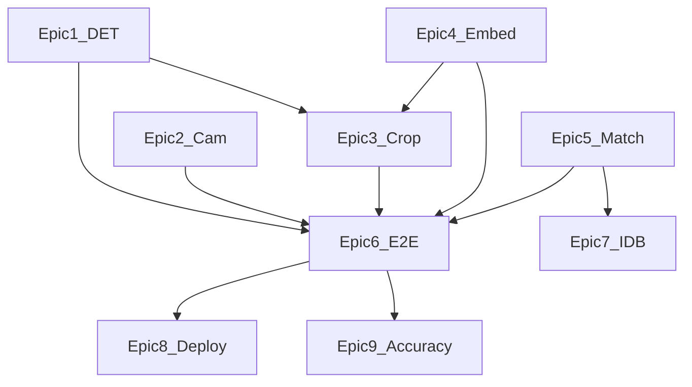

# PRE-PRD — Spike epics and findings

**Purpose:** Single pre-build gate: prove the riskiest parts in **throwaway** code before drafting [docs/PRD.md](docs/PRD.md) and starting the real Gatekeeper app.

**Authoritative inputs:** [docs/SPECS.txt](docs/SPECS.txt) (MVP, pipeline, testing scenarios 1–8, performance targets, deep dive, evaluation criteria), [docs/PRE-SEARCH.md](docs/PRE-SEARCH.md) (locked stack, detector fallback order, embedding spike §2, matching bands §3, IDB schema, Appendix A).

---

## Rules

- **Disposable spikes only.** Spike code is **expected to be thrown away**. Do not build Dexie schemas, admin routes, or production UI here.
- **Binary outcomes.** Each spike aims at proceed / adjust / invoke fallback—not feature completeness.
- **Minimal artifacts.** Prefer one HTML shell + one script + `models/` (or CDN URLs) unless a spike says otherwise.
- **Per-epic `spikes/` subfolders.** Each epic’s throwaway work lives in **its own** subdirectory under [`spikes/`](spikes/) (naming examples appear under **Conventions** and in the agent template). Do not mix multiple epics in one folder; if a later epic merges earlier spikes (e.g. Epic 6), do that **inside that epic’s** `spikes/` directory, not by reusing a sibling epic’s folder as the shared workspace.
- **Record numbers in Findings.** Latency, EP used, file sizes, and pass/fail feed the architecture doc and PRD later.

---

## Relationship to other docs

| Doc | Role |
| --- | --- |
| [docs/PRE-SEARCH.md](docs/PRE-SEARCH.md) | Decisions, rationale, ordered fallbacks, non-negotiable locks |
| [docs/SPECS.txt](docs/SPECS.txt) | Assignment requirements and grading scenarios |
| [docs/PRD.md](docs/PRD.md) | **After spikes:** prioritization, sequencing, acceptance criteria—not a third copy of requirement tables |

---

## Audience: AI agents and human supervisors

**Intent:** Supervisors assign **one epic at a time** (or explicit spike IDs). Agents execute **tasks in order** unless a task declares **parallel OK**. Agents **do not** merge spike code into the production app without supervisor sign-off.

**Conventions**

- **Task IDs:** `E{epic}-T{n}` (e.g. `E1-T2`).
- **STOP — supervisor:** Human must approve before continuing (e.g. fallback model choice, spend, public deploy).
- **Evidence:** Agent attaches to the epic **Findings** table: command outputs, screenshots, console logs, URLs (time-limited), and **hardware/browser** string (e.g. Chrome 1xx, MBP chip).
- **Spike folders:** Same as **Per-epic `spikes/` subfolders** in **Rules**—one epic, one directory under [`spikes/`](spikes/) (e.g. `spikes/epic-01-ort-detector/`).
- **Throwaway policy:** Those per-epic folders (or a disposable branch) are **disposable**; supervisor confirms deletion or archive after Findings are copied.
- **Spec links:** When a task cites SPECS, use [docs/SPECS.txt](docs/SPECS.txt); decisions already locked use [docs/PRE-SEARCH.md](docs/PRE-SEARCH.md).

---

## Assumption sweep (A / B / C)

**A — Hard constraints (physics / spec law)**  
Treat as fixed unless the course staff changes the assignment:

- Entire **ML inference in-browser**; **no server-side inference** ([docs/SPECS.txt](docs/SPECS.txt) MVP + pipeline).
- **YOLOv9** as primary detector narrative; fallbacks only per [docs/PRE-SEARCH.md](docs/PRE-SEARCH.md) ordered list.
- **Deploy** to a public HTTPS URL; project locks **Netlify** ([docs/PRE-SEARCH.md](docs/PRE-SEARCH.md)).
- MVP performance floors: e.g. detection **&lt; 500 ms**/frame (MVP tier), capture → decision **&lt; 3 s**, cold model load **&lt; 8 s**, preview **≥ 15 FPS** with detection running ([docs/SPECS.txt](docs/SPECS.txt) performance table).
- **$0** AI/tool spend cap unless logged exception ([docs/PRE-SEARCH.md](docs/PRE-SEARCH.md) D12).

**B — Conventions (challenge only if spikes force it)**

- Default **640×640** letterboxed input to detector; **INT8** before FP16 for size/speed.
- **Cosine** on **L2-normalized** embeddings; evaluation **bands** vs single 0.75 threshold ([docs/PRE-SEARCH.md](docs/PRE-SEARCH.md) §3).
- **Dexie.js** for IndexedDB in the real app—**not** used in spikes unless Epic 7 explicitly needs it.

**C — Unknown until spikes prove**

| Unknown | Epic |
| --- | --- |
| Exact detector checkpoint + ONNX export + ORT-web operator compatibility | 1 |
| Measured detection latency (WebGL vs WASM) on benchmark MBP | 1, 6 |
| Time from camera permission to first frame | 2 |
| Crop/tensor contract from bbox → embedder input | 3 |
| Chosen embedding ONNX + preprocess + output dim + embed latency | 4 |
| Whether default similarity bands need calibration | 5, 9 |
| Full-pipeline wall clock vs **3 s** | 6 |
| 50-user IDB write + full-gallery scan time + quota | 7 |
| Cold model load over HTTPS on Netlify vs **8 s** | 8 |
| Formal ≥20-face TPR/FPR (protocol + optional 5-face smoke only in PRE-PRD phase) | 9 |

---

## Kill criteria and fallback triggers

- **Detector gate zero (Epic 1):** If after a **2 h** focused attempt the primary path cannot **load and run** the chosen ONNX in ORT-web without fatal operator errors, **document the error** and move to the next row in [docs/PRE-SEARCH.md](docs/PRE-SEARCH.md) **Ordered detector fallback list** (smaller v9 → v8-face → BlazeFace-class → TF.js last resort). Do not spend a full day on a dead export without escalating.
- **Embedder shortlist (Epic 4):** If **no** license-clean candidate loads in ORT-web after **2–4 h** first touch on **2–3** options, stop and widen search **within $0**; if still blocked, record as **project risk** and course escalation—not a paid API workaround for inference (violates spec).
- **Deploy / model size (Epic 8):** If Netlify (or chosen tier) rejects asset size or cold load **repeatedly** exceeds **8 s** after reasonable caching/versioning, record constraint; adjust model artifact (smaller detector step, INT8) per PRE-SEARCH fallback—not silent failure.
- **Memory:** If Chrome tab **&gt; ~500 MB** during scan on benchmark hardware, treat as fail for deep-dive posture; shrink input / model per PRE-SEARCH **Ordered detector fallback** step 2.
- **All failures:** Log **reason** (export log, ORT message, EP used) in Epic Findings—interview story is “we escalated when X.”

---

## Gate flow


---

## Next actions (memory hook)

Short reminders that are easy to forget—not all due at once.

- **Spike order:** With Epics **1–2** done, the next PRE-PRD spike is **Epic 3** (synthetic bbox → letterbox/crop → tensor). You do **not** need full **decode + NMS** to complete Epic 3.
- **Before “real” detection UX** (live boxes from the model): add **decode + NMS** (or an API that outputs boxes). Epic 1 **stubbed** postprocess on purpose.
- **Before citing speeds** for interviews or writeups: re-run measurements in **Chrome on the real target machine** (e.g. MBP); Cursor’s embedded Chromium is **not** the canonical benchmark.
- **When building the production app:** choose whether the **generic** detector (Epic 1 spike) is enough for crops, or move to a **face-focused** model for tighter face boxes—**product choice**, not locked by Epic 1.

---

## Spec traceability matrix

| Epic | SPECS / PRE-SEARCH anchors |
| --- | --------- |
| 1 | MVP detection + bbox; pipeline stage 1; onnxruntime-web sample; perf **&lt; 500 ms**/frame; load **&lt; 8 s**; PRE-SEARCH gate zero + fallback list |
| 2 | MVP webcam; Testing **#1** (feed after permission); **≥ 15 FPS** preview with detection; `getUserMedia`; PRE-SEARCH D18 |
| 3 | Pipeline crop → resize; independently testable stages; letterbox |
| 4 | Pipeline stage 2 (128/512-d); PRE-SEARCH §2 S1–S5; deep-dive embed **&lt; 150 ms** |
| 5 | Pipeline stage 3; cosine; Evaluation criteria + PRE-SEARCH §3 bands |
| 6 | Testing **#3** (GRANTED + name **&lt; 3 s**); end-to-end budget |
| 7 | **≥ 50** users without degraded matching; PRE-SEARCH Appendix A **4.3** |
| 8 | MVP deployed public; HTTPS; Netlify; model hosting + CORS/same-origin |
| 9 | **≥ 85%** TPR, **≤ 5%** FPR on **≥ 20** faces; Testing **#4–#6** |
| 10 | SPECS AI cost analysis; PRE-SEARCH AI cost § + `AI_COST_LOG` |

**Coverage check — SPECS Testing scenarios 1–8:** Epics **2** (#1), **6+implementation** (#2–3), **9** (#4–6), **7+implementation** (#7), **implementation** (#8 log viewer).

**Where to find agent detail:** Each epic below has spike tables + Findings. **Step-by-step features and tasks** are in [§ Detailed epic breakdowns](#detailed-epic-breakdowns-ai-agents--supervisors).

---

## Epic 1 — ORT-web + detector gate zero (YOLOv9 first)

**Spec pressure:** [docs/SPECS.txt](docs/SPECS.txt) YOLOv9 ONNX via onnxruntime-web, live detection + bbox, MVP **&lt; 500 ms**/frame detection, **&lt; 8 s** cold load; deep-dive detection targets optional in findings.

**Open questions this epic answers:** Does the chosen (or placeholder-then-v9) ONNX load on **webgl** / **wasm**? Operator failures? Ballpark ms/frame on benchmark MBP?

**Spike status:** **Completed** (2026-04-17). Tasks **E1-T1–E1-T10** satisfied in **Findings — Epic 1** below. Repo folder `spikes/epic-01-ort-detector/` is optional to keep — **deletable** once findings are accepted (see [spikes/index.md](../spikes/index.md)).

| Spike | Smallest check | Timebox | Pass / fail | Adjust if fail |
| --- | --- | --- | --- | --- |
| **1a** | One HTML page: `InferenceSession.create` for **one** ONNX with `executionProviders: ['webgl','wasm']`; log EP used and console errors | 1 h | Session creates; first run completes without uncaught op error | Try wasm-only; note ops; advance **fallback list** |
| **1b** | Static image → preprocess (e.g. 640×640, `[0,1]` per SPECS snippet) → `session.run` → record output tensor shapes (NMS/postprocess **may be stubbed**) | 1 h | Deterministic shapes; no throw; values finite | Fix preprocess layout; try smaller input |
| **1c** | If Epic 2 done: webcam frame → **one** detect timing repeated **N≥10**; median vs **500 ms** | 30 min | Median **&lt; 500 ms** on MBP Chrome (MVP tier) | Smaller model step / INT8 / fallback row |

**Findings — Epic 1**

| Date | Result | Notes |
| --- | --- | --- |
| **2026-04-17** | **Pass** (static gate zero, tasks **E1-T1–E1-T8**; **E1-T9** on next row) | **Artifact:** `spikes/epic-01-ort-detector/` — run `python3 -m http.server` from that directory (not `file://`). **Checkpoint:** Hugging Face [Kalray/yolov9](https://huggingface.co/Kalray/yolov9) **`yolov9t.onnx`** (general YOLOv9-tiny **COCO**, not face-specific; face checkpoint still PRE-SEARCH row 1 narrative). **Size:** 8,735,041 bytes (**~8.33 MiB**). **Precision:** **FP32** (ONNX `FLOAT`; not INT8). **ORT:** `onnxruntime-web@1.22.0` (jsDelivr); `wasmPaths` set to explicit `{ mjs, wasm }` under package **`/dist/`** (fixes WASM loader resolving `…/1.x.x/ort-wasm-*.mjs` without `/dist/` on **1.20.1**). **EP (how determined):** `InferenceSession.create` options **`['webgl','wasm']`**, `graphOptimizationLevel: 'all'` per PRE-PRD/SPECS. **Cursor embedded Chromium** (Chrome/142, Electron/39) console: ORT **`removing requested execution provider "webgl" … backend not found`** → **inference executed on WASM** for successful run; on **1.20.1** earlier attempt: WASM dropped (bad dynamic import URL) + WebGL **`cannot resolve operator 'Split' with opsets: ai.onnx v19`** (full string captured in spike logs). No stable JS API for “active EP”; ground truth = ORT console lines. **I/O tensors:** input **`images`** `float32` **`[1,3,640,640]`**; output **`predictions`** `float32` **`[1,84,8400]`** (705,600 elements). **Preprocess validated:** synthetic still → **NCHW**, **`[0,1]`**, shape exact per SPECS sample. **Postprocess:** **NMS/decode not validated** — stub checks finiteness + notes raw head for future NMS. **Timing:** single static **`session.run`** ~**190 ms** (one shot). **Gate zero / fallback:** **N** — model loads and runs on WASM in this spike; **no** PRE-SEARCH detector row change. **Supervisor:** if product requires **WebGL** on this artifact, need different ORT bundle/export or alternate ONNX (row 2–3) — WebGL path not proven here. |
| **2026-04-17** | **Pass** **E1-T9** (live-frame median vs **500 ms**) | **Method:** `getUserMedia` (Epic 2 constraints: ideal **1280×720**, `facingMode: 'user'`; actual **640×480**); each tick: **letterbox** draw to **640×640** → **NCHW** **`[0,1]`** → **`session.run`** (same ONNX/session as E1-T1–T8). **N = 12** timed iterations; **1× warmup** `session.run` excluded from stats. **Samples (ms):** 183.30, 182.10, 183.60, 183.50, 181.60, 182.10, 182.30, 182.50, 183.40, 182.00, 183.80, 186.80. **Median preprocess+infer:** **182.90 ms** (min **181.60**, max **186.80**, ~p90 **183.80**). **MVP detection &lt; 500 ms/frame:** **PASS**. **Hardware/browser:** same **Cursor embedded Chromium** smoke as prior row (not a substitute for benchmark **MBP Chrome** — re-run spike there for interview numbers). **Supervisor gate** (median ≥ 500 ms): **not triggered**. |

---

## Epic 2 — Webcam capture and preview path

**Spec pressure:** [docs/SPECS.txt](docs/SPECS.txt) MVP webcam; Testing **#1** (feed within **2 s** of granting permission); preview **≥ 15 FPS** while detection runs (measure after infer loop exists).

**Open questions this epic answers:** Time-to-first-frame? Stable resolution vs PRE-SEARCH D18?

**Spike status:** **Completed** (2026-04-17). Tasks **E2-T1–E2-T6** satisfied in **Findings — Epic 2** below. Repo folder `spikes/epic-02-webcam-preview/` is optional to keep — **deletable** once findings are accepted (see [spikes/index.md](../spikes/index.md)).

| Spike | Smallest check | Timebox | Pass / fail | Adjust if fail |
| --- | --- | --- | --- | --- |
| **2a** | `getUserMedia` → `<video>`; timestamp from permission grant to **first `loadeddata` or frame** | 30 min | **≤ 2 s** on MBP Chrome | Constraints, HTTPS, device enum |
| **2b** | `requestAnimationFrame` loop: video → canvas; optional FPS counter (no ML) | 30 min | Stable loop; FPS baseline documented | Throttle; note for later infer cadence |

**Findings — Epic 2**

| Date | Result | Notes |
| --- | --- | --- |
| **2026-04-17** | **Pass** (tasks **E2-T1–E2-T6**; artifact `spikes/epic-02-webcam-preview/`) | **Artifact:** `spikes/epic-02-webcam-preview/` — serve over `http://localhost` or HTTPS (not `file://`); detail + per-task checklist in `FINDINGS.md`; screenshots `evidence-screenshot.png`, `evidence-log-fps.png`. **Grant→first frame (SPECS #1 / F2.2):** **359.4 ms** (gate ≤2000). **Start→first frame (E2-T3):** **389.7 ms** (gate ≤2000); first-frame signal **`loadeddata`** (`requestVideoFrameCallback` also armed as fallback). **Resolution:** **640×480** actual vs **1280×720** ideal (D18 floor met). **FPS (canvas-only, ML off):** **~120** (method: count rAF `drawImage` per rolling 1s); SPECS preview ≥15 with detection — baseline exceeds. **E2-T5:** `try/catch` + `#status`; synthetic invalid `deviceId` → **`OverconstrainedError`**, logged, no uncaught rejection. **Browser:** **Cursor 3.1.15** embedded Chromium (**Chrome/142**, **Electron/39.8.1**) on **macOS** — same caveat as Epic 1: not a substitute for benchmark **MBP Chrome** for interview numbers. **E2-T3 supervisor gate:** not triggered. |

---

## Epic 3 — Letterbox / crop contract

**Spec pressure:** [docs/SPECS.txt](docs/SPECS.txt) pipeline crop + resize; [docs/PRE-SEARCH.md](docs/PRE-SEARCH.md) letterbox; stages independently testable.

**Open questions this epic answers:** How bbox → padded crop → embedder input tensor?

**Spike status:** **Completed** (2026-04-17). Tasks **E3-T1–E3-T7** satisfied in **Findings — Epic 3** below. Repo folder `spikes/epic-03-letterbox-crop/` is optional to keep — **deletable** once findings are accepted (see [spikes/index.md](../spikes/index.md)). **Re-validate** **E3-T4–E3-T6** when Epic 4 freezes embedder input **H×W** (placeholder **112×112** in spike — not the final contract).

| Spike | Smallest check | Timebox | Pass / fail | Adjust if fail |
| --- | --- | --- | --- | --- |
| **3a** | On a static canvas frame, **fake bbox** → extract region → resize to embedder H×W → float tensor sanity (min/max, shape) | 1 h | Shape matches embedder; no clipping bugs | Adjust margin / square policy |

**Findings — Epic 3**

| Date | Result | Notes |
| --- | --- | --- |
| **2026-04-17** | **Pass** (tasks **E3-T1–E3-T7**; artifact `spikes/epic-03-letterbox-crop/`) | **Artifact:** `spikes/epic-03-letterbox-crop/` — `index.html` + `main.js` + baked **`test-image.png`** (deterministic **64×64** RGB); serve with `npx serve .` (not `file://` — `import.meta.url` asset load). Per-task checklist + math in **`FINDINGS.md`**. **Crop margin %:** **10%** of `max(w,h)` on **clamped** bbox (`MARGIN_FRAC = 0.1`); expand symmetrically around center, then **clamp** to image. **Letterbox vs stretch:** square crop → placeholder **112×112** → **uniform scale** (no bars). **Future non-square embedder H×W:** default **letterbox** (fit inside, pad — **provisional** until Epic 4 model card); independent axis stretch not default. **Coord system (detector → canvas):** **canvas 2D pixels**, origin **top-left**, **+x** right, **+y** down; bbox `(x,y,w,h)` non-negative; integer after round; detector uses **same space** as crop canvas (scale video to canvas first). **Square crop:** `side = max(w,h)`, cap `min(side, imgW, imgH)`, center on box center, clamp `x0,y0`. **Placeholder embedder size:** **112×112** (`EMBED_HW`) — **re-run E3-T4–E3-T6** after Epic 4 picks ONNX. **Tensor (provisional):** **Float32** **CHW** **RGB**, `/255` → **[0,1]**; shape **`[3,112,112]`** with placeholder; `normalizeForEmbedder` stub for mean/std later. **E3-T6:** min/max/mean/std logged in plausible **[0,1]** range. Edge-case clamps (negative origin, oversized, off-image) **no throw**; degenerate zero-area path documented in spike. |

---

## Epic 4 — Embedding model shortlist (ONNX in ORT-web)

**Spec pressure:** [docs/SPECS.txt](docs/SPECS.txt) stage 2 embedding (128-d or 512-d); [docs/PRE-SEARCH.md](docs/PRE-SEARCH.md) §2 S1–S5; deep-dive **&lt; 150 ms**/embed; L2-normalize for cosine.

**Open questions this epic answers:** Which ONNX wins on load + latency + sanity?

**Spike status:** **Completed** (2026-04-17). Tasks **E4-T1–E4-T9** satisfied in **Findings — Epic 4** below. Full tables, task pass/fail, supervisor **E4-T2** wording, and verbatim ORT errors: [spikes/epic-04-embedding-onnx/FINDINGS.md](../spikes/epic-04-embedding-onnx/FINDINGS.md).

| Spike | Smallest check | Timebox | Pass / fail | Adjust if fail |
| --- | --- | --- | --- | --- |
| **4a** | Table **2–3** candidates: license, source URL, input size, output dim | 45 min | Written shortlist in findings | Expand search ($0 only) |
| **4b** | Load winner in ORT-web; **one** synthetic/fixed crop → correct output shape | 1 h | Shape matches spec (e.g. 1×512) | Next candidate |
| **4c** | Same-person two crops vs different-person: **cosine order** correct (informal, small set) | 1 h | Same &gt; different on average | Revisit preprocess or model |
| **4d** | **N** embed runs: WebGL vs WASM ms | 30 min | Note p50/p90; compare to **150 ms** stretch | WASM acceptable for MVP if documented |

**Findings — Epic 4**

| Date | Result | Notes |
| --- | --- | --- |
| **2026-04-17** | **Pass** (tasks **E4-T1–E4-T7**, **E4-T9**; model + preprocess + sanity) | **Artifact:** `spikes/epic-04-embedding-onnx/` — HTTP only (not `file://`). **ORT:** `onnxruntime-web@1.22.0` (jsDelivr); `wasmPaths` under package **`/dist/`** (same convention as Epic 1). **Winner for Epic 6:** **`w600k_mbf.onnx`** (InsightFace MobileFaceNet / `w600k`, `buffalo_s` on HF): https://huggingface.co/deepghs/insightface/resolve/main/buffalo_s/w600k_mbf.onnx — **~12.99 MiB** (13 616 099 bytes). **Shortlist:** `w600k_mbf` (chosen), `w600k_r50` (~174 MB class), ONNX Model Zoo ArcFace — detail in sidecar. **License:** InsightFace **code** MIT; **pretrained weights** may carry non-commercial / research terms — **E4-T2** supervisor approval + course check recorded in sidecar. **I/O:** input **`input.1`**, **`[N,3,112,112]`** **float32** **NCHW** RGB; preprocess **`(pixel - 127.5) / 127.5`**; output tensor name **`516`**, shape **`[1,512]`** **float32**; **L2-normalize in JS** before cosine (raw ‖e‖ ≈ 11). **E4-T7:** same-identity cosine **0.5240** vs mean cross-identity **0.4127** → **PASS**. **Test images:** same-origin **`assets/*.jpg`** (avoids cross-origin canvas taint). |
| **2026-04-17** | **Pass** **E4-T8** (latency; forced EP) | **Measure:** preprocess + **`session.run`** per iter; **n = 22** after **1** warmup. **Environment:** **Cursor** embedded Chromium — **not** a substitute for benchmark **MBP Chrome**. **WebGL:** ORT `removing requested execution provider "webgl" from session options because it is not available: backend not found.` **WebGL-only** `InferenceSession.create`: `no available backend found. ERR: [webgl] backend not found.` **WASM-only:** **p50 18.900 ms**, **p90 19.200 ms** (min **18.400**, max **20.600**) — **&lt; 150 ms** embed stretch **PASS**. **Re-run** WebGL vs WASM in **desktop Chrome** for interview-grade EP comparison. |

---

## Epic 5 — 1:N matching sanity (JS only)

**Spec pressure:** [docs/SPECS.txt](docs/SPECS.txt) cosine similarity; evaluation table + [docs/PRE-SEARCH.md](docs/PRE-SEARCH.md) §3 bands; best match + optional margin.

**Open questions this epic answers:** Is pure-JS cosine + argmax correct? Margin rule worth carrying?

| Spike | Smallest check | Timebox | Pass / fail | Adjust if fail |
| --- | --- | --- | --- | --- |
| **5a** | L2-normalize + cosine + argmax over **K** random unit vectors; spot-check vs hand calc | 30 min | Matches expected argmax | Fix math |
| **5b** (optional) | Require **Δ ≥ 0.05** vs runner-up to grant strong accept | 30 min | Document false reject/accept tradeoff | Tune in PRD |

**Findings — Epic 5**

| Date | Result | Notes |
| --- | --- | --- |
| **2026-04-17** | **Pass** (E5-T1–E5-T6) | **Artifact:** `spikes/epic-05-matching-js/`. **§3 score:** L2-normalize, cosine = dot ∈ [-1,1], then **`(1 + cosine) / 2`** ∈ [0,1] so PRE-SEARCH §3 thresholds apply as written. **Bands:** strong ≥ **0.80**; weak **[0.65, 0.80)**; reject **&lt; 0.65** (§3 **&lt; 0.60** “unknown” copy — see sidecar). **Best match:** highest cosine; **tie → lowest index**; one gallery row → `secondScore` null. **Margin:** implemented (**Δ ≥ 0.05** vs runner-up for “strong GRANTED” when a runner-up exists); pros/cons in sidecar. **Tests:** `node --test spikes/epic-05-matching-js/matching.test.mjs` — **10** pass. **Supervisor still open:** weak band → **UNCERTAIN** vs **GRANTED-with-warning** (sidecar recommends UNCERTAIN). **Detail:** [spikes/epic-05-matching-js/FINDINGS.md](spikes/epic-05-matching-js/FINDINGS.md). |

---

## Epic 6 — End-to-end toy pipeline

**Spec pressure:** [docs/SPECS.txt](docs/SPECS.txt) Testing **#3** dry run: GRANTED path + correct identity signal in **&lt; 3 s** from capture to decision.

**Open questions this epic answers:** Which stage dominates latency?

| Spike | Smallest check | Timebox | Pass / fail | Adjust if fail |
| --- | --- | --- | --- | --- |
| **6a** | In-memory: 1 enrolled embedding; second crop from **same** photo → high cosine | 30 min | Score in “strong” band per §3 | Fix norm/preprocess |
| **6b** | One shot: detect (or fixed crop) → embed → match; `performance.now()` total | 1 h | **&lt; 3 s** total on MBP | Profile; downgrade model step |

**Findings — Epic 6**

| Date | Result | Notes |
| --- | --- | --- |
| **2026-04-17** | **Pass** (E6-T1–E6-T7) | **Artifact:** `spikes/epic-06-e2e-toy-pipeline/` — [spikes/epic-06-e2e-toy-pipeline/FINDINGS.md](spikes/epic-06-e2e-toy-pipeline/FINDINGS.md). Single page: detect (YOLO `[1,84,8400]` decode + NMS) → head-band heuristic on COCO person box → Epic 3 crop → Epic 4 `w600k_mbf` → Epic 5 match bands. **Scores:** measured headless browser run — same-person (Path B) similarity01 **0.9228** (strong, ≥0.80); stranger (Path C) **0.4965** (reject). Offline sanity same assets: **~0.94** / **~0.52**. **Timing (measured):** cold ONNX sessions **~375 ms**; steady-state total **~462 ms** (&lt; ~3 s; dominant cost **detect A+C**). Repro: `verify-browser.mjs` + `.epic6-verify-node` (see sidecar). **E6-T6:** no steady-state &gt; ~3 s gate triggered. |

---

## Epic 7 — IndexedDB scale headroom

**Spec pressure:** [docs/SPECS.txt](docs/SPECS.txt) **≥ 50** enrolled without degraded matching; [docs/PRE-SEARCH.md](docs/PRE-SEARCH.md) Appendix A **4.3** empirical.

**Open questions this epic answers:** Quota errors? Full-gallery scan ms at 50?

| Spike | Smallest check | Timebox | Pass / fail | Adjust if fail |
| --- | --- | --- | --- | --- |
| **7a** | Throwaway page: insert **50** synthetic `users` (float32 embeddings + small thumb); loop all cosine | 1 h | No quota throw; scan completes | Shrink thumbs; note browser |
| **7b** | Estimate storage footprint | 15 min | Document MB used | — |

**Findings — Epic 7**

| Date | Result | Notes |
| --- | --- | --- |
| **2026-04-17** | **Pass** (E7-T1–E7-T6) | **Artifact:** `spikes/epic-07-indexeddb-scale/` — [spikes/epic-07-indexeddb-scale/FINDINGS.md](spikes/epic-07-indexeddb-scale/FINDINGS.md). Raw IndexedDB; 512-d floats + 16×16 thumbs; **no quota errors**. **Typical middle scan time:** ~**0.017 ms** per normalize+50-dot pass (25 samples, inner×200 for timer resolution; headless Chromium — see sidecar). **`storage.estimate`:** ~**0.12 MiB** used vs ~**4230 MiB** quota on verify host. Repro: `node verify-browser.mjs` + `.epic7-verify-node` (see README). |

---

## Epic 8 — Deploy path smoke (Netlify)

**Spec pressure:** [docs/SPECS.txt](docs/SPECS.txt) MVP public deploy; HTTPS; camera; ~25 MB class model acceptable per PRE-SEARCH.

**Open questions this epic answers:** Does production-like HTTPS load models and camera together? Cold load vs **8 s**?

| Spike | Smallest check | Timebox | Pass / fail | Adjust if fail |
| --- | --- | --- | --- | --- |
| **8a** | Deploy minimal static site: page + **small** ONNX (or full if ready) + ORT; test `getUserMedia` + fetch model same-origin | 1–2 h | HTTPS OK; session loads; camera works | CORS path; chunking; host limits |

**Findings — Epic 8**

| Date | Result | Notes |
| --- | --- | --- |
| | | Cold load ms (uncached) |
| | | Cache headers / asset URL pattern |
| | | Netlify tier notes |

---

## Epic 9 — Accuracy protocol (PRE-PRD phase)

**Spec pressure:** [docs/SPECS.txt](docs/SPECS.txt) **≥ 85%** TPR, **≤ 5%** FPR on **≥ 20** faces; Testing **#4–#6**.

**Open questions this epic answers:** How will formal eval run? Does a tiny smoke test break thresholds?

| Spike | Smallest check | Timebox | Pass / fail | Adjust if fail |
| --- | --- | --- | --- | --- |
| **9a** | **Protocol only:** define 20+ identity set, lighting buckets, enrollment rules (single photo vs multi-angle stretch), GRANTED/DENIED labeling | 1 h | **PASS** — [spikes/epic-09-accuracy-protocol/](spikes/epic-09-accuracy-protocol/) | — |
| **9b** (optional) | **5-face** smoke: 1 enrolled vs stranger; unknown → DENIED/Unknown; two-face prompt | 1 h | **N/A** — skipped pending supervisor + safe fixture; see Findings | Tune bands in PRD |

**Findings — Epic 9**

| Date | Result | Notes |
| --- | --- | --- |
| 2026-04-17 | Protocol + mapping complete | [spikes/epic-09-accuracy-protocol/FINDINGS.md](spikes/epic-09-accuracy-protocol/FINDINGS.md) — optional smoke **skipped** (awaiting approval / fixture); **E9-T6 supervisor sign-off still required** before real faces or live trials; threshold calibration **TBD** after first real run |

---

## Epic 10 — Observability / submission hygiene

**Spec pressure:** [docs/SPECS.txt](docs/SPECS.txt) AI cost analysis; [docs/PRE-SEARCH.md](docs/PRE-SEARCH.md) automate cost tracking.

**Open questions this epic answers:** Is the cost log template ready day one of implementation?

| Action | Smallest check | Timebox | Pass / fail | Adjust if fail |
| --- | --- | --- | --- | --- |
| **10a** | Ensure **`docs/AI_COST_LOG.md`** exists with header + one-row template | 15 min | File created | Create on implementation day 1 |
| **10b** | Bookmark provider dashboards; calendar **weekly** reconcile | 15 min | Done | — |

**Findings — Epic 10**

| Date | Result | Notes |
| --- | --- | --- |
| | | `AI_COST_LOG.md` created? Y/N |
| | | Weekly reminder set? Y/N |

---

## PRE-SEARCH Appendix A — spike row mapping

Rows marked **Spike** or **prove in spike** in [docs/PRE-SEARCH.md](docs/PRE-SEARCH.md) Appendix A map here:

| Appendix A topic | Epic |
| --- | --- |
| 2.4 ORT-web verified; operator issues | **1** |
| 4.3 Max practical IDB size | **7** |
| Spike-only outcomes (exact checkpoint, measured headroom, EP) | **Findings tables** in 1, 4, 7, 8 |

**Deferred to implementation (not PRE-PRD spikes):** Full admin CRUD, entry log UI, sort/filter table, bulk JSON import, cooldown UX, side-by-side match UI, all eight scripted tests end-to-end, architecture PDF, demo video.

---

## After spikes — handoff to [docs/PRD.md](docs/PRD.md)

- [ ] Final detector artifact name(s), EP default, ms/frame on MBP Chrome
- [ ] Final embedder artifact, dim, preprocess recipe, ms/embed
- [x] Crop/letterbox spec frozen from Epic 3
- [ ] Matching bands + optional margin from Epics 5 and 9
- [ ] Netlify + asset strategy from Epic 8
- [ ] MVP vs stretch ordering (bulk import after single enroll; spoof stretch; ≥3 enhancements)
- [ ] Only then populate `docs/PRD.md` with user stories, sequencing, and acceptance criteria

---

## Detailed epic breakdowns (AI agents + supervisors)

For each epic: **Features** are outcomes; **Tasks** are ordered work units; **Supervisor gates** require human decision before proceeding.

### Agent prompt template (supervisor copy-paste)

Supervisors: replace the `ALL_CAPS` placeholders, then paste into the agent chat.

```text
You are executing a PRE-PRD spike epic under human supervision.

Source of truth: repo file PRE-PRD.md — section "Detailed epic breakdowns", Epic EPIC_NUMBER.
Also respect: docs/PRE-SEARCH.md (fallbacks, locks) and docs/SPECS.txt (requirements).

Scope for this run:
- Epic: EPIC_NUMBER
- Tasks for this session (task IDs from PRE-PRD): TASK_ID_LIST
  Example: "E1-T1 through E1-T8" or "E4-T1, E4-T2, E4-T3"
- Disposable artifact location: spikes/EPIC_SLUG/
  Example: spikes/epic-01-ort-detector/
  Do not merge into production app paths without supervisor OK.

Rules:
1. Work tasks in order unless a task explicitly allows parallel work.
2. Spike code is throwaway; optimize for clarity and evidence, not polish.
3. At every "STOP — supervisor" or "Supervisor gates" item: halt, print a short summary + recommendation, and wait—do not assume approval.
4. After each task, note pass/fail against acceptance criteria.
5. When finished with the assigned tasks, update the "Findings — Epic EPIC_NUMBER" table in PRE-PRD.md with dated rows (hardware, browser, key numbers, errors).

Evidence to include in your final message:
- What you built (file paths)
- Commands run (if any) and outcomes
- Metrics captured (ms, EP used, tensor shapes, etc.)
- Screenshot or paste of console if useful
- Any fallback triggered and exact error strings

If blocked for >30 minutes on one task, stop and report with logs; do not swap models or spend money without supervisor direction.
```

### Epic 1 — ORT-web + detector gate zero

**Goal:** Prove detector ONNX loads and runs in `onnxruntime-web` with measurable latency; document EP and fallback path if gate zero fails.

| Features | Description |
| --- | --- |
| F1.1 | Minimal static page loads ORT script + one ONNX from local or same-origin URL |
| F1.2 | `InferenceSession.create` uses `executionProviders: ['webgl','wasm']` and logs which EP actually runs |
| F1.3 | Single `session.run` succeeds on a **static** preprocessed tensor; output shapes recorded |
| F1.4 | Optional: webcam frame path times **N** inferences; median vs **500 ms** MVP target |
| F1.5 | Kill-criteria doc: if gate fails, **logged ORT error** + next fallback row from PRE-SEARCH |

| ID | Task | Acceptance criteria |
| --- | --- | --- |
| E1-T1 | Create disposable folder + `index.html` with ORT loaded (CDN or pinned bundle per team choice) | Page loads blank UI + no console error from ORT import |
| E1-T2 | Add `models/` copy step or fetch URL; document file name + **byte size** | Findings table updated with MB |
| E1-T3 | Implement `InferenceSession.create(path, { executionProviders: ['webgl','wasm'], graphOptimizationLevel: 'all' })` | Session exists; log **active EP** if API allows; else infer from performance + docs |
| E1-T4 | First run: catch and log **full** error text on failure | Error string captured in Findings |
| E1-T5 | Implement preprocess for **one** still image → `float32` tensor `[1,3,640,640]` value range per SPECS sample (`[0,1]`) | Tensor stats min/max finite; shape exact |
| E1-T6 | Map `session.run` inputs to model’s **actual** input names (inspect model or metadata) | No input-name mismatch throw |
| E1-T7 | Record raw output tensor names, shapes, **dtype** | Pasted into Findings |
| E1-T8 | Stub or minimal postprocess: assert outputs are usable for future NMS (even if TODO) | Documented “NMS not validated” or partial parse |
| E1-T9 | **If Epic 2 ready:** pipe one video frame through same preprocess + run; loop **N≥10**; median ms | Median recorded; compare to 500 ms |
| E1-T10 | Update **Findings — Epic 1** + link artifact folder | Supervisor can reproduce |

**Supervisor gates**

- **STOP after E1-T4 if hard fail:** Approve **placeholder tiny ONNX** only to prove ORT wiring, or approve **immediate fallback** to next detector in PRE-SEARCH list (document narrative).
- **STOP after E1-T9 if median ≥ 500 ms:** Approve smaller input, INT8 artifact, or fallback row—agent does not silently swap production story.

---

### Epic 2 — Webcam capture and preview path

**Goal:** Reliable `getUserMedia` → video → canvas; measure time-to-first-frame and baseline FPS.

| Features | Description |
| --- | --- |
| F2.1 | User grants camera; video stream binds to `<video>` |
| F2.2 | **≤ 2 s** from permission resolve to first rendered frame (SPECS Testing #1) |
| F2.3 | `requestAnimationFrame` draws video to canvas; optional FPS counter |
| F2.4 | Constraints align with PRE-SEARCH D18 (`ideal` 1280×720, `facingMode: 'user'`, floor 640×480) |

| ID | Task | Acceptance criteria |
| --- | --- | --- |
| E2-T1 | Disposable page on **HTTPS** or `localhost` | Camera API available |
| E2-T2 | `getUserMedia({ video: { ideal: { width: 1280, height: 720 }, facingMode: 'user' } })` | Stream active; log **actual** `videoWidth` / `videoHeight` |
| E2-T3 | Measure `performance.now()` delta: click “Start” → first `loadeddata` or first `requestVideoFrameCallback` if used | Delta **≤ 2000 ms** on benchmark machine or documented exceed |
| E2-T4 | Canvas draw loop + FPS estimate (frames counted per second) | FPS number logged (ML off) |
| E2-T5 | Handle denial: user-visible message | No uncaught rejection |
| E2-T6 | Update **Findings — Epic 2** | Supervisor sign-off on latency |

**Supervisor gates**

- **STOP if E2-T3 repeatedly > 2 s:** Try device list, lower constraints, or different browser; document for PRD.

---

### Epic 3 — Letterbox / crop contract

**Goal:** Deterministic **bbox → crop → embedder-sized tensor** independent of detector quality.

| Features | Description |
| --- | --- |
| F3.1 | Given canvas + **synthetic bbox** (x,y,w,h), extract ROI with optional margin |
| F3.2 | Resize to embedder input **H×W** with letterbox or stretch (document choice) |
| F3.3 | Float tensor + normalization hook matches Epic 4 embedder contract |

| ID | Task | Acceptance criteria |
| --- | --- | --- |
| E3-T1 | Load a **fixed** test image to canvas (file input or baked asset) | Reproducible pixels |
| E3-T2 | Draw or hard-code bbox; implement crop clamped to image bounds | No negative indices; edge bbox works |
| E3-T3 | Implement **square** crop policy (e.g. expand shorter side) if required by embedder | Document math in Findings |
| E3-T4 | Resize to target **H×W** (from Epic 4 shortlist winner—use placeholder 112×112 or 112×112 only until known) | Output dimensions exact |
| E3-T5 | Convert to `Float32Array` **CHW** or **HWC** per embedder need | Channel order documented |
| E3-T6 | Sanity: mean pixel in plausible range after norm | Findings note min/max |
| E3-T7 | Update **Findings — Epic 3** | Margin % and coord convention frozen |

**Supervisor gates**

- **STOP before E3-T4 if embedder H×W unknown:** Agent uses explicit placeholder dimensions and **re-runs E3-T4** after Epic 4 picks model.

---

### Epic 4 — Embedding model shortlist (ONNX in ORT-web)

**Goal:** Select license-clean embedder ONNX; prove load + forward + informal same-vs-different ordering + latency.

| Features | Description |
| --- | --- |
| F4.1 | Written shortlist of **2–3** candidates with license, URL, input size, output dim |
| F4.2 | Winner loads in ORT-web; tensor contract documented |
| F4.3 | Informal same-person vs different-person cosine ordering holds |
| F4.4 | Embed latency **N** runs WebGL vs WASM |

| ID | Task | Acceptance criteria |
| --- | --- | --- |
| E4-T1 | Build comparison table for **2–3** models | All columns filled in Findings |
| E4-T2 | **STOP:** Supervisor confirms **license** OK for submission context | Log approval in Findings |
| E4-T3 | Download ONNX; record **MB**; version filename | In `models/` or URL |
| E4-T4 | ORT session for embedder; match preprocess (mean/std vs [0,1]) from model card | First run succeeds |
| E4-T5 | Single forward: output shape matches expected **vector dim** | e.g. `[1,512]` or `[512]` documented |
| E4-T6 | L2-normalize output in JS for downstream cosine | Unit sanity: norm ≈ 1 |
| E4-T7 | Collect **≥2** crops same identity, **≥2** different; compute cosines | Same &gt; different on average |
| E4-T8 | Benchmark **≥20** embed iterations; drop warmup | p50/p90 ms; WebGL vs WASM |
| E4-T9 | Update **Findings — Epic 4** | Pick **one** winner for Epic 6 |

**Supervisor gates**

- **STOP at E4-T2** before any non–public-domain / unclear-license weight use.
- **STOP if all candidates fail ORT:** Approve widening search ($0) or course help; no paid inference API.

---

### Epic 5 — 1:N matching sanity (JS only)

**Goal:** Correct pure-JS **normalize → cosine → best match** and optional margin rule; no ML in this epic.

| Features | Description |
| --- | --- |
| F5.1 | L2 normalize vectors; cosine similarity in `[-1,1]` or `[0,1]` per chosen formula—**document** |
| F5.2 | Argmax over gallery; ties handled explicitly |
| F5.3 | Optional: require **best − second ≥ 0.05** for “strong” GRANTED |

| ID | Task | Acceptance criteria |
| --- | --- | --- |
| E5-T1 | Implement `l2Normalize(v)` | Unit test: length 1 within ε |
| E5-T2 | Implement `cosine(a,b)` on **already normalized** vectors | Hand-checked 2–3 pairs |
| E5-T3 | Implement `bestMatch(query, gallery)` returning `{ index, score, secondScore }` | Correct on toy arrays |
| E5-T4 | Map scores to **bands** from PRE-SEARCH §3 (strong / weak / reject) | Table in code comment or README snippet |
| E5-T5 | Optional: gate “strong” on margin **Δ ≥ 0.05** | Document false reject risk |
| E5-T6 | Update **Findings — Epic 5** | Supervisor confirms band policy for PRD |

**Supervisor gates**

- **STOP at E5-T6:** Confirm UNCERTAIN vs GRANTED behavior for weak band matches product intent.

---

### Epic 6 — End-to-end toy pipeline

**Goal:** One throwaway page chains **detect → crop → embed → match** (or crop stub) within **3 s** total.

| Features | Description |
| --- | --- |
| F6.1 | In-memory “enrollment”: one embedding stored |
| F6.2 | “Verify” path produces similarity + label decision |
| F6.3 | `performance.now()` breakdown: detect / embed / match |
| F6.4 | Meets **&lt; 3 s** MVP path or documents bottleneck + mitigation |

| ID | Task | Acceptance criteria |
| --- | --- | --- |
| E6-T1 | Reuse or minimally merge Epic 1–5 artifacts in **one** folder | Single `index.html` or small module set |
| E6-T2 | Path A: static image → detect → bbox → Epic 3 crop → Epic 4 embed | One embedding |
| E6-T3 | Path B: second crop same person → match → score **≥ 0.80** target band | Record score |
| E6-T4 | Path C: different person crop → DENIED / low score | Record score |
| E6-T5 | Full timing breakdown logged | Table in Findings |
| E6-T6 | If **&gt; 3 s:** identify dominant stage | Supervisor approves mitigation plan |
| E6-T7 | Update **Findings — Epic 6** | |

**Supervisor gates**

- **STOP at E6-T6:** Approve scope cut (e.g. lower-res detector) vs timebox extension.

---

### Epic 7 — IndexedDB scale headroom

**Goal:** Empirical **50** synthetic users; full linear scan match time + storage; no production schema required.

| Features | Description |
| --- | --- |
| F7.1 | Programmatic insert of **50** records with `Float32Array` embeddings + small thumbnail payload |
| F7.2 | Full-gallery brute-force cosine against random query |
| F7.3 | Storage estimate + quota behavior observed |

| ID | Task | Acceptance criteria |
| --- | --- | --- |
| E7-T1 | Disposable page; use **raw IndexedDB** or Dexie per supervisor (PRE-SEARCH allows Dexie in real app; spike may use either) | 50 writes succeed |
| E7-T2 | Embedding dim matches Epic 4 winner | |
| E7-T3 | Thumbnail: small Base64 or compact buffer | Total MB estimated |
| E7-T4 | Query: L2-normalize query; loop 50 cosines; time **p50** over **≥20** repeats | ms recorded |
| E7-T5 | `navigator.storage.estimate()` if available | Quota numbers in Findings |
| E7-T6 | Update **Findings — Epic 7** | |

**Supervisor gates**

- **STOP if quota errors:** Approve thumbnail shrink or drop images in spike only.

---

### Epic 8 — Deploy path smoke (Netlify)

**Goal:** Public HTTPS site loads ORT + model + camera together; cold load measured.

| Features | Description |
| --- | --- |
| F8.1 | Netlify (or supervisor-approved) static deploy from repo subfolder |
| F8.2 | Same-origin model fetch; **no** server inference |
| F8.3 | Cold cache load **&lt; 8 s** or documented exception + mitigation |
| F8.4 | `getUserMedia` works on deployed URL |

| ID | Task | Acceptance criteria |
| --- | --- | --- |
| E8-T1 | Add minimal `netlify.toml` or UI-deploy config if needed | Build succeeds |
| E8-T2 | Deploy **spike** subtree; capture **public URL** | HTTPS works |
| E8-T3 | Hard refresh (empty cache) measure **model fetch + session create** | ms in Findings |
| E8-T4 | Camera permission + stream on deployed origin | Screenshot or short note |
| E8-T5 | Check **response headers** for model asset (cache) | Documented |
| E8-T6 | Update **Findings — Epic 8** | |

**Supervisor gates**

- **STOP before first public deploy:** Confirm **no** secrets in repo; **no** real biometric data requirement for spike; rotate any test credentials if reused from elsewhere.

---

### Epic 9 — Accuracy protocol (PRE-PRD phase)

**Goal:** Written eval protocol for **≥20** identities; optional 5-face smoke; align with Testing #4–#6.

| Features | Description |
| --- | --- |
| F9.1 | Protocol doc: enrollment rules, lighting buckets, attempt counts |
| F9.2 | Definition of TPR/FPR for **this** demo (enrolled set, impostor set) |
| F9.3 | Optional smoke: stranger DENIED; two-face message |
| F9.4 | Link from protocol to PRE-SEARCH evaluation bands |

| ID | Task | Acceptance criteria |
| --- | --- | --- |
| E9-T1 | Draft **≥20** subject plan (who, how photos taken, consent note) | Markdown in Findings or linked file |
| E9-T2 | Define **positive** trials (enrolled, varied light) | Count ≥ spec intent |
| E9-T3 | Define **negative** trials (unenrolled, impostors) | Count ≥ spec intent |
| E9-T4 | Map trials to SPECS Testing **#4–#6** | Table |
| E9-T5 | Optional: run **5-face** smoke with Epic 6 stack | Outcomes in Findings |
| E9-T6 | **STOP:** Supervisor reviews protocol for ethics / campus rules | Approval noted |
| E9-T7 | Update **Findings — Epic 9** | |

**Supervisor gates**

- **STOP at E9-T6:** Human approval mandatory before collecting real faces.

---

### Epic 10 — Observability / submission hygiene

**Goal:** Cost-tracking scaffolding exists; weekly discipline defined.

| Features | Description |
| --- | --- |
| F10.1 | `docs/AI_COST_LOG.md` exists with table template |
| F10.2 | Bookmarks + calendar for dashboards / weekly reconcile |
| F10.3 | Rules for **est.** token rows after heavy IDE sessions |

| ID | Task | Acceptance criteria |
| --- | --- | --- |
| E10-T1 | Create [docs/AI_COST_LOG.md](docs/AI_COST_LOG.md) with columns: date, tool, task, est tokens in/out, est $, notes | File committed or created per repo policy |
| E10-T2 | Document in Findings: which billing portals to check | |
| E10-T3 | Add recurring calendar event (supervisor or personal) | Ack in Findings |
| E10-T4 | Update **Findings — Epic 10** | |

**Supervisor gates**

- **STOP if project forbids new docs:** Approve alternate path (single row in PRE-PRD only)—default is create `AI_COST_LOG.md`.

---

### Dependency order (recommended)



- **Epic 1** and **Epic 2** can start in **parallel**; only **E1-T9** (live-frame detect timing) needs Epic 2 first.
- **Epic 10** is independent; run in parallel with any epic.
- **Epic 3** should be revalidated when **Epic 4** freezes embedder **H×W**.
- **Epic 8** should use the same ORT + model loading pattern as Epic 1/6.
