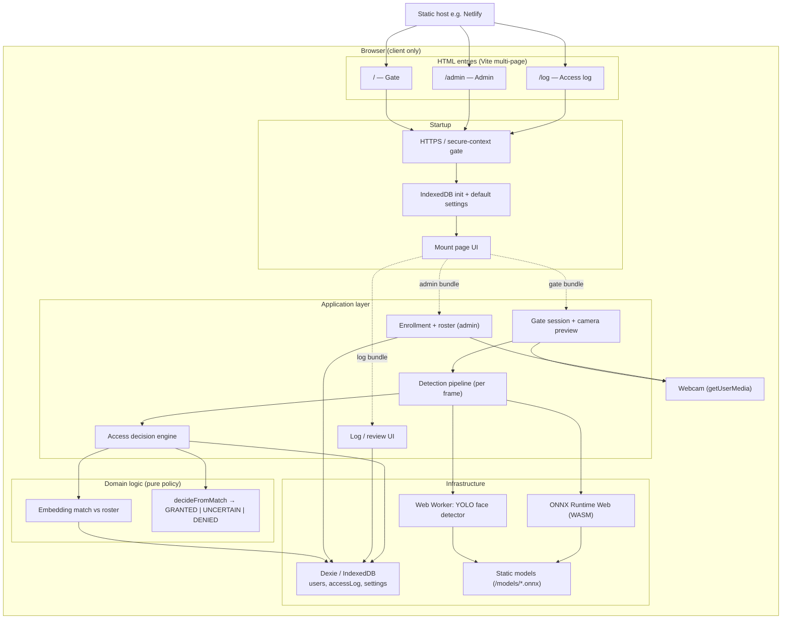
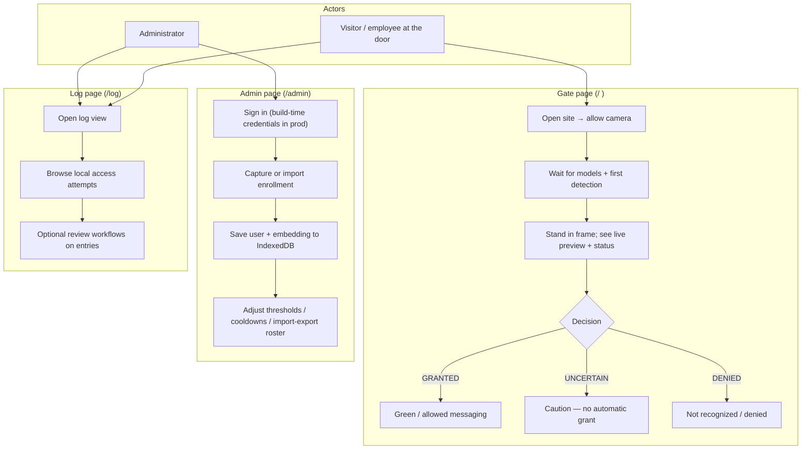
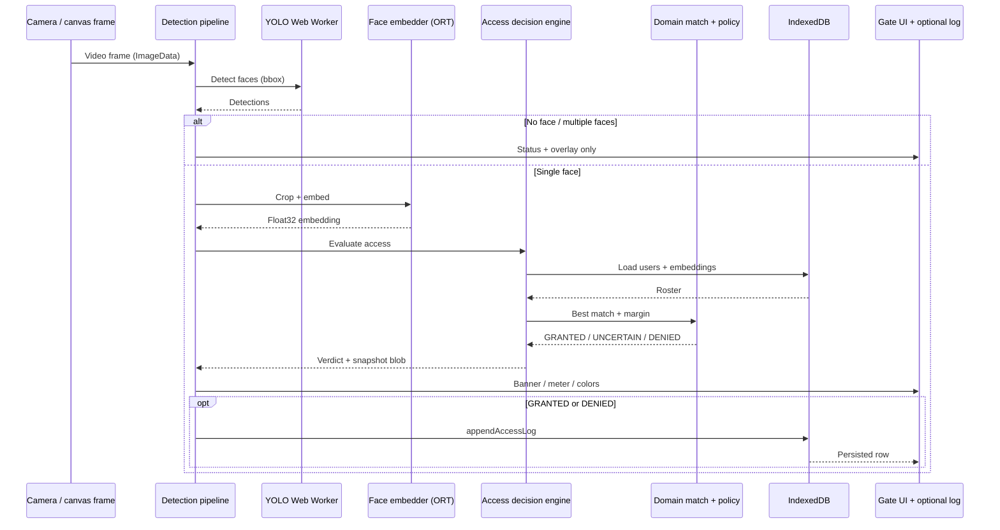

# Gatekeeper (Let Me In) — Presentation Diagrams

Use this document with a panel to explain **what the system is**, **how people use it**, and **how the software runs end-to-end**. All diagrams are [Mermaid](https://mermaid.js.org/); they render in GitHub, many IDEs, and the companion HTML file.

## Quick “elevator” script for the panel

- **Gatekeeper** is a **browser-only** access demo: no server runs your video or face models.
- The **gate** page uses the webcam; **face detection** runs in a **Web Worker**, **recognition** uses **local embeddings** compared to an **on-device roster**.
- Access outcomes are explicit **GRANTED**, **UNCERTAIN**, or **DENIED** (not a forced binary when the match is weak).
- **Admins** enroll people and tune thresholds on the **admin** page. **IndexedDB** on that device holds the **roster** (users, face embeddings, optional reference images), **settings** (thresholds, cooldowns), and **access logs** — not logs alone.
- **Tradeoffs**
  - **Upsides:** strong **privacy** (data stays on the device) and simple **static hosting** (no app server for video or inference).
  - **Limits:** no built-in **multi-device audit** or central log warehouse; no **enterprise identity** (SSO, directory sync) — those need extra architecture beyond this demo.

---

## 1. System architecture

High-level view of **components**, **where code runs**, and **what stays on the device**.

### How to explain the architecture diagram

1. **Single product, three surfaces**  
   The same repo ships three pages: the **gate** (live door check), **admin** (enroll people and tune thresholds), and **log** (local history and review). There is **no application server** in the loop for video or inference.

2. **Privacy posture**  
   Camera frames and face **embeddings** are processed in the browser. **IndexedDB** (`gatekeeper` database) holds enrolled users, embeddings, optional reference imagery, access attempts, and settings. Nothing in this diagram implies uploading a video stream to your backend.

3. **ML split**  
   **YOLO** face detection runs in a **Web Worker** so the main thread stays responsive (smoother preview). **Embedding** (face → vector) uses **ONNX Runtime Web** on the main thread (as wired today). Models load from **static assets** alongside the app.

4. **Policy is explicit code**  
   After “best match” vs enrolled vectors, **`decideFromMatch`** applies thresholds: strong match + margin → **GRANTED**; weak or ambiguous → **UNCERTAIN**; below weak band → **DENIED**. That logic lives in the domain layer so it is testable and documented.

5. **Bootstrap chain**  
   Every page runs **`bootstrapApp`**: enforce **secure context** for camera APIs, open **IndexedDB** with seeded defaults, then **mount** the page. Failures (e.g. DB blocked) surface without silently half-loading the app.

---

## 2. User flows

Who does what, in plain language—good for stakeholders and security reviewers.

### How to explain the user flow diagram

1. **Visitor at the gate**  
   They only need a **browser and permission to use the camera**. The app continuously analyzes the scene, shows **live feedback**, and converges on **GRANTED**, **UNCERTAIN**, or **DENIED**. **UNCERTAIN** is intentional: the system avoids guessing when confidence or separation from a runner-up is weak.

2. **Administrator**  
   Admins **enroll** approved identities (capture from camera or import flows depending on product state), **persist** them locally, and can **tune** sensitivity (thresholds, cooldown) to match the environment (strict office vs. looser demo).

3. **Log consumer**  
   Anyone with access to the **same browser profile** can open the **log** page and see **history stored on that device**. This is appropriate for a **demo or kiosk-style** deployment; central audit logging would require a deliberate backend design (out of scope for the browser-only MVP).

4. **Trust boundary**  
   Admin authentication is **front-door** to the admin UI (credentials supplied at **build time** in production). The panel should hear that this is **not** enterprise IAM—it is suitable for controlled demos and must be paired with device/OS controls for real deployments.

---

## 3. Application flow (runtime / per frame)

Technical **sequence** for the gate path: what happens from one camera frame to a decision.

### How to explain the application flow diagram

1. **Frame in**  
   The pipeline receives **raster data** from the preview path (conceptually one frame worth of pixels for detection/embedding).

2. **Detect first**  
   **YOLO** answers “where are faces?” The worker keeps heavy tensor work **off the UI thread**. Bounding boxes drive the on-screen overlay and the crop for embedding.

3. **Cardinality gates**  
   **Zero faces** → idle / “no face” messaging. **Multiple faces** → policy typically avoids a definitive grant (reduces wrong-person unlock). Only the **single-face** path runs embedding + access evaluation.

4. **Embed and compare**  
   The embedder turns the aligned face into a **vector**. The engine compares it to **stored embeddings** (e.g. cosine similarity), producing a **best score** and **runner-up** for margin checks.

5. **Decision + logging**  
   Domain **`decideFromMatch`** returns the tri-state decision. **GRANTED** and **DENIED** can append a row to **`accessLog`** with similarity and a captured frame blob; **UNCERTAIN** avoids treating ambiguous reads as a security event worth logging the same way (configurable product behavior—align narrative with current code paths when presenting).

6. **UI feedback loop**  
   The same loop runs at the camera cadence (subject to cooldown/debounce), so the experience feels like a **live door** rather than a one-shot photo check.

---

## Files

| File | Purpose |
|------|---------|
| [PRESENTATION_DIAGRAMS.md](./PRESENTATION_DIAGRAMS.md) | This markdown (version control, GitHub rendering) |
| [presentation-diagrams.html](./presentation-diagrams.html) | Same diagrams in a slide-friendly HTML page with Mermaid.js |

To view the HTML locally after `pnpm run dev`, open  
`http://localhost:5173/docs/presentation-diagrams.html`  
if your dev server serves the `docs/` folder; otherwise open the file directly in Chromium or use any static server on the repo root.
